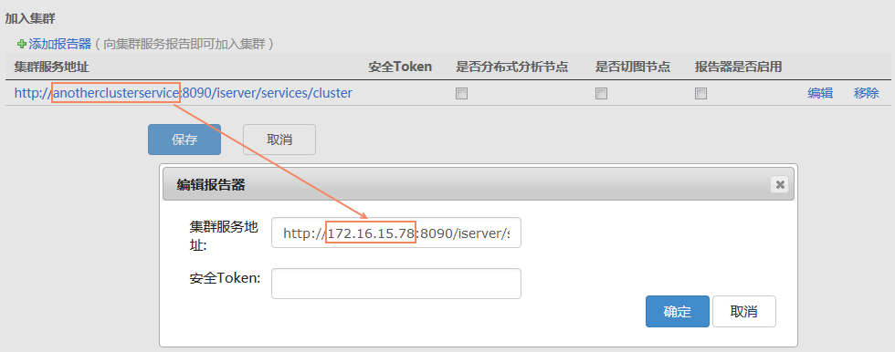
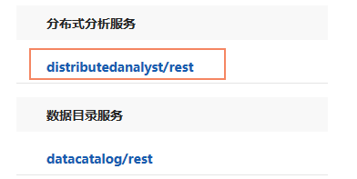

title: 大数据分析环境配置
---

　　SuperMap iDesktop Cross 9D 提供了大数据在线分析的功能，可对数据量较大、对象个数较多的数据进行高效、稳定的在线分析功能。大数据在线分析依赖于iServer服务，基于Spark计算平台，可对分布式存储的数据进行分析，支持HDFS存储的数据、BigDataStore中存储的数据、UDB中存储的数据。Cross提供了大数据的管理、分析、地图制图、出图等功能，在线分析功能支持：简单点密度分析、核密度分析、矢量裁剪分析、单对象查询、网格面聚合分析、多边形聚合分析、范围汇总分析。
 
　　大数据在线分析的环境配置和操作步骤如下：

- 分析服务环境配置
- 数据准备
- 大数据在线分析

### 大数据在线分析服务配置

　　若在使用大数据在线分析功能之前，没有可用的分析环境和数据，需先配置iServer服务环境与数据。iServer 服务在 Windows 中的配置操作说明如下：

1. 在获取到的iServer产品包中启动 iServer 服务；
2. 在浏览器中访问 [http://localhost:8090/iserver/](http://localhost:8090/iserver/)，创建管理员帐户后，依次检查系统环境--检查许可--配置示范服务，单击“下一步”按钮；
3. 点击“配置完成”页面中的“服务管理器”地址，登录帐号后，选择页面中的“集群”选项；
4. 切换到“配置集群”面板，勾选“是否启用Spark集群”，并选择“启用本机的Spark集群服务”，单击“保存”按钮即可；
5. 切换到“加入集群”面板，单击“集群服务地址”处的“编辑”，将默认地址中的 **anotherclusterservice** 修改为本机的ip，确定之后，勾选“是否分布式分析节点”及“报告器是否启用”复选款，单击“保存”即可。
　　
6. 切换至“分布式分析服务”面板，勾选“是否启用”复选框，单击“保存”按钮即可；
7. 完成上述集群配置之后，在浏览器中访问：[http://localhost:8090/iserver/services](http://localhost:8090/iserver/services)，查看服务列表中是否成功添加了分布式分析服务，如添加成功，则可基于该服务链接新建iServer任务，如下图所示：
　　
8. 配置好分析环境后，[准备好数据](DataPreparation.html)（BigDataStore、HDFS 或 UDB）的即可执行大数据在线分析操作。

###  相关主题

　　 [数据准备](DataPreparation.html)

