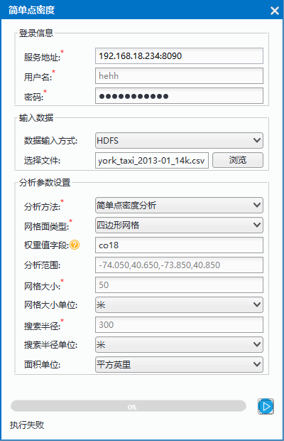
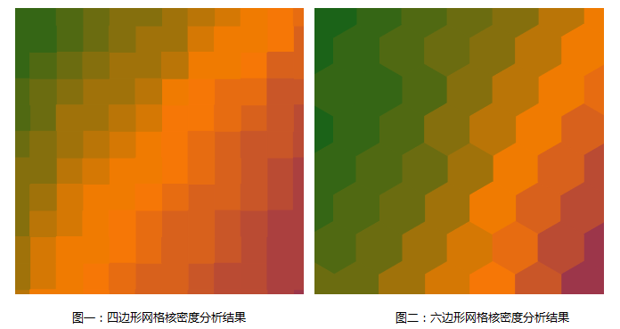

title: 密度分析
---

　　大数据在线分析服务的密度分析支持简单密度分析和核密度分析两种：

- 简单点密度分析：用于计算每个点的指定邻域形状内的每单位面积量值。计算方法为点的测量值除以指定邻域面积，点的邻域叠加处，其密度值也相加，每个输出栅格的密度均为叠加在栅格上的所有邻域密度值之和。结果栅格值的单位为原数据集单位的平方的倒数，即若原数据集单位为米，则结果栅格值的单位为每平方米。
- 核密度分析：用于计算点、线要素测量值在指定邻域范围内的单位密度。简单来说，它能直观的反映出离散测量值在连续区域内的分布情况。其结果是中间值大周边值小的光滑曲面，栅格值即为单位密度，在邻域边界处降为0。核密度分析可用于计算人口密度、建筑密度、获取犯罪情况报告、旅游区人口密度监测、连锁店经营情况分析等等。

##### 　　功能入口

　　Cross 提供了两个功能入口，如下所述：

- 在“在线分析”选项卡的“在线分析”组中，选择“简单点密度分析”或“核密度分析”，即可弹出**密度分析**的参数设置对话框。
- 在“可视化建模”选项卡中单击“新建”调出“工具箱”，双击“在线分析”中的“简单点密度分析”或“核密度分析”，或者选中对应功能，将其拖拽到“可视化建模”窗口中，双击即可弹出**参数设置**面板。

##### 　　参数说明

　　简单点密度分析与核密度分析的参数设置基本一致，包括登录信息、输入数据、分析参数三大类，具体说明如下：

　　

- **登录信息**

　　主要用于设置 iServer 服务器的地址及用户名等登录信息，以确保能使用iServer服务。

  - 服务地址：设置已启动和配置 iServer 服务的IP地址；
  - 端口号：设置服务器的端口号；
  - 用户名/密码：设置有iServer管理员的帐号和密码。

- **输入数据**

　　数据输入方式：支持HDFS、iServer DataStore、UDB三种数据输入方式，数据的使用和准备请参见：[数据准备](DataPreparation.html)。

　　**HDFS**

　　使用HDFS的数据输入方式，单击“选择文件”右侧的“浏览”按钮，在弹出的对话框中输入HDFS的数据地址，并选择待分析的scv文件即可。**注意**：参与密度分析的scv数据需要有对应的meta文件，若未创建meta文件，单击“meta文件不存在，请设置后使用”提示框中的“确定”按钮，即可在随后弹出的对话框中设置相关参数，“保存”后即可为scv文件创建meta文件。

　　**iServer DataStore**

　　使用iServer DataStore的数据输入方式，需要先打开iServer DataStore数据源，打开 iServer DataStore 的同时，会将存储了同样数据的 PostgreSQL 数据源打开，便于对数据进行分析。具体的使用方式如下：

1. 通过“打开Web型数据源...”的方式打开iServer DataStore数据源，打开iServer DataStore数据源的同时，会打开存储了同样数据的 PostgreSQL 数据源，该PostgreSQL 数据源的名称为**iServerDataStore_数据库名**；
2. 设置数据所在的服务器地址、数据库名称、用户名、密码，这些参数的设置可在**iServer DataStore**数据源下，单击数据集右键，选择“属性”查看即可，如下图所示：
　　
3. 设置待分析数据集所在的 PostgreSQL 数据名称，并选择待分析的数据集及其类型。

　　**UDB**

　　大数据在线分析功能可基于服务器UDB数据中的数据执行，此时，只需要将待分析的数据存储到UDB中即可，在分析过程中，**要保证UDB未存在打开、占用的情况**。

1. 数据源路径：设置为服务器中UDB数据源所在路径及名称；
2. 数据集名称：设置待分析的数据集名称；
3. 数据集类型：选择参与分析的数据集类型；
4. Spark核数的5倍：分析是Spark使用的核数的5倍，默认为36。

- **分析参数设置**

1. 分析方法：指定分析方法为简单点密度分析或核密度分析。必填参数。
2. 网格面类型：指定网格单元为四边形网格，还是六边形网格。必填参数。
3. 权重值字段：指定待分析的点的权重值所在的字段名称集合。格式如：col7,col8。选填参数。**备注**：可以传递多个表示权重的字段索引，以逗号分隔，相当于对待分析的点进行多次操作，每次对应不同的权重值。如果该参数为空，则点的权重为1。无论该值设置与否，都会自动分析权重值为1的情况。结果体现在结果数据集的属性表字段里。
4. 分析范围：分析区域外的点数据不参与计算。默认为输入数据的全幅范围。
5. 网格大小：对于四边形网格为网格的边长；对于六边形网格为六边形顶点到中心点的距离。（默认值为 10）。
　　
6. 网格大小单位：可选值：Meter、Kilometer、Yard、Foot、Mile（默认值为 Meter）
7. 搜索半径：默认值为 100
8. 搜索半径长度单位：可选值：Meter、Kilometer、Yard、Foot、Mile（默认值为 Meter）
9. 面积单位：即密度的分母单位。可选值：SquareMeter、SquareKiloMeter、Hectare、Are、Acre、SquareFoot、SquareYard、SquareMile（默认值为 SquareMile）

###  相关主题

　　 [环境配置](BigDataAnalysisEnvironmentConfiguration.html)

　　 [数据准备](DataPreparation.html)

