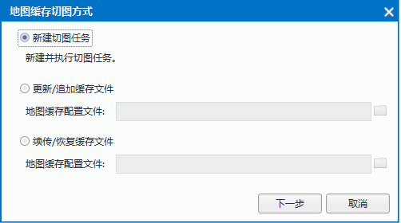
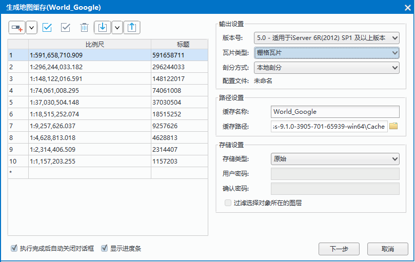
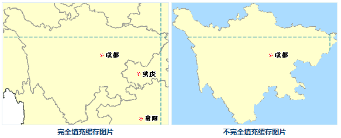

title: 地图缓存（单任务）
---
　　**地图缓存**，用来对地图数据生成缓存文件，优化地图的浏览效果。程序提供两种方式创建地图缓存：地图缓存（单任务）和地图缓存（多任务）。以下介绍创建地图缓存（单任务）的具体操作。

### 操作步骤     　　

  1. 配制好待切缓存的地图后，保存地图，在“数据源”节点处单击鼠标右键，选择“重新只读打开”，将数据源设置为只读打开并保存工作空间。此时，在地图窗口中重新打开待切缓存的地图。

  2.  在“地图”选项卡的“制图”组，单击“单任务”按钮。弹出”地图缓存切图方式“对话框。可选择三种切图方式：新建切图任务、更新/追加缓存文件、续传/恢复缓存文件。   
   
        
  3.  选择“新建切图任务”，单击“下一步”按钮，弹出如下所示“**生成地图缓存**”对话框，在对话框中设置缓存比例尺、路径、存储类型等参数，具体说明如下：     
      
-  
-  **地图比例尺**:切图比例尺默认为地图设置的显示比例尺，用户可在添加、删除切图比例尺，也可对比例尺进行导入、导出等操作。   
  
-   **输出设置**：不同版本的地图缓存，需要与相应版本的服务器版本匹配，以方便地图切片在服务端进行发布。系统提供了六种版本的地图缓存生成方式，其中，5.0版本的缓存采用了高精度校准方式，对于首次生成地图缓存的用户，推荐使用5.0版本的缓存方案。只有在选择5.0版本的时才可设置剖分方式。剖分方式分为两种：本地剖分和全球剖分。**注意**：全球剖分只有在地图坐标系为WGS 1984时才可用。   
-    **路径设置**:路径设置包括缓存名称和缓存路径两个参数，具体说明如下:     
  
      - **缓存名称**：设置缓存名称后，拆分任务会在缓存路径下生成一个缓存名称文件夹，并在这个文件夹中生成地图的缓存配置文件（*.sci）文件，该 *.sci 文件记录了整幅地图生成缓存的相关切图范围、切图比例尺、瓦片存储类型、瓦片设置、数据库信息、缓存路径等参数信息，可在桌面打开该文件浏览整个地图缓存。    
      
      - **缓存路径**：设置地图缓存文件和子任务的存放路径，任务拆分完成后，该路径下会生成一个以缓存名称命名的文件夹，如下图中的China文件夹，用于存放缓存配置文件（*.sci），切完缓存之后直接打开该*.sci文件，即可查看china地图的缓存；缓存路径还会生成一个“CacheTask”文件夹，其中包含check、task两个文件夹，文件夹中的存放内容如下：     
           
 
       - **check**：存放了check.udb、check.udd，用于缓存检查，检查切图后是否存在白图和空文件等情况。  
       
       - **task**：用于存放地图缓存拆分后的子任务文件（*.sci）。
    
-  **输出设置**：用于设置地图缓存类型，程序提供了三种缓存类型，包括：原始、紧凑、MongoDB。  
  
       - **原始型**：原始型缓存切片文件以单独的图片文件格式存放在磁盘上，不对数据进行压缩。主要特点为：可以直接读取；占用磁盘空间大，不太易于管理，拷贝和迁移不太方便；对密级较高的数据，不能设置密码。  
         
       - **紧凑**:紧凑型缓存会对原始的切片文件采用一定的压缩和加密机制，在结构上采用一组文件替代原始的图片格式。此时，不同比例尺文件夹下的缓存数据将存储为一组文件，该组文件包括两个部分：索引文件（*.sci）、一组数据文件（*.sc00和*.lock）。与原始型相比，紧凑型存储方式具有以下优势：减少文件数量，有利于大量的缓存数据的传输与拷贝；缩短缓存创建的时间耗费；数据支持加密。
       - **MongoDB 型**:生成的缓存切片文件，以分布式格式存储在服务器的数据库中，本地会生成一个索引文件（*.sci）。若选择 MongoDB 类型，需设置服务器名称、数据库名称、用户名称等参数。**注意**：若MongoDB缓存需要用多机进行切图，而服务器就是拆分任务的机器，则服务器地址须写IP地址，其他机器才可正常访问到MongoDB所在的服务器。  
       
       - **MongoDB 型存储方式有以下优势**：切片存储于服务器中，地图切片的存取速度较快；以分布式格式进行存储，瓦片数据支持直接进行拷贝分发，有利于数据传输与备份。  
       
       - **注意**：如果使用多进程切图并且缓存输出到MongoDB数据库中，需要先创建一个MongoDB库，创建MongoDB数据库的信息由命令行传入的缓存配置文件中的MongoDB信息指定；同时会根据指定的缓存配置文件（*.sci）在同级目录下生成一个新的 *.sci 文件。  
       

   4.选择“新建切图任务”，单设置好以上参数后，单击“下一步”按钮，在对话框中设置缓存范围、索引范围、图片参数等，如下图所示：   
   
    
 
   - **缓存范围**：设置需要切缓存的地图范围，提供了整幅地图、当前窗口、自定义、复制粘贴四种设置方式。	  
 
   - **索引范围**：是地图缓存瓦片切分规则的依据。当索引范围确定时，瓦片的切分规则即可以确定。具有相同索引范围的地图缓存可以进行合并。系统提供了四种建立索引范围的方式：整幅地图、当前窗口、自定义、复制粘贴。具体操作见缓存范围的设置方法。注意：只有索引范围相同的地图缓存，才能追加成功。　  
   - **瓦片类型**：提供两种瓦片生成格式，栅格瓦片和矢量瓦片。根据数据格式选择对应的瓦片类型。  
   
   - **图片类型**：可设置缓存图片存储的类型，支持 PNG、GIF、JPG、PNG-JPG 和 PNG 8这几种图片格式。当地图缓存格式为 PNG -JPG混合形式的瓦片缓存，可根据结果瓦片格式判断是否包含无效数据像元。无效数据像元是指不包含任何数据内容的瓦片（地图边界处），其文件格式为 PNG，否则为 JPG 格式。使用 JPG_PNG 图片类型时，会默认勾选背景透明选项。采用混合图片类型，可以大大减少缓存数据的大小，从而优化数据下载时间。  
   
   - **块大小（像素）**：获取缓存预处理后生成的每个缓存分块文件的采样尺寸，单位为像素。应用程序提供了 2048*2048、1024*1024、512*512、256*256、128*128、64*64 六种尺寸共用户选择。   
    
   - **图片压缩率**：缓存图片被压缩的百分率。图片压缩率的范围为0-100，默认为75。  
     
   - **背景透明**：当地图设置了背景色时，勾选此项，在生成地图缓存的时候，会自动将背景色设置为透明；否则将保留地图的背景色。  
   
   - **完全填充缓存图片**：当地图缓存范围设置为选中对象范围时，该复选框可用，可设定的缓存范围（或者索引范围）内生成的缓存图片是否完全填充。勾选该项，表示缓存范围内会完全填充缓存图片，不勾选该项，表示只输出选中的对象的范围与缓存范围交集部分，其他部分不填充，输出为空白。例如，当用户选中某个对象时，使用和不使用完全填充缓存图片的效果如下图所示：　　  
     
  　  
 5.设置好以上参数后，单击“生成”按钮，弹出“正在生成地图缓存”对话框，开始执行切图任务。

   
   
　　 　　
   
 
   
