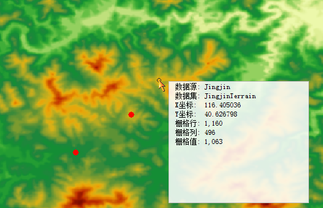

　　像元是栅格数据最基本的信息存储单元，每个像元都有给定的属性值来表示地理实体或现实世界的某种现象。删格数据都具有一定的空间分辨率，一个像元对应着地表的一定范围的区域，因而像元值代表的是像元所覆盖的区域的占主导的要素或现象。比如卫星影像和航空相片中的光谱值反映了光在某个波段的反射率；DEM 栅格的像元值可以表示地表高程、降水量、污染物浓度、距离等数量值。查询栅格值功能可以查询鼠标所在像元的信息，包括坐标值、行列号、栅格值等。

### 操作步骤

　　1.  在地图窗口中打开栅格数据后，在“空间分析”选项卡的“栅格分析”组中选择“**栅格查询**”项。

　　2.  将鼠标移至删格数据中即可查看像元信息，在移动鼠标的过程中，在鼠标尾部出现即时消息框，实时显示鼠标所在位置的栅格值信息，包括栅格数据所在的数据源、数据集，该栅格位置的地理坐标、栅格坐标（行号和列号）以及栅格值，如下图所示。

　　

　　3.  使用鼠标单击想要查询栅格值的点，则在地图窗口会高亮显示选中的点，同时在输出窗口会显示该点的地理坐标、栅格坐标以及栅格值。

　　4.  按住 ESC 键或者单击鼠标右键可以取消查询，且按住 ESC 键可以同时清除地图窗口高亮的栅格点。

