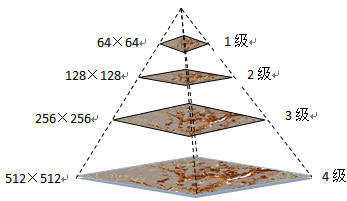

### 基本概念

　　影像金字塔是栅格数据集的简化的分辨率（Reduced Resolution）图像的集合，通过影像重采样方法，建立一系列不同分辨率的影像图层，每个图层分别存储，并建立相应的空间索引机制，从而提高缩放浏览影像时的显示速度。为减小影像的传输数据量和优化显示性能，有时需要为影像建立影像金字塔。

### 实现原理

　　影像金字塔是按照一定规则生成的一系列分辨率由细到粗的图像的集合。影像金字塔技术通过影像重采样方法，建立一系列不同分辨率的影像图层，每个图层分割存储，并建立相应的空间索引机制，从而提高缩放浏览影像时的显示速度。如下图所示的影像金字塔，底部是影像的原始最高分辨率的表示，为512×512图像分辨率，越往上的影像的分辨率越小，分别为256×256，128×128，顶部是影像金字塔的最低分辨率的图像64×64，因此这个影像金字塔共有4层，即4个等级的分辨率。显然影像的图像分辨率越高，影像金字塔的等级越多。对于图像分辨率为2^a×2^b的（a&gt;b）影像，SuperMap中将会为其建立（b-6）+1 层的金字塔。

  

　　为影像建立了影像金字塔之后，以后每次浏览该影像时，系统都会获取其影像金字塔来显示数据，当您将影像放大或缩小时，系统会自动基于用户的显示比例尺选择最合适的金字塔等级来显示该影像。

　　金字塔只能针对原始的数据进行创建。一次只能给一个数据集创建金字塔，如果想再次创建，需要将已创建的金字塔删除。浏览创建影像金字塔后的栅格数据集时，实际上时在访问已创建的金字塔。如下图所示在不同的比例尺下金字塔的建立过程。

  

　　建立影像金字塔可以显著地提高影像缩放显示渲染的速度和性能，但是同时影像金字塔的建立会增加数据集的存储空间，即增大影像数据集所在数据源文件的大小，这是因为建立的影像金字塔实际上就是影像在不同分辨率下的图像的集合，这些不同分辨率下的图像都和数据一起存储在数据源文件中，从而增大了数据源文件的大小。而且栅格数据集数据量越大建立金字塔的时间越长，影像金字塔的存储空间也就越大，但是会为以后的影像浏览节约了更多的时间，所以对于海量影像数据，创建金字塔不失为一种优化效率的选择。

　　SuperMap SIT 影像文件存储格式是集成了影像压缩及高效的影像金字塔技术的数据格式，因而可以超快速地显示影像数据，与影像数据大小基本无关，即使在很低配置的机器上也能非常流畅地对海量影像数据进行显示。

### 影像金字塔管理

　　影像金字塔管理功能包括创建和删除金字塔的功能，具体操作说明如下：

#### 创建影像金字塔

　　支持创建影像金字塔的数据集有影像、栅格数据集、及以数据源形式直接打开的栅格文件（目前支持 tiff、tif、img 格式）。创建影像金字塔有两种操作方式，如下所述：
* **方式一**：单击“数据集”菜单栏，选择“影像金字塔...”项，在弹出的“影像金字塔管理”对话框中添加需创建金字塔的数据集，可批量创建影像金字塔。
* **方式二**：在工作空间管理器中选中待创建影像金字塔的影像（或栅格）数据集，单击鼠标右键选择“创建影像金字塔...”项，即可对选中的数据集创建影像金字塔。**注意**：若在工作空间管理器中选中多个数据集通过右键菜单创建金字塔，必须都为影像数据集，或都为栅格数据集。

#### 删除影像金字塔

　　创建了影像金字塔的影像和栅格数据集可进行删除操作，但是，对于以数据源形式打开的影像文件，如 tiff、img格式的数据，不能进行删除影像金字塔的操作。删除影像金字塔也有以下两种方式：

* **方式一**：单击“数据集”菜单栏，选择“影像金字塔...”项，在弹出的“影像金字塔管理”对话框中添加并选中需删除金字塔的数据集，可批量删除影像金字塔。
* **方式二**：在工作空间管理器中选中一个或多个需删除影像金字塔的影像（或栅格）数据集，单击鼠标右键选择“删除影像金字塔...”项，即可将选中的数据集创建影像金字塔。**注意**：若在工作空间管理器中选中多个数据集通过右键菜单创建金字塔，必须都为影像数据集，或都为栅格数据集。

