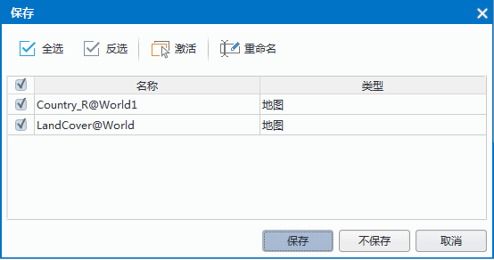
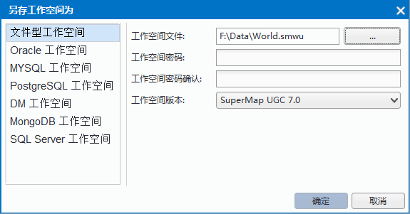

　　工作空间是用户进行地图操作时的工作环境，包括用户在该工作空间中打开的数据源、保存的地图、布局和场景等，当用户打开工作空间时可以继续上一次的工作成果来工作。工作空间的管理包括工作空间的打开、保存、另存、关闭和删除等内容。

### 打开工作空间

工作空间有两种类型，包括文件型工作空间和数据库型工作空间。  
    
* **文件型工作空间**：是将工作空间存储为扩展名为 *.sxw/*.smw 或者 *.sxwu/*.smwu 类型的文件；   
* **数据库型工作空间**：是将工作空间存储在数据库中。目前，支持打开的数据库型工作空间包括：SQL Server、Oracle、PostgreSQL、MySQL、MongoDB、DM 六种数据库工作空间。     

打开工作空间的方式有三种：  
  
+   “文件“选项卡中“打开”按钮提供打开不同类型的工作空间的功能。   
+   ”开始“选项卡”工作空间“组提供”文件“和”数据库“两个按钮以打开不同类型的工作空间。其中下拉按钮包含两个部分，一是按钮部分，单击该部分将执行下拉菜单中第一项的功能；二是下拉按钮部分，单击该部分将弹出下拉菜单，通过选择下拉菜单中的项来实现打开相应类型的工作空间.  
+    单击右键工作空间管理器中工作空间节点，可在右键菜单中选择”打开文件型工作空间“和”打开数据库型工作空间“。    
   
**打开文件型工作空间**       
1. 在"开始"选项卡“工作空间”组,点击“文件”按钮，弹出“打开工作空间”对话框。  
2. 在弹出的“打开工作空间”对话框，找到想要打开的工作空间文件（*.sxw/*.smw 或者 *.sxwu/*.smwu）。  
3. 单击“打开”按钮即可打开选择的工作空间。   

**打开数据库型工作空间**       
1. 在“开始”选项卡“工作空间”组中，点击"数据库“按钮，在弹出的下拉选择框中选择需要选择打开的数据库工作空间类型，弹出“打开数据库型工作空间”对话框。  
2. 在弹出的“打开数据库型工作空间”对话框中，左侧可切换选择不同的数据库类型，选择数据库工作空间类型并在对话框右侧输入对应数据库的信息，然后单击“确定”按钮即可打开相应的工作空间。 

    
    
**注意事项**  : 
	在应用程序中，当前只能打开一个工作空间，不能同时打开多个工作空间，因此，在打开工作空间时，应用系统会先关闭当前打开的工作空间。在关闭当前打开的工作空间时，如果应用程序当前存在一个打开的未保存的工作空间，系统将弹出对话框，提醒保存关闭原有的工作空间，待关闭原有的工作空间后，才能继续打开操作。

### 保存/另存为工作空间  
  
 “**保存**”按钮提供保存当前打开的工作空间中的操作结果以及保存工作空间的功能，只有工作空间中有未保存的内容，该按钮才可用。工作空间中的操作结果只有先保存到工作空间中，然后，在进行工作空间本身的保存，这些操作成果才能最终保存下来，在关闭工作空间后，当再次打开工作空间时，才能获取上一次工作的环境以及操作成果。  
1. 当工作空间中有未保存的内容，单击“保存”按钮时，会弹出“保存”对话框。    
  
2.在弹出的“保存”对话框中的列表为未保存的项目，包括：未保存的地图、模型、布局。每个项目前有一个复选框，默认为选中状态，当复选框被选中时，表示将该项内容保存到工作空间中；否则，不进行保存。“重命名”按钮用来重新指定选中项的名称，即可以改变选中地图、布局或模型的名称。   
3. 指定好要保存到工作空间中的内容后，单击对话框中的“保存”按钮，保存指定的内容到工作空间中并关闭对话框。   
4. 如果当前打开的工作空间是已经存在的工作空间，则在上一步中单击“保存”按钮后，即可实现工作空间的保存；如果当前打开的工作空间是一个新的工作空间（非已有的工作空间），则在上一步单击“保存”按钮后，将弹出如下所示的“工作空间另存”对话框，通过“另存工作空间为”对话框可以将工作空间保存为你所需要的类型的工作空间；  
     
5. 在对话框左侧可选择存储为文件型工作空间或数据库型工作空间。    
  
-  当左侧选择“文件型工作空间”项，对话框的右侧会出现保存文件型工作空间时的用户输入界面，用户需要输入工作空间文件的文件名并指定工作空间文件的保存类型（*.sxwu 或者 *.smwu），并为工作空间设置密码。  
-  当左侧选择某一数据库型工作空间，对话框的右侧会出现保存对应数据库工作空间的用户输入界面，用户需要输入必要参数，即可保存工作空间。  

### 关闭工作空间  
“**关闭工作空间**”，主要提供关闭当前打开的工作空间的功能。关闭工作空间后，应用程序会提供一个默认打开的空的工作空间作为当前打开的工作空间。  
1. 在工作空间节点上右击鼠标，在弹出的右键菜单中选择“关闭工作空间”项。  
2. 应用程序在执行当前打开的关闭工作空间操作时，如果应用程序中当前打开的工作空间没有未被保存的内容，则直接关闭当前的工作空间；如果当前打开的工作空间存在未被保存的内容，则会弹出提示对话框，提示用户在关闭当前打开的工作空间时是否保存这些内容。  
3. 如果点击“否”按钮，则不进行保存直接关闭当前打开的工作空间；如果点击“是”按钮，则对当前打开的工作空间进行保存工作。有关保存/另存为工作空间请参看上一节保存操作。  
  

