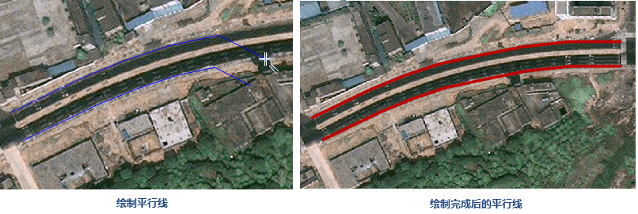

　　在实际的应用中，线对象主要用来描述线状地物，如河流、铁路、道路、电力线等。应用程序也提供了多种绘制折线的方式，满足不同应用情景下的绘制要求。

### 直线

**绘制直线**

1.  在“对象操作”选项卡的“对象绘制”组中，单击“线”下拉按钮，选择下拉菜单中的“直线”选项，出现直线光标。 
2.  将鼠标移动到地图窗口中，可以看到随着鼠标的移动，在合适的位置单击鼠标左键确定直线的起始位置。 
3.  再次移动鼠标确定另外一个端点的位置，单击鼠标左键完成一条直线的绘制，单击鼠标右键结束当前绘制操作。 

**绘制折线**

1. 在“对象操作”选项卡的“对象绘制”组中，单击“线”下拉按钮，选择下拉菜单中的“折线”选项。 
2. 将鼠标移动到地图窗口中，可以看到随着鼠标的移动，在合适位置单击鼠标左键，确定折线的起始位置。 
3. 移动鼠标确定下一个节点的位置，完成折线的第一段线的绘制。 
4. 继续移动光标到合适的位置，依次单击鼠标左键确定节点位置，完成折线其它线段的绘制。 

**绘制平行线**

1. 在“对象操作”选项卡的“对象绘制”组中，单击“线”下拉按钮，选择下拉菜单中的"平行线”按钮，出现平行线光标。 
2. 将鼠标移动到地图窗口中，在适当的位置单击鼠标左键，移动鼠标确定平行线的间距后再次单击鼠标。
3. 移动鼠标，可以预览固定宽度平行线的实时效果，在合适的位置单击鼠标左键确定确定平行线的方向和长度。 
4. 其后绘制平行线其它段的操作步骤与绘制折线类似，此时绘制的平行线都是与上面步骤中等宽的平行线。 

### 曲线绘制

　　应用程序支持多种曲线，贝兹曲线、B 样条曲线、Cardinal 曲线或者自由曲线。

**绘制贝兹曲线**

　　贝兹曲线由不在曲线上的两个起始结点和两个终止结点控制曲线的走向，通过在曲线上的其他控制点拟合出曲线的各中间点。至少需要6个控制点才能完成一段贝兹曲线的绘制。

1.  在“**对象操作**”选项卡的“**对象绘制**”，单击“**曲线**”下拉菜单中的“**贝兹曲线**”选项，出现贝兹曲线光标。
2.  将鼠标移动到地图窗口中，单击鼠标左键确定贝兹曲线第一个控制点的位置。
3.  同样的方式确定第二到第四个控制点的位置，前面四个控制点的坐标确定了贝兹曲线的走向。
4.  确定曲线上第五个控制点的坐标，此时在第三个控制点和第四个控制点之间会出现蓝色虚线，是贝兹曲线上拟合的第一段线。
5.  继续输入第六个控制点的坐标，绘制贝兹曲线上第二段线。
6.  重新上一步骤，继续绘制贝兹曲线的其他线，单击鼠标右键结束当前绘制。

**B 样条曲线**

　　B 样条曲线时通过曲线上首尾两个控制点，以及不在曲线上的各中间控制点绘制而成。曲线上的其它点都根据曲线上的中间控制点拟合得到。至少需要4个控制点才能完成一段 B 样条曲线的绘制。

1.  在“**对象操作**”选项卡的“**对象绘制**”，单击“**曲线**”下拉菜单中的“**B样条曲线**”选项，出现 B 样条曲线光标。
2.  将鼠标移动到地图窗口中，在适当位置单击鼠标左键确定曲线第一个控制点位置。
3.  移动鼠标确定曲线上的第二、第三个控制点，此时在第二个控制点和第三个控制点之间会拟合一条曲线，表示 B 样条曲线的第一段线。
4.  输入曲线上第四个控制点的坐标，此时在第三个控制点和第四个控制点之间也会拟合一条曲线，表示 B 样条曲线的第二段线。
5.  重新上一步骤，继续绘制 B 样条曲线的其他段线，单击鼠标右键可结束当前绘制。

**Cardinal 曲线**

　　Cardinal 曲线是通过确定曲线上的各控制点绘制曲线，曲线的其它点是根据所有控制点拟合而成。至少需要3个控制点才能完成一段 Cardinal 曲线的绘制。

1.  在“**对象操作**”选项卡的“**对象绘制**”，单击“**曲线**”下拉菜单中的“**Cardinal 曲线**”选项，出现 Cardinal 曲线光标。
2.  将鼠标移动到地图窗口中，在适当位置单击鼠标左键确定曲线第一个控制点位置。
3.  同样方式确定第二个控制点，可以看到这两点间拟合了一条曲线。
4.  移动鼠标，输入第三个控制点的坐标，可以看到从第二个控制点和第三个控制点之间会出现第二段曲线。
5.  单击鼠标右键，结束当前绘制。

**自由曲线**

　　自由曲线通过自由拖动鼠标绘制得到的一段曲线。绘制自由曲线在创建不规则边界或使用数字化仪追踪时非常有用。

1.  在“**对象操作**”选项卡的“**对象绘制**”，单击“**曲线**”下拉菜单中的“**自由曲线**”选项，出现自由曲线光标。
2.  将光标移至创建自由曲线的位置，单击鼠标左键，并按住鼠标左键不放，移动鼠标，可以在地图上画出与光标移动轨迹一致的曲线。
3.  完成绘制后，单击鼠标右键结束操作。

### 弧线

**三点弧**

1.  在当前图层可编辑的情况下，在“**对象操作**”选项卡的“**对象绘制**”，单击“**弧线**”下拉菜单中的“**三点弧**”选项，出现三点弧光标。
2.  将鼠标移动到地图窗口中，可以看到在地图窗口中随着鼠标的移动，在合适的位置单击鼠标确定三点弧的起始位置。
3.  再次移动鼠标，确定第二点和最后一个点的位置，完成三点弧的绘制，单击鼠标右键可取消当前绘制操作。

**绘制椭圆弧**

1.  在当前图层可编辑的情况下，在“**对象操作**”选项卡的“**对象绘制**”，单击“**弧线**”下拉菜单中的“**椭圆弧**”选项，出现椭圆弧光标。
2.  在地图中单击鼠标左键后移动鼠标确定椭圆的起始点，移动鼠标确定椭圆一个轴长。
3.  移动鼠标，地图窗口中会实时标识鼠标位置与第一条轴的长度与夹角，移动鼠标在适当位置单击鼠标左键，完成椭圆的绘制。
4.  继续移动鼠标，在椭圆弧线上单击鼠标左键确定弧线的的起始位置，继续移动鼠标，根据鼠标所在的位置会实时出现绘制一段椭圆弧，再次单击鼠标左键确定椭圆弧的终点，完成椭圆弧的绘制。

