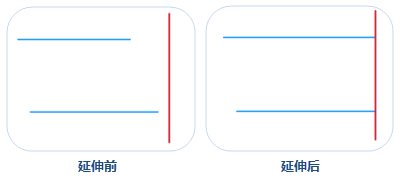
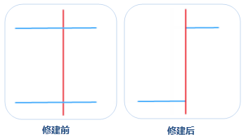

### 炸碎

　　炸碎功能用来将把线对象分解成最小单位的直线对象。最小单位的直线对象表示该对象有且仅有两个节点即两个端点，且为简单对象。

　　如下图所示，待炸碎的对象共有5个节点（左图）；炸碎后该对象分解为4个对象，且每段对象仅包含2个节点。右图所示为对炸碎后的多个对象按照 SMID 制作单值专题图的结果。

　　 

**使用说明**

-   炸碎功能适用于线图层以及 CAD 图层，且该功能只能在有线对象选中的情况下可用。
-   复杂对象也同样适用于炸碎操作，炸碎后的复杂对象将被分解，同时每一个子对象被分解为最小单位的直线。

**操作步骤**

1.  在可编辑图层中，选择一个或多个要炸碎的线对象。
2.  在“对象操作”选项卡的“对象编辑”组的 Gallery 控件中，单击“**类型转换**”组中的“**炸碎**”按钮，执行炸碎操作。
3.  炸碎操作完成后，会在输出窗口中提示炸碎后生成多少个对象。例如：图层“Road@Jingjin”中，线对象\[smID\]=108被炸碎共产生4个新对象。

**注意**：对于圆弧、圆等节点较多的对象，炸碎后由于新生成的对象每一段比较碎小，在小比例尺下不会显示。应用程序对一些小对象进行过滤显示，对于长度小于0.4mm
的线对象，不予显示。

### 延伸

　　延伸功能用来将在容限范围内不相交的线对象进行延伸，保证他们最终能够相交。

**使用说明**

- 在可编辑的线图层或者 CAD 图层中，将选中的线对象（或者 CAD 图层的线对象）延伸到指定对象（基线）。
- 在选择延伸线对象时，需要单击选中延伸线上靠近基线方向的位置。
- 在延伸状态下，如果已经选择一个线对象作为基线，那么只能连续将不同的其他线对象延伸到该基线。 
- 延伸操作只对延伸后会与基线相交的线对象有效，而对于不会相交的线对象将不进行任何操作。 
- 在线图层中，基线可以是任意类型的线对象，如直线、平行线、圆等，也可以是复杂线对象。在待延伸的线可以是任意不封闭的简单线对象，如直线，折线，弧段，多段线等，需要说明的是平行线是有两个子对象的复杂对象。 
- 在 CAD 图层中，基准线和待延伸的线均必须是对象类型为线的线对象。对象类型可通过对象属性的空间信息进行查看。 

**操作步骤**

1.  在“对象操作”选项卡的“对象编辑”组的 Gallery 控件中，单击“**编辑端点**”组中的“**延伸**”选项。
2. 将鼠标移至地图窗口中提示：`请选择基线`，选择一个线对象作为基线，此时鼠标会提示：`请点击要延伸的线段`。
3. 单击需要延伸的线对象，一定要选择该线对象的靠近基线方向的位置，则应用程序会自动延伸距离基线近的端点到基线位置。如果单击改线对象上远离基线方向的端点位置时，不会进行延伸。
4. 如果需要将其他的线对象延伸到该基线，继续单击要延伸的线对象即可。要结束此操作，可以通过鼠标右键或按键盘 ESC 键结束。结果示例如下图所示：

　　 

### 修剪

　　修剪工具可以将选中一个线对象（基线）与其相交的选中的另外一个线对象（修剪对象）相交处修剪掉。

**使用说明**

- 按基线对象定义的剪切边修剪对象。使用修剪工具时，应先选择用于修剪的线要素（基线），然后单击要修剪的相交线段。鼠标单击的部分将被移除，即被修剪掉。
- 适用于修剪线图层的对象或者 CAD 图层的线对象。同时要求要修剪的对象所在的图层可编辑。
- 修剪操作只对与基线相交的线对象有效，而对于不相交的线对象将不进行任何操作。
- 待修剪对象必须为简单线对象；基线可以是复杂线对象或简单线对象，但不能是复合对象。
- 当需要连续修剪与同一条线（基线）相交的多个线要素时，先选择一个线对象作为基线，然后连续修剪与基线相交的线对象即可。

 
**操作步骤**

1. 在“对象操作”选项卡的“对象编辑”组的 Gallery 控件中，单击“**编辑端点**”组中的“**修剪**”选项。
2. 将鼠标移至地图窗口中，鼠标提示：`请选择基线`，选择一条线对象作为基线，此时鼠标会提示：`请点击要修剪的线段`。
3. 选择想要修剪掉的线对象部分。修剪完成后，基线仍然保留，包含鼠标点击位置的线段部分将被删除。**注意**：新对象的系统字段（除 SmUserID 外）由系统赋值，非系统字段和字段 SmUserID 保留修剪对象的相应属性。

　　

### 连接线

　　连接线是指将未相连的线对象按照一定的规则进行连接，连接线有首尾相连和临近点相连两种方式，不同的连接方式决定了连接后线对象的线形有所不同。

- **首尾相连**：按照线的顺序（线对象的选择顺序或者 SMID 次序）将起点和终点依次连接，即将第一条线对象的终点与第二条线对象的起点相连，第二条线的终点与下一条线的起点相连，其他依次类推。连接后生成的线的方向与第一条线对象的方向相同。
- **临近点相连**：连接的时候不考虑线的起止点，按照线对象端点之间距离远近判断，将第一条线的端点与距离最近的线对象的端点进行连接。连接后生成的线的方向与第一条线对象的方向相同。

　　

**使用说明**

- 连接线对象功能适用于线图层和 CAD 图层。
- 连接线对象功能只有在可编辑图层中选中线对象时可用。
- 此操作不适用于复杂对象和复合对象。
- 线对象的顺序说明：在对象首尾相连时，需要确定待连接线对象的次序，以确定线的方向。应用程序有两种方式确定待连接的线对象的顺序：一种是按住 Shift 键选择多条线对象，连接的时候线对象按照选择顺序进行连接；另外一种是通过鼠标框选，按所选择的线对象的 SMID 升序进行连接。 

**操作步骤**

1. 在可编辑图层中选择两个或多个待连接的线对象。
2. 在“对象操作”选项卡的“对象编辑”组的 Gallery 控件中，单击“**编辑端点**”组中的“**首尾连接线**”或“**临近点连接线**”选项。
3. 在弹出的对话框中设置结果对象属性保留方式，具体说明请参见[面运算](PolygonEdit.html)页面中的**合并**。
