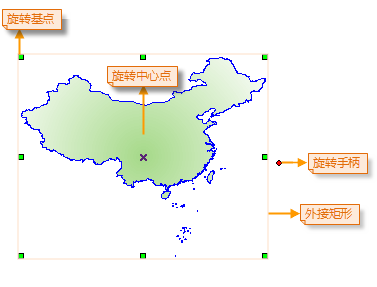
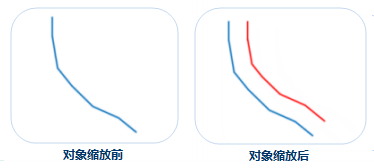
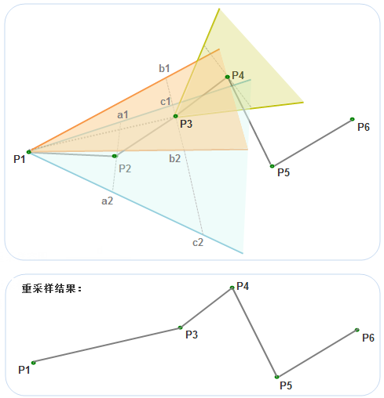
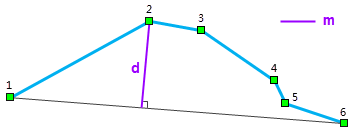
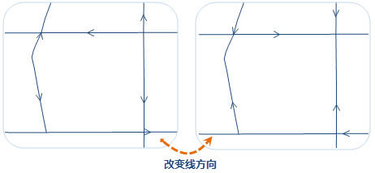

### 旋转

　　旋转有基点旋转和中心点旋转两种方式，旋转基点是几何对象范围的外接矩形左上角的角点，旋转中心点位于几何对象的内部（X 状，如下图所示），在对几何对象进行旋转时，旋转基点保持不变，几何对象绕旋转中心点按照指定的角度进行旋转。当一次选中多个对象时，旋转基点为这几个对象共同的外接矩形左上角的角点位置。

　　

　　SuperMap 支持对点图层、线图层、面图层、文本图层、CAD 图层、路由图层中的对象进行旋转。在进行旋转时，既可以通过拖动旋转的方式，将对象旋转至目标位置，也可以通过手动输入旋转角度的方式，对几何对象进行精确旋转。具体操作步骤如下：

**拖动旋转**

1.  在可编辑图层中选择一个或多个待旋转对象。
2.  将鼠标放置在旋转手柄上，当鼠标状态变为可旋转状态时 ，按住鼠标左键，拖动对象至旋转的目标位置松开鼠标左键即可。

**精确旋转**

1.  在可编辑图层中选择一个或多个待旋转对象。
2.  “**对象操作**”菜单或工具栏中，选择“**旋转**”选项，弹出“对象旋转参数设置”对话框。
3.  旋转中心点列出了该点的(X,Y)坐标值。默认的选择中心点为几何对象的外接矩形左上角的锚点。用户可以通过修改(X,Y)坐标，设定新的旋转基点。
4.  在编辑框中键入旋转角度，正值表示对象按逆时针方向进行旋转，负值表示对象按顺时针方向进行旋转。
5.  单击“确定”按钮，对选中的几何对象进行旋转。

### 镜像

　　“镜像”按钮提供了绕指定的临时镜像线翻转选中的几何对象（非文本几何对象）来创建对称的镜像对象，选中的原几何对象保持不变，所创建的镜像对象为选中的原几何对象的副本，其与选中的原几何对象的位置关系为：所创建的镜像对象为选中的原几何对象绕指定的临时镜像线翻后所得的效果。主要操作步骤如下：

1.  将地图窗口中要进行镜像操作的几何对象（非文本几何对象）所在的图层设置为可编辑状态。
2.  选中要进行镜像操作的几何对象（非文本几何对象），可以同时按住 Shift 或者 Ctrl 键，连续选中多个几何对象或者使用拖框选择的方式选中多个几何对象。
3.  在“**对象操作**”菜单或工具栏中，选择“**镜像**”选项，将鼠标移动到地图窗口中，绘制一条临时的镜像线， 在适当位置处点击鼠标左键确定镜像线的第一个点，移动鼠标，经出现随鼠标移动而不断变化的临时线段，在适当位置处点击鼠标确定镜像线的另一个点（最后一个点），此时，所确定的线段即为选中的几何对象绕其旋转的临时镜像线，同时，在鼠标按下时，便执行了镜像操作。

　　

### 缩放

　　缩放功能是按照一定的缩放距离，创建一个形状与原对象形状比例不变的新对象。

-   缩放操作适用于线图层、面图层或者 CAD 图层。
-   缩放操作既适用于简单对象，也适用于复杂对象。对于复杂对象，同时对复杂对象的每个子对象按照指定的缩放距离缩放。
-   CAD 图层中的参数化对象（如正多边形、扇形等）、复合对象不支持缩放。
-   在输入偏移距离时，输入的距离值为正值，表示向上偏移；输入的距离值为负值，则表示向下偏移。

**操作步骤**

1.  开启图层可编辑状态后，在“**对象操作**”菜单栏或工具栏中，选择“**缩放**”选项。
2.  根据输出窗口“选择要缩放的对象”的提示，选择一个对象（线对象或者面对象）作为缩放对象。
3.  拖动光标，可以看到一个与被选对象形状平行的临时对象随着鼠标而移动。
4.  将鼠标移动到合适的位置，单击左键，完成缩放操作，按 ESC 键或者单击鼠标右键结束操作。为对象缩放前后的示意图如下所示，蓝色为源对象，红色会缩放后的对象。

　　

**备注**

-   缩放的结果会产生一个新对象，同时保留源对象，新产生的对象的非系统字段的属性与源对象的属性保持一致。
-   如果在缩放过程中新生成对象有自交现象，则对于线对象，其缩放距离应小于缩放对象任意两点之间的距离；而对于简单面对象，其缩放距离应小于缩放对象任意两点之间的距离的一半。

### 曲线光滑

　　曲线光滑功能主要对线几何对象或面几何对象的边界线进行平滑处理，使折线转变成连续的光滑线对象。光滑的目的是：当折线或多边形的边界的线段过多时，就可能影响对原始特征的描述，不利用进一步的处理或分析，或显示和打印效果不够理想，因此需要对数据简化，简化的方法一般有重采样和光滑。光滑是通过增加节点的方式使用曲线或直线段来代替原始折线的方法。

　　需要注意的是，对折线进行光滑后，其长度通常会变短，折线上线段的方向也会发生明显改变，但两个端点的相对位置不会变化；面对象经过光滑后，其面积通常会变小。

**使用说明**

-   参与光滑处理的线对象必须是具有3个以上（含3个）节点的线对象。因为两点直线就是一个光滑的线，无需光滑处理。
-   该功能采用 B 样条法对矢量数据集进行光滑，光滑系数越大，结果数据越光滑，在 B 样条法中可以光滑系数理解成线段上两个节点之间插入点后分隔的段数，光滑系数的建议取值范围为[2,10]。对非闭合线段进行光滑处理时要尽量保持原来曲线的形状，为了实现此目标通常采用的方法是：首、末两端点位置保持不变，增加首、末两端线段插入点后分段的数目（通常是光滑系数的二倍）。B 样条法插点数目计算方式分为闭合线和非闭合线两种：
  - 如果线段闭合，最终节点数目=(控制点数目-1)*光滑系数+1 。
  - 如果线段非闭合，最终节点数目=（控制点数目+1）*光滑系数+1 。

　  控制点可以理解为光滑前线对象上实际的节点数目。

**操作步骤**

1.  设置待光滑对象所在的图层为可编辑状态，在地图窗口中选中要进行平滑的线或面对象，可以同时按住 Shift 或者 Ctrl 键，连续选中多个对象。
2.  在“**对象操作**”的菜单栏或工具栏中，选择“**光滑**”选项，弹出“曲线光滑系数设置”对话框，在文本框中输入曲线平滑度的数值，默认值为 4。
3.  单击“确定”按钮，完成对选中对象的曲线光滑处理。不同的光滑系数得到的结果如下图所示：

　　

### 线重采样

　　当线几何对象或面几何对象的边界线上的节点太多时，可用“重采样”按钮对其进行重采样处理，以达到对数据进行简化的目的，同时尽量保持线的形状。该方法可以对线数据集、面数据集和网络数据集进行重采样。对面数据集重采样时，实质是对面对象的边界进行重采样。参数化曲线（如弧线、自由曲线、贝兹曲线、B 样条曲线等）进行重采样时，会先将曲线转为线段，然后对转换线段进行重采样。注：CAD数据集中，参数化曲线不支持重采样。

　　SuperMap 提供了两种重采样方法，即光栏法和道格拉斯-普克法：

   
   

**光栏法**

  -   过 P2 作线段 P1P2 的垂线，在垂线上选择距离点 P2 为“重采样距离”的 a1、a2 两点，分别连接 P1 和 a1、a2 两点并继续延伸形成重采样区域（下图中的蓝色区域），判断节点P3是否在该区域内。如果在该区域内，则删除节点 P2；否则保留。 由于节点P3在重采样区域内，所以节点P2被删除。
  -   连接 P1 和 P3，过 P3 作 P1P3的垂线，该垂线与前面的重采样扇形区域相交于 c1 和c2，则 P1b1 与 P1b2 延伸形成的重采样扇形区域与前面的重采样扇形区域相交形成新的重采样扇形区域 ，即 P1c1 和 P1b2 形成的新的扇形区域，
  -   再判断下一个节点，若 P4 在新扇形区域内，则重复第上一步，按照保留下来的点重新划定重采样区域。直到发现有一个节点在最新形成的重采样区域外为止。
  -   重采样结果如下图所示，被保留的点为 P1、P3、P4、P5、P6。

　　

**格拉斯-普克法**

　　如下图所示，将折线的首尾节点相连，得到一条连线，其他节点到这条线的距离的最大值为 d，如果 d > m（重采样容限），则 d 所对应的节点保留，并以该节点为分界点，将原线对象划分为两部分，分别继续使用该方法进行重采样，直到所有划分出来的线都不能再进行重采样（即仅包含两个节点）；否则所有中间节点均被删除。

  -   下图中的 d > m，因此节点 2 保留，原线对象划分为两部分，分别包含节点1、2和2、3、4、5、6。 

　　

  -   如下左图所示，由节点1、2构成的线不能再简化。对由节点2、3、4、5、6构成的线重复上一步骤，由于 d < m，因此节点2和6之间的节点均被删除，剩余节点2和6，因此不能再继续简化，从而得到下图（右）所示的重采样最终结果。 

　　

**操作步骤**

1.  在当前地图的可编辑图层中，选中要进行重采样的几何对象，可以同时按住 Shift 或者 Ctrl 键，连续选中多个几何对象。
2.  在“**对象操作**”菜单栏或工具栏中，选择“**重采样**”选项，弹出“重采样参数设置”对话框。
3.  在重采样方法的下拉框中，选择合适的重采样方法，并在"采样容限"右侧的文本框中输入容限值，默认值为0.4，应用该方法对线几何对象或面几何对象进行重采样。
4.  单击“确定”按钮，对选中的几何对象进行重采样操作。

**注意事项**

- 对于多个面对象的公共边界，如果进行了拓扑预处理，则只会对其中一个多边形的该公共边界重采样一次，其他多边形的该公共边界会依据该多边形重采样的结果进行调整使之贴合，因此不会出现缝隙。当启动了多图层编辑时，用户可以同时选中多个可编辑图层中。
- 重采样容限过大时，可能影响数据正确性，如出现两多边形的公共边界处出现相交的情况。

### 改变方向

　　改变方向是指改变选中的线或面几何对象的节点顺序。支持节点顺序反向功能的对象有：二维线对象、三维线对象、二维面对象、三维面对象及复合对象。

　　主要操作步骤为：在可编辑图层中，选中一个或者多个线或面几何对象，在“**对象操作**”菜单栏或工具栏中，选择“**改变方向**”选项，执行改变节点顺序的操作，则选中的对象线方向会发生变化。结果如下图所示：

　　

**注意事项**

1.  当选中的多个几何对象中既包含线对象、面对象及其他几何对象，同时，既有可编辑的对象也有不可编辑的对象，那么，执行变方向操作后，只能改变可编辑的线和面类型的几何对象的节点方向。
2.  改变节点顺序后相当于重构了一个线或面对象，因此，在CAD图层中，变方向后的线或面对象风格会变为默认风格。

### 定位复制

定位复制可将选中的对象复制到指定的位置。主要操作步骤如下：

1.  在图层可编辑状态下，选择一个或多个要复制的对象。
2.  在“**对象操作**”菜单栏或工具栏中，单击“**定位复制**”按钮，执行定位复制操作。
3.  此时鼠标提示：“请指定定位复制的基点坐标”，在地图窗口中的合适位置单击鼠标，确定定位复制的基点坐标。
4.  在地图窗口中移动鼠标，会实时显示待复制对象的预览图（用虚线表示），在合适位置单击鼠标，最终确定复制的目标位置，完成一次复制操作。
5.  如果不再继续进行复制，单击鼠标右键结束操作；如果继续复制，则重复上一步骤，直至单击右键结束复制。
