　　面对象的编辑操作包括组合、合并、异或、擦除、岛洞、选择对象分割、分解等，方便用户在数据生产和更新的过程中对面对象进行相关的编辑。

### 组合

　　组合功能将当前图层中任意对象（相同类型或不同类型的几何对象）组合成一个复合对象。

-   对相同或不同类型对象进行组合操作生成一个新的复合对象。对于线和面图层中的相同类型的对象可以进行组合。对 CAD 复合图层中的不同类型的对象可以进行组合。
-   新生成的复合对象的属性信息中系统字段（除 SmUserID 外）由系统赋值，字段 SmUserID 和非系统字段继承参与组合的对象中 SmID 值最小的对象的相应信息。
-   支持对跨图层的几何对象进行组合。
-   在点数据集中，不支持点对象的组合。
-   对象重叠面个数为偶数时，组合后此区域显示为白色，是结果数据的一部分。

　　组合的具体操作步骤为：在图层可编辑状态下，选中两个或者多个对象，在“对象操作”选项卡的“对象编辑”组的 Gallery 控件中，单击“**组合**”按钮，对选中的对象进行组合；或单击鼠标右键，在弹出的右键菜单中选择“**组合**”命令即可。

**组合与合并的区别**

-   合并只能对同一类型的对象进行操作，而组合可以对不同类型的对象进行操作。
-   合并不能对点、线对象进行操作，而组合能对文本对象、复合数据集中的点、线对象进行操作。
-   合并适用于面图层、CAD 图层（相同类型的对象），组合适用于线图层、面图层、文本图层和 CAD 图层。 
-   合并只能对同一类型的对象进行操作生成复杂对象，而组合可以对不同类型的对象进行操作而生成复合对象。 
-   参与合并的对象被融合成一个简单对象或复杂对象；而参与组合对象只是被组合成一个块，成为一个复合对象，而不进行融合。 
-   合并运算时，非系统字段和字段 SmUserID 数据采用多种操作方式（保留第一个、为空、求和及平均）进行处理；组合运算时，非系统字段字段 SmUserID 保留组合对象中 SmID  值最小的对象的相应属性值。

　　

**注意**

-   在面图层中进行组合操作后，面对象两两叠加的部分为白色，其为结果一部分，并非缺失。
-   当进行组合的面对象之间存在包含关系时，按岛洞多边形处理，结果也与岛洞多边形结果一致。

### 合并

　　实际应用中，我们可能需要对对象进行合并操作。例如：当我们想在全国行政区划图上把黑龙江、吉林、辽宁三省合并为东北区，则可以选中东北三省三个面对象，使用合并运算，合成东北区。

　　在进行合并操作时，还会出现多种特殊情况，下面对这些情况分别进行说明：

1. 当前图层为面图层

- 如果参与对象运算的面相交于点或者不相交也不相邻，则这些面对象被合并成一个复杂面对象。 

  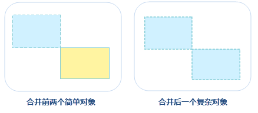

- 如果参与对象运算的面相交于线，则这些面对象间的相邻边线将消失，合并成一个简单面对象。

  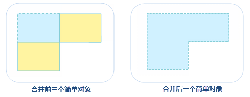

- 如果参与对象运算的面相交于面，则重新合并成一个简单面对象。

  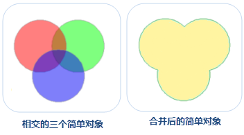

2. 当前图层为复合图层

- 在 CAD 图层中，线对象、曲线对象、椭圆弧对象、圆弧对象参与运算后，生成的新对象的类型为线对象；面对象、矩形对象、圆对象、斜椭圆对象参与运算后，生成的新对象的类型为面对象。
 
**操作步骤**

1. 在图层可编辑状态下，选中两个或者多个对象，在“对象操作”选项卡的“对象编辑”组的 Gallery 控件中，单击“**合并**”，弹出“合并”对话框。
2. 在对话框中设置结果对象的属性赋值方式，应用程序提供了一下四种设置方式：  
 - 为空:指合并结果对象此字段的值为空。   
 - 求和:指合并结果对象此字段的值为各个合并对象相应字段值的和。数值型字段直接相加求和。文本型字段求和时多个对象的文本按照 SmID 顺序自动进行连接。   
 - 加权平均:指合并结果对象此字段的值（必须是数值型的字段）为所有合并对象此字段的平均值。既可以计算简单平均值，也可以计算加权平均值。默认计算简单平均值。   
     - 选中“平均”单选按钮，单击右侧的下拉按钮，选择“无加权字段（平均）”项，即不使用加权字段时，表示计算简单平均值，将所有源对象的选中字段值相加然后除以源对象的个数。  
     - 若在“平均”单选按钮右侧的下拉菜单，选择其一个字段，表示使用该字段与列表框中的选中的字段进行加权平均运算。

- 保存对象:指操作结果对象此字段的值与第几个已经选择的对象的此字段值相同。

3. 设置好以上参数后，单击“确定”按钮，即可完成合并操作。

### 求交

　　求交操作可以得到两个或多个对象的公共部分。通过求交运算，对两个或者多个相同几何类型的对象的公共区域进行操作，从而创建一个新的对象。多个对象的公共区域被保留下来，其余部分被删除。需要注意的是，求交适用于面对象，线线之间不支持求交运算。

**使用说明**

- 如果参与对象运算的面两两交集不为空集，则求交之后，会生成一个两两相交部分的简单对象。
- 如参与对象运算的面两两交集为空，则求交之后，所有源对象都会被删除掉，且不会生成一个新的对象。 
- 生成的新对象需要在属性对话框中设置保留那个对象的属性信息，以及对字段值进行什么样的操作。关于对象求交属性处理对话框及对话框上各参数的说明，请参见[合并](#合并)。
- 在 CAD 图层中，面对象、矩形对象、圆对象、斜椭圆对象对象参与运算后，生成的新对象的类型为面对象。

**操作步骤**

1. 在图层可编辑状态下，选中两个或者多个对象，在“对象操作”选项卡的“对象编辑”组的 Gallery 控件中，单击“**求交**”，弹出“求交”对话框。
2. 在对话框中设置结果对象的属性赋值方式，设置完成后单击“确定”按钮，即可执行求交操作。

### 异或

　　将两个或多个对象的共有部分除去，其余部分合并成一个对象。在进行异或操作时，会出现多种情况，下面对这些情况分别进行说明。

- 如果参与运算的对象仅相交于点或互不相交，则这些面对象被合并成一个复杂对象。

　　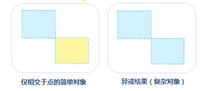

- 如果参与运算的对象仅相交于线，则这些对象间的相邻边线将消失，合并成一个简单对象。

　　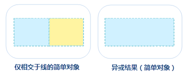

- 如果参与运算的对象两两相交于面且不重合，则两两相交部分会被删除，然后合并成一个复杂对象。

　　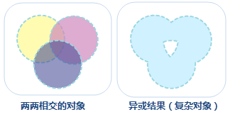

- 如果参与运算对象续相交于面，且无两两相交部分（即公共相交部分），则参与运算的对象会合并成一个简单面对象。

　　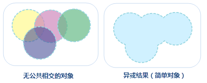

- 如果参与运算的对象相互重合，参与运算的对象全被删除。

操作步骤：

1. 在图层可编辑状态下，选中两个或者多个对象，在“对象操作”选项卡的“对象编辑”组的 Gallery 控件中，单击“**异或**”，弹出“异或”对话框。
2. 在对话框中设置结果对象的属性赋值方式，设置完成后单击“确定”按钮，即可执行异或操作。

### 擦除

　　擦除包括擦除内部和擦除外部两个功能，擦除内部是指根过擦除对象将被擦除对象与其重叠的部分删除；擦除外部是指根据擦除对象范围将被擦除对象与其重叠以外的部门删除。在进行擦除操作前需了解擦除的使用说明，如下所述：

- 被擦除对象所在图层开启可编辑后，选中擦除对象时擦除功能才可用，擦除对象只能是面对象。
- 擦除功能适用于线图层、面图层以及 CAD 图层。 
- 被擦除和擦除对象不能是同一个对象。 
- 被擦除对象可以是多个线对象或面对象，但擦除对象必须为一个面对象。 
- 擦除操作对数据规范性有一定的要求，不允许数据内部存在例如自相交等拓扑错误。建议对复杂的数据，在进行擦除操作前，先对数据进行拓扑检查，修正拓扑错误后再进行操作。 

　　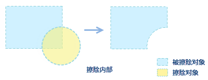

　　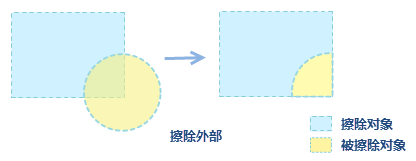

　　擦除的操作步骤为：

1. 开启被擦除对象图层可编辑，在地图中选中一个面对象作为擦除对象，此时“擦除”选项可用。
2. 在“对象操作”选项卡的“对象编辑”组的 Gallery 控件中，单击“**擦除**”选项。
3. 将鼠标移至地图窗口中，选中被擦除对象即可执行擦除操作，按`Ctrl`键的可实现擦除内部和外部的切换。
4. 依次选中被擦除对象可对多个对象进行擦除，单击鼠标右键结束擦除操作。

### 选择对象分割

　　选择对象分割是指通过选择的对象来分割面或线对象，在使用该功能时，需了解以下说明：

- 选中可编辑的图层中的一个或多个对象时，“选择对象分割”功能才可用。
- 分割对象和被分割对象可以是线对象或者面对象，适用于线图层、面图层、CAD 图层。
- 当用线对象来分割对象时，只有分割线完全穿过可编辑的线或者面几何对象，待分割对象才会被分割。

　　选择对象分割的具体操作步骤如下：

1. 将待分割对象所在图层开启可编辑状态，并选中一个或多个待分割对象。
2. 在“对象操作”选项卡的“对象编辑”组的 Gallery 控件中，单击“选择对象分割”。
3. 将鼠标移至当前地图窗口中，鼠标提示“请选择分割对象”，选择一个线对象或面对象作为分割对象，即根据两个对象相交处，将被分割对象进行分割。 如下示例图所示：

　　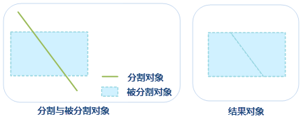

### 岛洞多边形

　　岛洞多边形是一种复杂几何对象类型。在可编辑状态下，将两个或两个以上具有包含关系的面对象在重合区域进行处理（删除或者保留，面对象为偶数则重合部分将删除，为基数则保留），最终形成一个岛洞多边形。如一个区域内有湖泊时，就会得到一个岛洞多边形。

**使用说明**

- 岛洞多边形适用于面图层或者 CAD 图层。 
- 选择两个或两个以上的面对象，进行岛洞多边形操作，会有以下几种情况： 
  - 如果选择的面对象互不相交或者相交于点，则会生成一个复杂对象。
  - 如果选择的面对象相交于线，则这些面对象被合并成一个简单对象。
  - 如果选择的面对象相交于面但不重合，当面对象个数为奇数时，面对象相交部分被保留，结果得到一个复杂对象；当面对象个数为偶数时，面对象相交部分被删除，结果得到一个复杂对象。
   
　　
  - 如果选择的面对象完全重合，当重合个数为奇数，结果会得到一个面对象；当面对象个数为偶数时，所有面对象将被删除。例如：三个重合的圆进行岛洞多边形的操作，最终得到一个圆对象；两个重合的圆进行岛洞多边形的操作，得到的结果为空。

**操作步骤**

1. 在图层可编辑状态下，选择多个面对象，在“对象操作”选项卡的“对象编辑”组的 Gallery 控件中，单击“**岛洞多边形**”选项。 
2. 在弹出“岛洞多边形”对话框中，设置结果对象的属性信息，具体操作方式可参考“**合并**”处的说明。 
3. 单击“岛洞多边形”对话框中的确定“按钮，即可执行岛洞多边形操作，结果示意图如下：

　　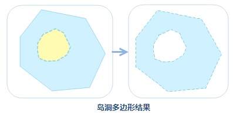

### 分解

　　分解是指将一个或多个复杂或复合对象分解为单一的对象，或者是复杂对象。具体的功能说明如下：

- 分解功能适用于线图层、面图层以及 CAD 图层。
- 只能对复杂对象或者复合对象进行分解，简单对象不能被分解。
- 对复杂对象（即含有多个子对象的对象）进行分解，生成的多个单一对象均为简单对象；对复合对象进行分解，生成多个单一对象，如果生成的单一对象中仍有复合对象则可以继续对其进行分解，直至全为简单对象。如下图所示为一个岛洞多边形，对它进行分解操作之后，得到的新对象为两个单一的对象。
- 生成的新对象的属性信息中字段 SmUserID 和非系统字段继承源对象相应信息，其他系统字段由系统赋值。

操作步骤

1. 在图层可编辑状态下，选中一个或多个复杂对象或复合对象。
2. 在“对象操作”选项卡的“对象编辑”组的 Gallery 控件中，单击“分解”选项，或者单击鼠标右键选择“分解”，即可执行分解操作。
3. 如果分解后的对象仍然包含复合对象，可以继续使用分解功能，对其进行分解，直到全部分解为单一对象。结果示意图如下：

　　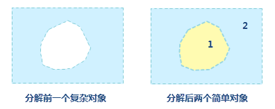

### 保护性分解

　　保护性分解将复杂的具有多层岛洞嵌套关系的面对象分解成只有一层岛洞嵌套关系的面对象。保护性分解与分解的区别在于：如果被分解的面对象存在岛洞关系，保护性分解后的结果会保留最简单一层的岛洞关系面对象，而分解会将岛洞关系的面对象一并分解。

- 保护性分解功能适用于面图层、CAD 图层。
- 只能对复杂对象或者复合对象进行分解，简单对象不能被分解。
- 对复杂对象（即含有多个子对象的对象）进行分解，生成的多个单一对象均为简单对象（除岛洞对象外）；对复合对象进行分解，生成多个单一对象，除岛洞对象外，如果生成的单一对象中仍有复合对象则可以继续对其进行分解，直至全为简单对象。 如下图所示为一个岛洞对象与另一个对象组合，对它进行保护性分解操作之后，得到的新对象为一个岛洞对象和一个单一对象：

　　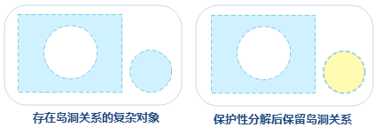  
  
### 填补缝    

  填补缝隙功能用于当两个对象之间存在缝隙时， 需要将缝隙合并到其中一个对象当中去，以消除缝隙。方便用户通过拓展当前面对象来填补该对象与周围面对象之间的缝隙。  
  
+  填补缝隙操作需先选择对象作为被补基面。   
+  填补缝隙操作支持跨图层操作。要求被补对象所在的图层必须为可编辑。  
  
操作步骤  
  
1. 将当前面图层处于可编辑状态。在“对象操作”选项卡的“对象编辑”组的 Gallery 控件中，单击“填补缝隙”按钮，执行填补缝隙操作。   
2. 当前地图窗口鼠标提示“请选择被补基面”，左键选择一个基面作为被补的面对象。   
3. 选中被补基面后，鼠标变为十字光标提示“请绘制补缝隙范围！”，此时，就可以绘制需要补缝的范围。绘制范围时需注意:   
  
 + 绘制范围的多边形必须与被补基面有交集，否则程序将提示“补缝隙失败，您绘制的补缝隙范围不符合要求，请重新绘制。”   
 + 当绘制补缝隙范围大于相邻非被补基面对象时，程序会对二者重叠的部分进行删除，删除后的部分即为需要补缝的范围。   
  
4. 单击右键结束补缝范围的绘制，程序将补缝范围与被补基面合并为一个对象。  
  
　  
  
### 画线分割  
  
“画线分割”：通过绘制的临时分割线来分割线或者面几何对象。只有当前地图窗口中有可编辑的图层且图层中存在一个或多个选中对象时，“画线分割”按钮才可用。临时分割线所穿越的所有可编辑图层中被选中线或者面几何对象都将被分割。  
  
操作步骤  
  
1.将地图窗口中要进行分割的线或者面几何对象所在的图层设置为可编辑状态。  
2.单击选中需要进行分割的线或者面几何对象。或者，通过框选或按住Shift键选择多个几何对象。  
3.在“对象操作”选项卡的“对象编辑”组的 Gallery 控件中，单击“画线分割”按钮，执行画线分割操作。此时，当前地图窗口中的操作状态为画线分割线或者面对象状态。   
4.绘制临时分割线，即绘制用于分割面几何对象的临时折线，具体操作为：鼠标移动到地图窗口时变为  状态，此时，就可以绘制分割线，在适当位置处点击鼠标左键确定分割线的第一个点，移动鼠标，经出现随鼠标移动而不断变化的临时线段，在适当位置处点击鼠标确定分割线的下一个点，继续点击鼠标，绘制临时分割线的其他点。   
5.临时分割线（折线）绘制完成后，右键点击鼠标，结束临时分割线绘制，此时，将执行分割操作，同时临时分割线消失。分割的结果为：临时分割线所穿越的所有可编辑图层中被选中线或者面几何对象都将被分割。  
6. 继续进行下一次的画线分割操作，重复上面第 4 步的操作；如果要添加其他数据中的线或者面几何对象进行切割，那么添加数据并将数据对应的图层设置为可编辑状态，然后在重复上面第 4 步的操作。   
7. 取消画线分割的操作状态，只需点击“画线分割”按钮，使按钮处于非按下状态。   

   
  
### 画面分割    
  
“画面分割”：通过绘制的临时分割面来分割面或者面几何对象。只有当前地图窗口中有可编辑的图层且图层中存在一个或多个选中对象时，“画面分割”按钮才可用。  
  
操作步骤：  
  
1.将地图窗口中要进行分割的线或者面几何对象所在的图层设置为可编辑状态。 用户不需要选中线或者面几何对象，直接对几何对象进行分割操作，临时分割面所穿越的所有可编辑的线或者面几何对象都将被分割。  
2.在“对象操作”选项卡的“对象编辑”组的 Gallery 控件中，单击“画面分割”按钮，执行画面分割操作。此时，当前地图窗口中的操作状态为画面分割面或者面对象状态。   
3. 绘制临时分割面，即绘制用于分割面或者面几何对象的临时面，具体操作为：在适当位置处单击鼠标左键确定分割面的第一个点，移动鼠标，经出现随鼠标移动而不断变化的临时线段，在适当位置处单击鼠标确定分割面的下一个点，继续单击鼠标，绘制临时分割面的其他点。  
4. 临时分割面绘制完成后，右键单击鼠标，结束临时分割面绘制，此时，将执行分割操作，同时临时分割面消失。 分割的结果为：临时分割面所穿越的所有可编辑图层中被选中线或者面几何对象都将在与分割面相交处被分割。  
5. 继续进行下一次的画面分割操作，重复上面第 4 步的操作；如果要添加其他数据中的线或者面几何对象进行切割，那么添加数据并将数据对应的图层设置为可编辑状态，然后在重复上面第 4 步的操作。  
6.  取消画面分割的操作状态，只需单击“画面分割”按钮，使按钮处于非按下状态。  
  
 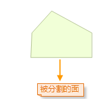   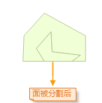 

  
 

  

