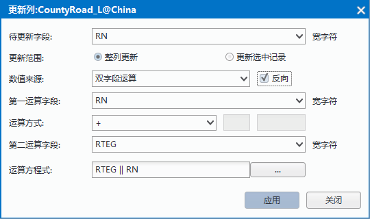

　　“属性表”选项卡的“编辑”组，组织了对矢量数据集的属性表和纯属性数据集的数据进行编辑的功能，可以对属性表中的行和列数据进行整体和批量更新。

### 删除行  
  
“删除行”选项，用于删除矢量数据集的属性表或纯属性数据集中选中的一行或多行属性记录。
  
**操作方式**  
  
1. 打开需要进行删除行操作的属性表，可以是矢量数据集属性表，也可以是纯属性数据集。   
2. 选中矢量数据集的属性表或纯属性数据集中的一行或多行属性记录，或选中要删除行中的单元格。   
3. 单击右键，选择“删除行”选项，或单击“属性表”选项卡“编辑”组中“删除行按钮，弹出对话框提示“被选择的记录一旦被删除是无法恢复的，是否继续”。  
4. 点击“是”，即可删除选中行或选中的单元格对应行的属性记录。 
  
**注意事项**    
    
+ 使用“删除行”按钮删除矢量数据集的属性表中的属性记录，被删除的记录对应的几何对象也会被一并删除，所以“删除行”按钮要慎用。   
+ 只有矢量数据集或纯属性数据集为非只读状态，“删除行”选项才可用，否则该选项会一直显示灰色，即为不可用状态。 

  
### 添加行
  
“添加行”按钮，用于在纯属性数据集中添加属性记录。“添加行”按钮只有在当前属性表窗口中是纯属性数据集时，才为可用状态。

**操作方式**   
  
1. 打开需要进行添加行操作的纯属性数据集，可在工作空间管理器中，右键点击要打开的纯属性数据集，在弹出的右键菜单中选择“浏览属性表”，或双击纯属性数据集，打开属性数据集。  
2. 点击“添加行”按钮，即可在当前纯属性数据集最后添加一行空的属性记录。 
  
**注意事项**   
 
+ 若打开矢量数据集的属性表，“添加行”按钮显示灰色，即为不可用状态。   
+ 只有纯属性数据集为非只读状态，“添加行”按钮才可用，否则该按钮会一直显示为灰色，即为不可用状态。 

  
### 更新列 
  
“更新列”选项，可以实现快速地按一定的条件或规则统一修改当前属性表中多条记录或全部记录的指定属性字段的值，方便用户对属性表数据的录入和修改。

  
  
**操作方式**  
  
1. 打开要进行更新的属性表，可以是矢量数据集属性表，也可以是纯属性数据集。   
2. 若需更新选中的单元格内容，则需先在属性表中选中待更新的单元格，单击“属性表”选项卡中的“更新列”按钮，或单击鼠标右键，在右键菜单中选择“更新列”选项，即可弹出“更新列”对话框，如下图所示： 更新方式，需先选中要进行更新的单元格。     
     
3. 确定更新范围：更新范围提供了整列更新、更新选中记录两种更新方式：   
  + 整列更新：表示对指定的待更新字段中的所有字段值进行更新；   
  + 更新选中记录：表示更新指定的待更新字段中的选中记录，即对属性表中所有选中的单元格的值按照指定的规则进行更新。   
    
4. 数值来源：用来指定用于更新属性表字段值的值来源，分为：统一赋值、单字段运算、双字段运算以及函数运算具体说明请参见表格：  
数值来源|描述  
-|-  
统一赋值|通过指定一个值，在指定的更新范围内的单元格的值都将更新为这个值。
单字段运算 |构建某个指定的字段（“更新列”对话框中“运算字段”所指定的字段）与指定值（“更新列”对话框中“运算因子”所指定的值）的简单数学表达式，例如： SmID + 100，来更新属性表中指定的更新范围内的单元格的值。
在指定的更新范围内，对某个待更新单元格所在的记录而言，取出指定的字段（运算字段）的属性值和用户指定的值（运算因子）、运算方式，构建运算方程式进行运算，返回的值就是待更新单元格更新后的值。
双字段运算|基于指定的两个字段（“更新列”对话框中“第一运算字段”和“第二运算字段”所指定的字段），以及指定的运算方式，构建字段的简单数学表达式，例如： SmID + SmUserID，来更新属性表中指定的更新范围内的单元格的值。在指定的更新范围内，对某个待更新单元格所在的记录而言，取出指定的两个字段（第一、第二运算字段）的属性值和用户指定的运算方式，构建运算方程式进行运算，返回的值就是待更新单元格更新后的值。
函数运算|基于指定的字段（“更新列”对话框中“运算字段”所指定的字段），按照用户指定的函数规则（“更新列”对话框中“运算函数”）构建字段的函数表达式，例如：Abs(SmID)，来更新属性表中指定的更新范围内的单元格的值。在指定的更新范围内，对某个待更新单元格所在的记录而言，取出指定的字段（运算字段）的属性值和用户指定的运算函数，构建函数表达式进行运算，返回的值就是待更新单元格更新后的值  
     
5. 反向： 当数值来源为单字段运算或者双字段运算时，勾选该复选框后，可以交换表达式中运算符两侧的参数位置，然后再进行表达式的运算。  
6. 运算字段：当数值来源为单字段运算或者函数运算时，运算字段用来指定用于构建数学表达式或函数表达式的字段。  
7. 第一运算字段、第二运算字段:当数值来源为双字段运算时，用来指定参与构建运算表达式的两个字段。  
8. 运算方式：当数值来源为单字段运算或者双字段运算时，运算方式用来指定单字段与运算因子间或者双字段间的运算法则，可以为：加、减、乘、除、取模。    
运算方式|描述
-|- 
＋（加）|对数值型参数而言，就是把两个数值相加，返回一个数值；对字符型参数而言，就是把两个字符连接起来，其中前面的参数在新的字符前面，字符型参数之间只有“＋”运算。  
－（减）|只有数值型参数才有此运算方式，运算符前面的数值减去运算符后面的数值。  
×（乘）|只有数值型参数才有此运算方式，运算符前面的数值乘以运算符后面的数值。  
/ （除）|只有数值型参数才有此运算方式，运算符前面的数值除以运算符后面的数值，当除数为零时，不能进行该运算，返回被除数的值。  
％（取模）|只有数值型参数才有此运算方式，运算符前面的数值除以运算符后面的数值，返回余数值。当除数为零时，不能进行该运算，返回被除数的值。
  
 
9. 运算函数：当数值来源为函数运算时，用来指定运算的函数。   
  
  + 当数值来源为函数运算时，“运算函数”右侧两个文本框可用来指定函数的其他参数信息。具体说明请参见运算函数页面。  
  + 当预置的函数不够用时，用户可以点击下拉列表中的“更多”项，在弹出的SQL表达式中编辑自定义的表达式。 
10.  运算方程式：用来显示和编辑需要构建的运算表达式。单击组合框右侧的按钮，即可弹出“SQL表达式”对话框，可在弹出的对话框中构建字段表达式，或在“运算方程式”文本框中直接输入字段表达式，SQL表达式的具体说明请参见SQL表达式对话框页面。在指定的更新范围内，对某个待更新单元格所在的记录而言，根据用户构建的 SQL 表达式进行运算，返回的值就是待更新单元格更新后的值。  
11.  设置好以上参数后单击“应用”按钮，即可根据设置的运算方程式，执行更新属性表中待更新的单元格值的操作。    
  
### 撤销/重做 
  

