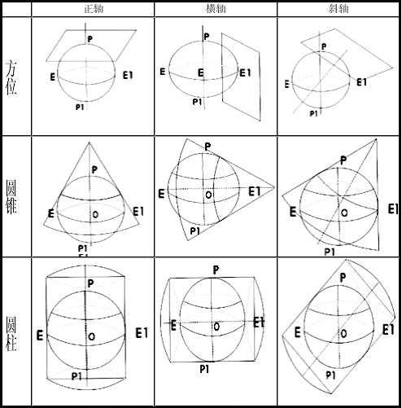

　　地图投影的种类很多，一般按照两种标准进行分类：一是按投影的变形性质分类，二是按照投影的构成方式分类。

#### 按投影变形性质分类

　　按照投影的变形性质可以分为以下几类：等角投影、等积投影、任意投影。

-   等角投影：能保持无限小图形的相似。同一点上长度比处处相同-变形圆，不同点变形圆的半径不同，大范围看，投影图形与地面实际形状并不完全相似。由于这种投影无角度变形，便于图上量测方向/角度，所以常用于对真实角度和方向要求高的地图，比如航海、洋流和风向图等。由于此类投影面积变形很大，故不能量算面积。
-   等面积投影：是等面积投影，便于面积的比较和量算。常用于对面积精度要求较高的自然和经济地图，如地质、土壤、土地利用、行政区划等地图。
-   任意投影既不等角又不等积，各方面变形都存在，但都适中。在任意投影中，有一类比较特殊的投影叫做等距投影，满足正轴投影中经线长度比为1，在斜轴或横轴投影中垂直圈长度比为1。任意投影常用于教学地图、科学参考地图和通用世界地图等。

#### 按投影构成方式分类

　　根据投影构成方式可以分为两类：几何投影和解析投影。

-   几何投影是把椭球体面上的经纬网直接或附加某种条件投影到几何承影面上，然后将几何面展开为平面而得到的一类投影，包括方位投影、圆锥投影和圆柱投影。根据投影面与球面的位置关系的不同又可将其划分为：正轴投影、横轴投影、斜轴投影。如下图所示：

   

  - **方位投影**：以平面作为几何承影面，使平面与椭球体面相切或相割，将球面经纬网投影到平面上而成的投影。在切点或割线上无任何变形，离切点或割线越远，变形越大。

  - **圆锥投影**：以圆锥作为几何承影面，使圆锥与椭球体面相切或相割，将球面经纬网投影到圆锥面上而成的投影。该投影适用于中纬度地带沿纬线方向伸展地区的地图，我国的地图多用此投影。

  - **圆柱投影**：以圆柱作为几何承影面，使圆柱与椭球体面相切或相割，将球面经纬网投影到圆柱面上而成的投影。该投影方式一般适用于编制赤道附近地区的地图和世界地图。

-   解析投影是不借助于辅助几何面，直接用解析法得到经纬网的一种投影。主要包括：伪方位投影、伪圆锥投影、伪圆柱投影、多圆锥投影。

  - **伪方位投影**：据方位投影修改而来。在正轴情况下，纬线仍为同心圆，除中央经线为直线外，其余经线均改为中央经线的曲线，且相交于纬线的圆心。

  - **伪圆柱投影**：据圆柱投影修改而来。在正轴圆柱投影的基础上，要求纬线仍为平行直线，除中央经线为直线外，其余的经线均改为对称于中央经线的曲线。

  - **伪圆锥投影**：据圆锥投影修改而来。在正轴圆锥投影的基础上，要求经线仍为同心圆弧，除中央经线为直线外，其余的经线均改为对称于中央经线的曲线。

  - **多圆锥投影**：这是一种假想借助多个圆锥表面与球体相切而设计成的投影。纬线为同轴圆弧，其圆心均位于中央经线上，中央经线为直线，其余的经线均为对称于中央经线的曲线。

 
