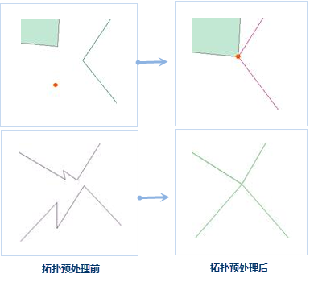
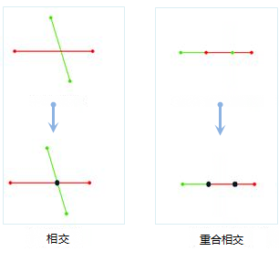
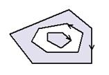

### 使用说明

　　在使用拓扑数据集对关联数据集进行拓扑检查前，需要对待拓扑检查数据进行拓扑预处理操作，通过预处理将那些在容限范围内的问题数据进行调整。不进行拓扑预处理，可能会导致拓扑检查的结果出现错误。拓扑预处理方式包括：插入节点、节点和节点的捕捉、多边形走向的调整。

### 操作步骤

1.  在 “数据处理” 菜单栏中选择 “拓扑预处理...” 项，在弹出对话框中单击“添加”按钮，在数据集列表框内添加需要进行拓扑预处理的数据集。

2.  用户需在对话框中进行如下参数设置：
  -   **容限值**：用于进行拓扑预处理的容限值，它是一个距离值，指的是在这个值的范围内，所有的节点或（和）线被认为是重合的、同一的。例如，若一个线对象的节点与另一个线对象的节点距离在容限范围内，则认为这两个节点重合；若一个线对象的节点与一个点对象的距离在容限范围内，则认为点在线上。节点或（和）线之间的距离小于容限值时，将进行拓扑预处理。  
  -   **节点捕捉**：将容限范围内的节点捕捉在一起（即将捕捉在一起的节点修改为同样的二维坐标），其中“节点”的含义是指点对象以及线对象和面对象的所有控制节点。勾选“节点捕捉”复选框后，可在“参考数据集”处选择一个数据集，以该数据集的节点位置为参照进行捕捉。在捕捉后会将线对象和面对象在容限范围内的临近点去除，节点捕捉处理效果如下图所示。

  

   -   **节点与线段间插入节点**：若勾选此项，则会根据设置的容限值，对待检查数据集中的拓扑错误进行预处理，在点到线段距离小于容限的情下况，将点到线的垂足插入到线上。
    

  -   **线段间求交插入节点**：若勾选此复选框，则在线段相交或重合相交处，并保证数据走向的同时插入节点，处理效果如下图所示。

    

  -   **多边形走向调整**：若勾选此复选框，则将传入面数据集对象的边界走向调整为标准走向，即外边界为顺时针走向，洞为逆时针走向，岛为顺时针走向，如下图所示。

   

### 注意事项

　　拓扑预处理会改变源数据集中的空间位置，用户若不想修改原始数据，请在拓扑预处理之前进行数据的备份工作。

