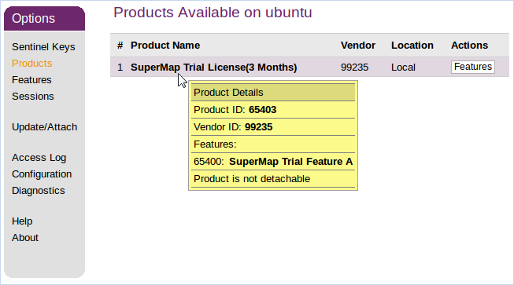

title: SuperMap iDesktop Cross 许可配置(Linux)
---

　　在启动SuperMap iDesktop Cross之前，需要进行许可配置，在 Linux 操作系统下，支持软许可和硬件许可，但都必须安装驱动程序，所有的许可验证都是通过驱动的方式进行通信。

### 1 安装许可驱动

　　安装许可驱动需要以　root 身份进行，解压　Cross　的　tar　包之后，在根目录的　support\SuperMap_License\support\aksusbd-2.4.1-i386　目录下进行安装即可。

　　进入上述目录后，通过以下命令即可执行许可驱动的安装：

    $ ./dinst

　　或者

    $ sh dinst

　　安装完许可驱动后就可获得90天的试用许可，即可使用 SuperMap GIS 系列产品。如果 通过dinst命令没有可执行权限，请授予执行权限，执行如下命令：

    $ chmod +x dinst

　　在 Linux 64位操作系统上安装 SuperMap License Center 许可驱动程序时，有的会出现：“The 32bit support is missing…”错误，是因为该 Linux 64 位操作系统缺少 32bit 支持库，所以运行会出错。解决方法是需要手动安装支持32位的支持库，缺少的支持库如下所述。您可以加载系统盘的补充安装相关库，也可以到相应系统的官网上获取相关库来安装。

-   libc6-i386 和 ia32-libs（Ubuntu）

-   libstdc++-devel.i686、glibc.i686、libgcc.i686、libstdc++.i686、glibc-devel.i686（RHEL、CentOS、OpenSUSE、SLES 和 OES）

-   glibc-32bit（OpenSUSE、SLES 和 OES） 

### ２  配置许可信息

#### 2.1  配置软许可

　　SuperMap 许可中心目前提供的软许可配置方式为软件激活，不同于 Windows 操作系统下的界面化配置，在 Linux 操作系统下是通过./licensetool.sh 命令，来完成软许可配置。

　　进入软件包的根目录，执行如下命令，可以查看配置软许可的相关命令：

    $ ./licensetool.sh

　　进入软件包的根目录，使用“软件激活”的方式配置许可，步骤如下：

　　(1)获取本机信息，执行如下命令，并指定生成的本机信息文件所存放的路径，再指定的路径下生成\*.c2v 文件。

    $ ./licensetool.sh -create /路径名称/\*.c2v

　　(2) 将本机信息提交给“北京超图软件股份有限公司”。

　　将上一步骤生成的本机信息文件（\*.c2v）提交给北京超图软件股份有限公司，我们将根据您的申请生成\*.v2c许可文件并返回给您，您通过该文件配置正式许可。

　　(3)将您获得的\*.v2c 正式许可文件指定到文件位置，执行如下命令：

    $ ./licensetool.sh -update /路径名称/\*.v2c

#### 2.2 配置硬件许可

　　在您进行许可配置之前，请确保已经获得北京超图软件股份有限公司的授权许可。如果在同一网段内已经配置了许可服务器，则许可会自动配置，不需要再进行手工配置；如果当前网络环境中（其他网段）存在可用的硬件锁许可，请按照以下步骤进行许可配置：

　　(1) 打开浏览器，访问 http://localhost:1947 或 http://本地 IP:1947。

　　(2) 在左侧 Options 中选择 Configuration。

　　(3) 在右侧选择 Access to Remote License Managers 选项卡。

　　(4) 在 Specify Search Parameters 填入其他网段的许可服务器 IP，点击 Submit。

　　(5) 稍等几分钟就可以在左侧 Options 中的 Sentinel Keys 选项下看到该服务器的加密锁了。

　　许可状态的查询也可以通过在SuperMap iDesktop Cross包的根目录下，执行如下命令进行查看：

    $ ./licensetool.sh -s

#### 2.3 申请试用许可

　　(1) 生成运行报告

　　在包的根目录下执行如下命令，并指定运行报告的存放路径：

    $ ./licensetool.sh -report /路径名/\*.report

　　命令运行后将在指定的路径下生成 \*.report 文件。

　　(2)申请试用许可

　　您可以直接在北京超图软件股份有限公司官网上的“SuperMap技术资源中心”申请试用许可，申请后您将获得：

-   如果申请的是 SuperMap GIS 7C 系列产品的许可，您将获得 一个\*.lic7c 格式的许可文件；

-   如果申请的是 SuperMap GIS 8C 系列产品的许可，您将获得 一个\*.lic 格式的许可文件。

　　(3) 试用许可生效

　　您可以通过以下两种方式使申请的试用许可生效：

　　方式一：将获得的试用许可文件放在操作系统的opt目录下，具体为：/opt/SuperMap/License/。请注意为该目录授予读写权限。系统会自动使用该目录的许可文件，无须其他配置。

　　方式二：进入SuperMap iDesktop Cross包的根目录，将您获得的 \*.lic 或 \*.lic7c 试用许可文件指定到文件位置，执行以下命令：

    $ ./licensetool.sh -update /路径名/\*.lic

　　或

    $ ./licensetool.sh -update /路径名/\*.lic7c

### 3 管理许可信息

  通过许可管理，您可以查看许可状态，更新许可，许可借入/借出，许可归还等。

#### 3.1 查看许可状态

　　许可状态的查询可以通过在产品根目录下执行如下命令进行查看：

    $ ./licensetool.sh  -s

　　许可状态信息依次为产品ID、模块ID、产品名称、许可类型（包括正式版和试用版）、许可个数，以及许可过期时间。

#### 3.2 许可更新

　　将您获得的\*.v2c正式许可文件指定到文件位置，执行如下命令：

    $ ./licensetool.sh  -update /路径名/\*.v2c

　　许可更新可以接受以下几种文件，用于不同的目的：

-   许可激活文件(\*.v2c)，用于在当前计算机激活购买的正式许可，需要先获取本机信息以生成许可激活文件。

-   7C文件许可(\*.lic7c)，用于更新当前计算机中7C系列产品的试用许可，需要先生成当前计算机的运行报告。

-   文件许可(\*.lic)，用于更新当前计算机中8C、9D系列产品的试用许可，需要先生成当前计算机的运行报告。

-   许可借出凭证(\*.h2r)，用于将网络软许可中的一个许可借出到当前计算机。

-   许可归还凭证(\*.r2h)，用于将借出的许可提前归还到当前的许可服务器，由借入许可的计算机生成。

#### 3.2  许可借入/借出

　　1.  生成借入信息文件(\*.id)

　　在需要借入许可的服务器上运行如下命令，生成本机的借入信息文件(\*.id)：

     $ ./licensetool.sh –id \*.id

　　2.  设置允许许可借出

　　在许可借出的服务器上设置允许许可借出：

-   打开浏览器，访问 http://localhost:1947 或 http://本地 IP:1947；

-   在左侧 Options 中点击 Configuration，进入配置页面；

-   在页面右上方点击 Detachable License，打开借出许可的配置页面；

-   勾选 Enable Detaching of Licenses，即可允许许可借出；

-   您还可以根据实际情况设置许可借出的限制，如最长借出时间（Max. Detach Duration）等。

　　3.  生成许可借出文件

　　在借出许可的服务器上运行如下命令，生成借出凭证文件：

        $ ./licensetool.sh -detach  \[daycount\] \[productid\] \[idfile\] \[h2rfile\]

　　示例：（借出2天，产品ID为1，借入许可的服务器信息文件server1.id，生成借出凭证文件 mylicense.h2r）

        $ ./licensetool.sh -detach 2 1 server1.id mylicense.h2r

　　其中:

-   daycount 为需要借出许可的天数，不能超出最长借出时间；

-   productid 为借出的产品ID，您可以通过 http://localhost:1947，在 Products 页面将鼠标放在想要借出的产品上查看产品ID；

　　

-   idfile为需要借入许可的服务器的信息文件（\*.id）

-   h2rfile为生成借出凭证文件（\*.h2r）

　　4.  配置使用借到的许可

　　借入许可的服务器获取到借出凭证文件（\*.h2r）后，需要执行更新许可命令：

    $ ./licensetool.sh –u \*.h2r

#### 3.4 许可归还

　　在借入许可的服务器上运行如下命令，获取归还凭证文件（\*.r2h）：

    $ ./licensetool.sh –cd KeyID canceldetachfile

　　KeyID 可用 infofile 命令获取许可信息文件，在 infofile 命令后指定信息文件生成的目录位置：

    $ ./licensetool.sh –infofile /路径名/

　　执行上述命令后，在指定的目录下会生成后缀为 .xml 的许可信息文件，其中参数为&lt;attached&gt;true&lt;/attached&gt;为可归 keyID。

　　在许可服务器上面运行许可更新命令，完成许可归还。

    $ ./licensetool.sh –update \*.r2h

　　通过查看许可状态命令可看到许可总数自动加1。

    $ ./licensetool.sh –status
