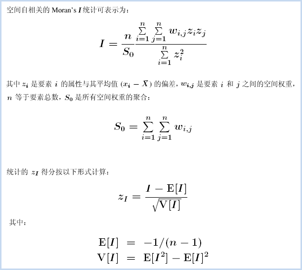
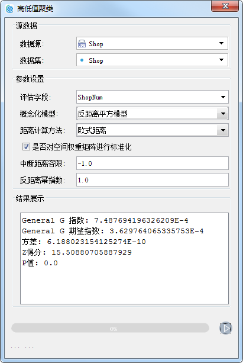
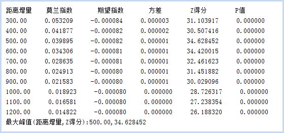

title: 分析模式
---

　　分析模式可用于评估一组要素的空间模式是聚类、离散还是随机的。分析模式采用推论式统计，会在进行统计检验时预先建立零假设，假设要素或与要素相关的值都表现为空间随机模式。分析结果会得到一个 p 值，用来表示零假设的正确概率，用以判定是接受"零假设"还是拒绝"零假设"。分析结果过还会得到Z值，用来表示标准差的倍数，用以判定数据是呈聚类、离散或随机。在制定特定决策时可能需要高置信度的数据，这时，计算概率就可能很重要。例如，如果您的决策涉及公众安全或法律，则可能需要用统计证据来证明您的决策的合理性。

　　通过分析模式可将数据模式量化，先对数据进行初始分析，然后再进行更深入的分析。分析模式提供了空间自相关、高低值聚类、增量空间自相关、平均最近邻四个工具，具体说明如下：

- **空间自相关**：根据要素的空间位置和属性值，通过莫兰指数统计量测量空间自相关性。
- **高低值聚类**：统计可度量高值或低值的聚类程度。
- **增量空间自相关**：测量一系列距离的空间自相关，并选择性创建这些距离及其相应 z 得分的折线图。z 得分反映空间聚类的程度，具有统计显著性的峰值 z 得分表示促进空间过程聚类最明显的距离。这些峰值距离通常为具有“距离范围”或“距离半径”参数的工具所使用的合适值。
- **平均最近邻**：根据每个要素与其最近邻要素之间的平均距离计算其最近邻指数。

### 空间自相关

　　根据指定的要素及相关属性，使用全局莫兰指数统计量评估要素所表达的模式是聚类模式、离散模式还是随机模式。

##### 分析原理

　　空间自相关的统计值可根据以下公式计算：

　　Global Moran's I 统计量所依据的数学公式如上所示。该工具计算所评估属性的均值和方差。然后，将每个要素值减去均值，从而得到*与均值的偏差*。将所有相邻要素（例如位于指定距离范围内的要素）的偏差值相乘，从而得到*叉积*，Global Moran's I 统计量的分子是这些叉积的和。

　　空间自相关 (Global Moran's I) 工具计算了指数值后，将计算期望指数值。然后，将期望指数值与观察指数值进行比较。在给定数据集中的要素个数和全部数据值的方差的情况下，该工具将计算 z 得分和 p 值，用来指示此差异是否具有统计学上的显著性。指数值不能直接进行解释，只能在零假设的情况下进行解释。

##### 　　  应用案例

- 通过查找距离（即空间自相关最强位置对应的距离），可为各种空间分析方法确定合适的邻近距离。
- 度量种族或民族分离随时间推移的总体趋势 - 分离程度是逐渐增强还是逐渐减弱？
- 总结某种观点、疾病或趋势随空间和时间变化的传播情况 - 观点、疾病或趋势是保持隔离和集中，还是传播开并变得更加分散？

##### 　　操作说明

　　Cross 提供了两个功能入口，如下所述：

- 单击菜单栏中的“工具箱”菜单，在“空间统计分析”的二级菜单中，选择“分析模式”中的“空间自相关”，即可弹出“空间自相关”对话框。
- 在“可视化建模”面板中，双击“空间统计分析”→“分析模式”→“空间自相关”，即可弹出“空间自相关”对话框。

##### 　　主要参数

- **源数据**：设置待分析的矢量数据集，支持点、线、面三种类型的数据集。建议源数据中的对象个数大于或等于30，以保证结果的可靠性。
- **评估字段**：选择待分析变量的属性字段。
- **概念化模型**：选择应反映要分析的要素之间的固有关系，设置要素在空间中彼此交互方式构建的模型越逼真，结果就越准确。
  - 固定距离模型：适用于点数据、及面大小变化较大的面数据。
  - 面邻接模型(共边、相交)：适用于存在相邻边、相交的面数据。
  - 面邻接模型(邻接点、共边、相交)：适用于有邻接点、相邻边、相交的面数据。
  - 反距离模型：所有要素均被视为所有其他要素的相邻要素，所有要素都会影响目标要素，但是随着距离的增加，影响会越小，要素之间的权重为距离分之一，适用于连续数据。
  - 反距离平方模型：与”反距离模型”相似,随着距离的增加，影响下降的更快，要素之间的权重为距离的平方分之一。
  - K最邻近模型：距目标要素最近的K个要素包含在目标要素的计算中（权重为1）,其余的要素将会排除在目标要素计算之外（权重为0）。如果想要确保具有一个用于分析的最小相邻要素数，该选项非常有效。当数据的分布在研究区域上存在变化以致于某些要素远离其他所有要素时，该方法十分适用。当固定分析的比例不如固定相邻对象数目重要时，K 最近邻方法较适合。
  - 空间权重矩阵：需要提供空间权重矩阵文件，空间权重是反映数据集中每个要素和其他任何一个要素之间的距离、时间或其他成本的数字。如果要对城市服务的访问性进行建模，例如要查找城市犯罪集中的地区，借助网络对空间关系进行建模是一个好办法。可选择已有的空间权重矩阵文件 (.swm)，也可根据源数据集创建一个新的空间矩阵文件。
  - 无差别区域模型：该模型是”反距离模型”和”固定距离模型”的结合，会将每个要素视为其他各个要素的相邻要素，该选项不适合大型数据集，在指定的固定距离范围内的要素具有相等的权重（权重为1）；在指定的固定距离范围之外的要素,随着距离的增加，影响会越小。
- **中断距离容限**：”-1”表示计算并应用默认距离，此默认值为保证每个要素至少有一个相邻的要素；”0”表示为未应用任何距离，则每个要素都是相邻要素。非零正值表示当要素间的距离小于此值时为相邻要素。
- **反距离幂指数**：控制距离值的重要性的指数，幂值越高，远数的影响会越小。
- **相邻数目**：设置一个正整数，表示目标要素周围最近的K个要素为相邻要素。当概念化模型选择的是“K最邻近模型”时需要设置该参数。
- **距离计算方法**：目前只支持欧式距离的计算方式，即两要素间的直线距离。
- **空间权重矩阵标准化**：当要素的分布由于采样设计或施加的聚合方案而可能偏离时，建议使用行标准化。选择行标准化后，每个权重都会除以行的和（所有相邻要素的权重和）。行标准化的权重通常与固定距离相邻要素结合使用，并且几乎总是用于基于面邻接的相邻要素。这样可减少因为要素具有不同数量的相邻要素而产生的偏离。行标准化将换算所有权重，使它们在 0 和 1 之间，从而创建相对（而不是绝对）权重方案。每当要处理表示行政边界的面要素时，您都可能会希望选择“行标准化”选项。

##### 结果输出

　　设置好以上参数后，单击对话框中的“运行”按钮，即可执行空间自相关分析，分析结果会在“结果展示”文本框中展示，如下图所示：

空间自相关分析结果会返回：Moran's I 指数、预期指数、方差、Z得分、 P值五个参数，使用 z 得分或 p 值指示统计显著性时，则可以拒绝零假设，如果 Moran's I 指数值为正值，就表示这份数据具有空间正相关性，数据集用于分析的值与空间聚集度成正比；如果 Moran's I 指数值为负则指示离散趋势。下表对结果的解释进行了汇总：

| **分析结果**                 | **空间自相关**                                |
| ------------------------ | ---------------------------------------- |
| p 值不具有统计学上的显著性。          | 不能拒绝零假设。要素值的空间分布很有可能是随机空间过程的结果。观测到的要素值空间模式可能只是完全空间随机性  的众多可能结果之一。 |
| p 值具有统计学上的显著性，且 z 得分为正值。 | 可以拒绝零假设。如果基础空间过程是随机的，则数据集中高值或低值的空间分布在空间上聚类的程度要高于预期。 |
| p 值具有统计学上的显著性，且 z 得分为正值。 | 可以拒绝零假设。如果基础空间过程是随机的，则数据集中高值和低值的空间分布在空间上离散的程度要高于预期。离散空间模式通常会反映某种类型的竞争过程 - 具有高值的要素排斥具有高值的其他要素；类似地，具有低值的要素排斥具有低值的其他要素。 |

　　

### 高低值聚类

　　高低聚类是使用 Getis-Ord General G 统计可度量高值或低值的聚类程度。General G 指数也是一种推论统计，即利用有限的数据来对整体情况的特征进行估计。当结果返回的P值较小，且在统计学上显著，则可以拒绝零假设，此时，若 Z 值为正数，则观测的 General G 指数会比期望的 General G 指数要大，表明属性的高值将在研究区域中聚类；若 Z 值为负数，则观测的 General G 指数会比期望的 General G 指数要小一些，表明属性的低值将在研究区域中聚类。

##### 　　应用案例

- 在访问急症室的次数中查找出现的异常峰值，可能表明在局部或区域的健康问题的爆发。 
- 比较在城市中不同种类零售业的空间模式，利用比较购物的方式来了解哪类行业充满竞争性（如汽车经销商）以及哪类行业拒绝竞争（如健康中心/健身房）。 
- 汇总空间现象聚类的程度以检查不同时期或不同位置的变化。例如，众所周知的城市及其人口聚类。使用高/低聚类分析时，可以随时间来比较某个城市的人口聚类的程度（城镇发展以及密集度的分析）

##### 　　操作说明

　　Cross 提供了两个功能入口，如下所述：

- 单击菜单栏中的“工具箱”菜单，在“空间统计分析”的二级菜单中，选择“分析模式”中的“高低值聚类”，即可弹出“高低值聚类”对话框。
- 在“可视化建模”面板中，双击“空间统计分析”→“分析模式”→“高低值聚类”，即可弹出“高低值聚类”对话框。

##### 　　主要参数
- **概念化模型**：选择应反映要分析的要素之间的固有关系，设置要素在空间中彼此交互方式构建的模型越逼真，结果就越准确。
  - 固定距离模型：适用于点数据、及面大小变化较大的面数据。
  - 面邻接模型(共边、相交)：适用于存在相邻边、相交的面数据。
  - 面邻接模型(邻接点、共边、相交)：适用于有邻接点、相邻边、相交的面数据。
  - 反距离模型：所有要素均被视为所有其他要素的相邻要素，所有要素都会影响目标要素，但是随着距离的增加，影响会越小，要素之间的权重为距离分之一，适用于连续数据。
  - 反距离平方模型：与”反距离模型”相似,随着距离的增加，影响下降的更快，要素之间的权重为距离的平方分之一。
  - K最邻近模型：距目标要素最近的K个要素包含在目标要素的计算中（权重为1）,其余的要素将会排除在目标要素计算之外（权重为0）。如果想要确保具有一个用于分析的最小相邻要素数，该选项非常有效。当数据的分布在研究区域上存在变化以致于某些要素远离其他所有要素时，该方法十分适用。当固定分析的比例不如固定相邻对象数目重要时，K 最近邻方法较适合。
  - 空间权重矩阵：需要提供空间权重矩阵文件，空间权重是反映数据集中每个要素和其他任何一个要素之间的距离、时间或其他成本的数字。如果要对城市服务的访问性进行建模，例如要查找城市犯罪集中的地区，借助网络对空间关系进行建模是一个好办法。可选择已有的空间权重矩阵文件 (.swm)，也可根据源数据集创建一个新的空间矩阵文件。
  - 无差别区域模型：该模型是”反距离模型”和”固定距离模型”的结合，会将每个要素视为其他各个要素的相邻要素，该选项不适合大型数据集，在指定的固定距离范围内的要素具有相等的权重（权重为1）；在指定的固定距离范围之外的要素,随着距离的增加，影响会越小。
- **中断距离容限**：”-1”表示计算并应用默认距离，此默认值为保证每个要素至少有一个相邻的要素；”0”表示为未应用任何距离，则每个要素都是相邻要素。非零正值表示当要素间的距离小于此值时为相邻要素。
- **反距离幂指数**：控制距离值的重要性的指数，幂值越高，远数的影响会越小。
- **相邻数目**：设置一个正整数，表示目标要素周围最近的K个要素为相邻要素。当概念化模型选择的是“K最邻近模型”时需要设置该参数。
- **距离计算方法**：目前只支持欧式距离的计算方式，即两要素间的直线距离。
- **空间权重矩阵标准化**：当要素的分布由于采样设计或施加的聚合方案而可能偏离时，建议使用行标准化。选择行标准化后，每个权重都会除以行的和（所有相邻要素的权重和）。行标准化的权重通常与固定距离相邻要素结合使用，并且几乎总是用于基于面邻接的相邻要素。这样可减少因为要素具有不同数量的相邻要素而产生的偏离。行标准化将换算所有权重，使它们在 0 和 1 之间，从而创建相对（而不是绝对）权重方案。每当要处理表示行政边界的面要素时，您都可能会希望选择“行标准化”选项。

##### 结果输出

　　设置好以上参数后，单击对话框中的“运行”按钮，即可执行“高低值聚类”分析，分析结果会在对话框的“结果展示”处展示，结果如下图所示：

　　
　　
　　高低值聚类分析是一种推论统计，这意味着分析结果将在零假设的情况下进行解释。分析结果返回的 p 值较小且在统计学上显著，则可以拒绝零假设。如果零假设被拒绝，则 z 得分的符号将变得十分重要，若 z 得分值为正数，则观测的 General G 指数会比期望的 General G 指数要大一些，表明属性的高值将在研究区域中聚类；若 z 得分值为负数，则观测的 General G 指数会比期望的 General G 指数要小一些，表明属性的低值将在研究区域中聚类。

- Z得分为正——观察General G指数大于期望GeneralG指数——数据在高值区域聚类。
- Z得分为负——期望General G指数大于观察GeneralG指数——数据在低值区域聚类。

　　当存在完全均匀分布的值并且要查找高值的异常空间峰值时，首选高低值聚类分析。当观测 General G 指数等于期望 General G 指数时，高值和低值同时聚类，它们倾向于彼此相互抵消。此时可以使用空间自相关分析。

| 结果                           | 高低值聚类                                    | 空间自相关                                    |
| ---------------------------- | ---------------------------------------- | ---------------------------------------- |
| p 值**不**具有统计学上的显著性。          | 不能拒绝零假设。要素属性值的空间分布很有可能是随机空间过程的结果。也就是说，所观测到的值的空间模式很可能是完全空间随机性的众多可能结果之一。 |                                          |
| p 值**具有**统计学上的显著性，且 z 得分为正值。 | 可以拒绝零假设。如果基础空间过程是完全随机的，则数据集中**高**值的空间分布与预期的空间分布相比在空间上的聚类程度更高。 | 可以拒绝零假设。如果基础空间过程是完全随机的，则数据集中高值和/或低值的空间分布在空间上聚类的程度要高于预期。 |
| p 值**具有**统计学上的显著性，且 z 得分为负值。 | 可以拒绝零假设。如果基础空间过程是完全随机的，则数据集中**低**值的空间分布与预期的空间分布相比在空间上的聚类程度更高。 | 可以拒绝零假设。如果基础空间过程是完全随机的，则数据集中高值和低值的空间分布在空间上**离散**的程度要高于预期。离散的空间模式通常反映某种类型的竞争过程：具有高值的要素排斥具有高值的其他要素；类似地，具有低值的要素排斥具有低值的其他要素。 |

### 增量空间自相关

　　测量要素间距离的空间自相关，通过 z 值反映空间聚类的程度，具有统计显著性的峰值 z 得分表示促进空间过程聚类最明显的距离。峰值距离通常为具有“距离范围”或“距离半径”参数的功能使用，在做类似热点分析或者密度分析的时候，选择一个合适的距离，非常重要的事情。此时，通过增量空间自相关，分析得到一个合适的距离。

　　例如，有一份北京市的微博登录数据，想要研究登录点空间分布的热点及聚集情况，并以每个位置的登录人数作为评估字段，从空间和人数两方面进行聚类研究，可通过热点分析或核密度分析，得到相应的结果，在此之前，先通过“增量空间自相关”分析得到合适的距离值。

##### 　　应用案例

- ​
- ​

##### 　　操作说明

　　Cross 提供了两个功能入口，如下所述：

- 单击菜单栏中的“工具箱”菜单，在“空间统计分析”的二级菜单中，选择“分析模式”中的“增量空间自相关”，即可弹出“增量空间自相关”对话框。
- 在“可视化建模”面板中，双击“空间统计分析”→“分析模式”→“增量空间自相关”，即可弹出“增量空间自相关”对话框。

##### 　　主要参数
- **源数据**：设置待分析的矢量数据集，支持点、线、面三种类型的数据集。
- **评估字段**：设置分析要素参与分析的属性字段值，该字段值应为多种值，若所有哦对象的属性值都为1，则无法求解。仅支持数值型字段。
- **开始距离**：指增量空间自相关开始分析的起始距离，可以根据数据的聚集情况来确定。如果未给定开始距离，则默认值为最小距离，在该距离处，数据集中的每个要素至少具有一个相邻要素。如果您的数据集中存在位置异常值，那么此距离可能不是最合适的开始距离。
- **距离增量**：增量空间自相关每次分析的间隔距离，即第二次分析会用开始距离加上距离增量进行分析。如果未给定增量距离，则使用平均最近邻距离或 (Md - B) / C（其中 Md 为最大阈值距离，B 为开始距离，C为距离段数量）二者当中的较小者。该算法可确保始终根据指定的距离段数量来执行计算，确保最大距离段不会过大以致一些要素以所有其它要素或几乎所有其它要素作为其相邻要素。
- **递增距离段数**：增量空间自相关指定分析数据集的次数，数值范围为：2 ~ 30。 
- **距离计算方法**：目前只支持欧式距离的计算方式，即两要素间的直线距离。
- **空间权重矩阵标准化**：当要素的分布由于采样设计或施加的聚合方案而可能偏离时，建议使用行标准化。选择行标准化后，每个权重都会除以行的和（所有相邻要素的权重和）。行标准化的权重通常与固定距离相邻要素结合使用，并且几乎总是用于基于面邻接的相邻要素。这样可减少因为要素具有不同数量的相邻要素而产生的偏离。行标准化将换算所有权重，使它们在 0 和 1 之间，从而创建相对（而不是绝对）权重方案。每当要处理表示行政边界的面要素时，您都可能会希望选择“行标准化”选项。

##### 结果输出

　　设置好以上参数后，单击对话框中的“运行”按钮，即可执行“增量空间自相关”分析，分析结果会在对话框的“结果展示”处展示，结果如下图所示：

　　
　　
　　增量空间自相关返回的结果又六个值：距离增量、莫兰指数、预期指数、方差、z 得分、 p 值。z 得分反映空间聚类的程度，具有统计显著性的峰值 z 得分表示促进空间过程聚类最明显的距离。Z的峰值距离通常为具有“距离范围”或“距离半径”参数的所使用的合适值。如上图结果所示，距离增量为500时，Z值最大，说明500适合作为距离半径来进行微博登录数据的热点分析。

### 平均最近邻

　　平均最近邻工具可测量每个要素的质心与其最近邻要素的质心之间的距离，然后计算所有这些最近邻距离的平均值。同时会得到最近邻指数，如果最近邻指数小于 1，则表现的模式为聚类；如果指数大于 1，则表现的模式趋向于扩散。如果该平均距离小于假设随机分布中的平均距离，则会将所分析的要素分布视为聚类要素。如果该平均距离大于假设随机分布中的平均距离，则会将要素视为分散要素。平均最近邻可以得出一份数据的具体聚集程度的指数，通过这个指数，可以对比不同数据中，哪个数据的聚集程度最大。

　　平均最近邻方法对面积值非常敏感。均最近邻最适用于对固定研究区域中不同的要素进行比较。如果没有设置面积值，则会使用默认面积值。该默认面积值为数据集的最小面积外接矩形的面积。

##### 　　应用案例

- 评估竞争或领地：量化并比较固定研究区域中的多种植物种类或动物种类的空间分布；比较城市中不同类型的企业的平均最近邻距离。 
- 监视随时间变化的更改：评估固定研究区域中一种类型的企业的空间聚类中随时间变化的更改。 
- 将观测分布与控制分布进行比较：在木材分析中，如果给定全部可收获木材的分布，则您最好将已收获面积图案与可收获面积图案进行比较，以确定砍伐面积是否比期望面积更为聚类。

##### 　　操作说明

　　Cross 提供了两个功能入口，如下所述：

- 单击菜单栏中的“工具箱”菜单，在“空间统计分析”的二级菜单中，选择“分析模式”中的“平均最近邻”，即可弹出“平均最近邻”对话框。
- 在“可视化建模”面板中，双击“空间统计分析”→“分析模式”→“平均最近邻”，即可弹出“平均最近邻”对话框。

##### 　　主要参数
- **源数据**：设置待分析的矢量数据集，支持点、线、面三种类型的数据集。
- **研究区域面积**：设置研究区域面积的大小，单位为平方米，面积值域为≥0；若研究区域面积为0，则会自动将源数据集的最小外接矩形面积作为研究区域面积来计算。
- **距离计算方法**：目前只支持欧式距离的计算方式，即两要素间的直线距离。

##### 　　结果输出

　　设置好以上参数后，单击“运行”按钮即可执行“平均最近邻”分析，分析结果包括以下5个参数：最近邻指数、预期平均距离、平均观测距离、z得分、P值，如下图所示。

　　最近邻指数是平均观测距离与预期平均距离的比率，如果最近邻指数小于 1，则表现的模式为聚类。如果最近邻指数大于 1，则表现的模式趋向于扩散。下图结果表示该数据模式趋向于聚类分布。

　　

###  相关主题

[基础词汇](BasicVocabulary.html)

[地理度量分析](MeasureGeographicDistributions.html)

[聚类分析](Clusters.html)

[空间关系建模](SpatialRelationshipModeling.html)
