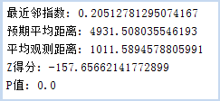

title: 平均最近邻
---

　　平均最近邻工具可测量每个要素的质心与其最近邻要素的质心之间的距离，然后计算所有这些最近邻距离的平均值。同时会得到最近邻指数，如果最近邻指数小于 1，则表现的模式为聚类；如果指数大于 1，则表现的模式趋向于扩散。如果该平均距离小于假设随机分布中的平均距离，则会将所分析的要素分布视为聚类要素。如果该平均距离大于假设随机分布中的平均距离，则会将要素视为分散要素。平均最近邻可以得出一份数据的具体聚集程度的指数，通过这个指数，可以对比不同数据中，哪个数据的聚集程度最大。

　　平均最近邻方法对面积值非常敏感。均最近邻最适用于对固定研究区域中不同的要素进行比较。如果没有设置面积值，则会使用默认面积值。该默认面积值为数据集的最小面积外接矩形的面积。

##### 　　应用案例

- 评估竞争或领地：量化并比较固定研究区域中的多种植物种类或动物种类的空间分布；比较城市中不同类型的企业的平均最近邻距离。 
- 监视随时间变化的更改：评估固定研究区域中一种类型的企业的空间聚类中随时间变化的更改。 
- 将观测分布与控制分布进行比较：在木材分析中，如果给定全部可收获木材的分布，则您最好将已收获面积图案与可收获面积图案进行比较，以确定砍伐面积是否比期望面积更为聚类。

##### 　　操作说明

　　Cross 提供了两个功能入口，如下所述：

- 在“空间分析”选项卡的“空间统计分析”组中，单击“分析模式”中的“平均最近邻”，即可弹出“平均最近邻”对话框。
- 在“可视化建模”选项卡中单击“新建”调出“工具箱”，双击“空间统计分析”→“分析模式”→“平均最近邻”，即可弹出“平均最近邻”对话框。

##### 　　主要参数
- **源数据**：设置待分析的矢量数据集，支持点、线、面三种类型的数据集。
- **研究区域面积**：设置研究区域面积的大小，单位为平方米，面积值域为≥0；若研究区域面积为0，则会自动将源数据集的最小外接矩形面积作为研究区域面积来计算。
- **距离计算方法**：目前只支持欧式距离的计算方式，即两要素间的直线距离。

##### 　　结果输出

　　设置好以上参数后，单击“运行”按钮即可执行“平均最近邻”分析，分析结果包括以下5个参数：最近邻指数、预期平均距离、平均观测距离、z得分、P值，如下图所示。

　　最近邻指数是平均观测距离与预期平均距离的比率，如果最近邻指数小于 1，则表现的模式为聚类。如果最近邻指数大于 1，则表现的模式趋向于扩散。下图结果表示该数据模式趋向于聚类分布。

　　

###  相关主题

[空间自相关](SpatialAutocorrelation.html)

[高低值聚类](HighLowClustering.html)

[增量空间自相关](IncrementalSpatialAutocorrelation.html)

