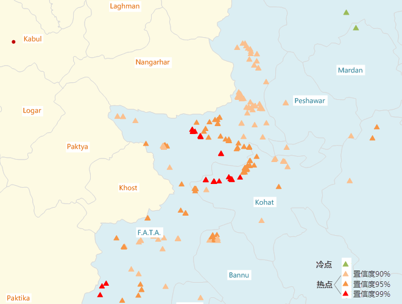

title: 热点分析
---

　　热点分析是给定一组加权要素，使用局部 General G 指数统计识别具有统计显著性的热点和冷点。热点分析会查看邻近要素环境中的每一个要素，因此，仅仅一个孤立的高值不会构成热点，单个要素以及它的邻居都是高值才算是热点。

##### 　　分析原理

　　在衡量高低值聚类的时候，通常需要用 General G 指数。在热点分析工具中，z 得分和 p 值都是统计显著性的度量，用于逐要素地判断是否拒绝零假设。置信区间（Gi_Bin字段） +3 到 -3 中的要素反映置信度为 99% 的统计显著性，置信区间 +2 到 -2 中的要素反映置信度为 95% 的统计显著性，置信区间 +1 到 -1 中的要素反映置信度为 90% 的统计显著性；而置信区间 0 中要素的聚类则没有统计学意义。

　　如果要素的 z 得分高且 p 值小，则表示有一个高值的空间聚类。如果 z 得分低并为负数且 p 值小，则表示有一个低值的空间聚类。z 得分越高（或越低），聚类程度就越大。如果 z 得分接近于零，则表示不存在明显的空间聚类。

##### 　　应用案例

　　应用领域包括：犯罪分析、流行病学、投票模式分析、经济地理学、零售分析、交通事故分析以及人口统计学。其中的一些应用示例包括： 

- 疾病集中爆发在什么位置？ 
- 何处的厨房火灾在所有住宅火灾中所占的比例超出了正常范围？ 
- 紧急疏散区应位于何处？ 
- 峰值密集区出现于何处/何时？ 
- 我们应在哪些位置和什么时间段分配更多的资源？

##### 　　操作说明

　　Cross 提供了两个功能入口，如下所述：

- 单击菜单栏中的“工具箱”菜单，在“空间统计分析”的二级菜单中，选择“聚类分布”中的“热点分析”，即可弹出“热点分析”对话框。
- 在“可视化建模”面板中，双击“空间统计分析”→“聚类分布”→“热点分析”，即可弹出“热点分析”对话框。

##### 　　主要参数

- **源数据**：设置待分析的矢量数据集，支持点、线、面三种类型的数据集。
- **评估字段**：将分析要素分类别的字段，分类后每一组的对象分别会有一个中心要素，分组字段可以是整型、日期型或字符串类型。若分组字段中我字段值为空，则会将该要素从分析中排除。
- **概念化模型**：选择应反映要分析的要素之间的固有关系，设置要素在空间中彼此交互方式构建的模型越逼真，结果就越准确。
  - 固定距离模型：适用于点数据、及面大小变化较大的面数据。
  - 面邻接模型(共边、相交)：适用于存在相邻边、相交的面数据。
  - 面邻接模型(邻接点、共边、相交)：适用于有邻接点、相邻边、相交的面数据。
  - 反距离模型：所有要素均被视为所有其他要素的相邻要素，所有要素都会影响目标要素，但是随着距离的增加，影响会越小，要素之间的权重为距离分之一，适用于连续数据。
  - 反距离平方模型：与"反距离模型"相似,随着距离的增加，影响下降的更快，要素之间的权重为距离的平方分之一。
  - K最邻近模型：距目标要素最近的K个要素包含在目标要素的计算中（权重为1）,其余的要素将会排除在目标要素计算之外（权重为0）。如果想要确保具有一个用于分析的最小相邻要素数，该选项非常有效。当数据的分布在研究区域上存在变化以致于某些要素远离其他所有要素时，该方法十分适用。当固定分析的比例不如固定相邻对象数目重要时，K 最近邻方法较适合。
  - 空间权重矩阵：需要提供空间权重矩阵文件，空间权重是反映数据集中每个要素和其他任何一个要素之间的距离、时间或其他成本的数字。如果要对城市服务的访问性进行建模，例如要查找城市犯罪集中的地区，借助网络对空间关系进行建模是一个好办法。分析之前使用生成网络空间权重工具创建一个空间权重矩阵文件 (.swm)，然后指定提供所创建的 SWM 文件的完整路径。
  - 无差别区域模型：该模型是"反距离模型"和"固定距离模型"的结合，会将每个要素视为其他各个要素的相邻要素，该选项不适合大型数据集，在指定的固定距离范围内的要素具有相等的权重（权重为1）；在指定的固定距离范围之外的要素,随着距离的增加，影响会越小。
- **中断距离容限**："-1"表示计算并应用默认距离，此默认值为保证每个要素至少有一个相邻的要素；"0"表示为未应用任何距离，则每个要素都是相邻要素。非零正值表示当要素间的距离小于此值时为相邻要素。
- **反距离幂指数**：控制距离值的重要性的指数，幂值越高，远数的影响会越小。
- **相邻要素数目**：设置一个正整数，表示目标要素周围最近的K个要素为相邻要素。
- **距离计算方法**：目前支持欧式距离的计算方式，即两要素间的直线距离。
- **是否进行FDR校正**：若进行FDR（错误发现率）校正，则统计显著性将以错误发现率校正为基础，，否则，统计显著性将以P值和z得分字段为基础。
- **自身权重字段**：设置距离权重值，仅支持数值型字段。
- **距离计算方法**：目前只支持欧式距离的计算方式，即两要素间的直线距离。
- **保留统计字段**：在字段列表框中设置结果数据的保留字段，及字段值的计算方式。列表中显示的字段即为结果数据要保留的字段，字段支持删除、添加、全选、反选等操作，选中字段即可设置其保留值的统计类型。
- **结果设置**：设置结果数据所要保存在的数据源，及数据集名称。

##### 　　结果输出

　　设置好以上参数后，单击对话框中的“运行”按钮，即可执行热点分析，下图为巴基斯坦发生恐怖袭击事件的热点分析结果图，图中的橘色和红色点为热点，绿色点为冷点。

　　

　　热点分析返回的结果数据集将会包含四个属性字段：z 得分和 p 值、置信度、Gi_ConfInvl。 

　　如果要素的 z 得分高且 p 值小，则表示有一个高值的空间聚类。如果 z 分低并为负数且 p 值小，则表示有一个低值的空间聚类。z 得分越高（或越低），聚类程度就越大。如果z 得分接近于零，则表示不存在明显的空间聚类。

　　在具有空间聚集性的前提下，Z得分为负值，则表示该处为一个冷点，对应的 Gi_ConfInvl 字段为负数；Z 得分为正值，则表示该处为一个热点，对应的 Gi_ConfInvl 字段为正数。

　　Gi_ConfInvl 字段会识别统计显著性的热点和冷点。Gi_ConfInvl 为+3 和-3 的要素反映置信度为 99%的统计显著性；Gi_ConfInvl 为+2 和-2 的要素反映置信度为 95% 的统计显著性；Gi_ConfInvl 为+1 和-1 的要素反映置信度为 90%的统计显著性；而Gi_ConfInvl 为 0 的要素的聚类则没有统计意义。  

　　如下表所示：

|   Z 得分(标准差)    | P 值(概率) | 置信度  | Gi_ConfInvl 值 |
| :------------: | :-----: | :--: | :-----------: |
| <-1.65 或 >1.65 |  <0.10  | 90%  |    -1 , 1     |
| <-1.96 或 >1.96 |  <0.05  | 95%  |    -2 , 2     |
| <-2.58 或 >2.58 |  <0.01  | 99%  |    -3 , 3     |

###  相关主题

　　[聚类异常值分析](ClusterOutlierAnalyst.html)

　　[分析模式](AnalyzingPatterns.html)

