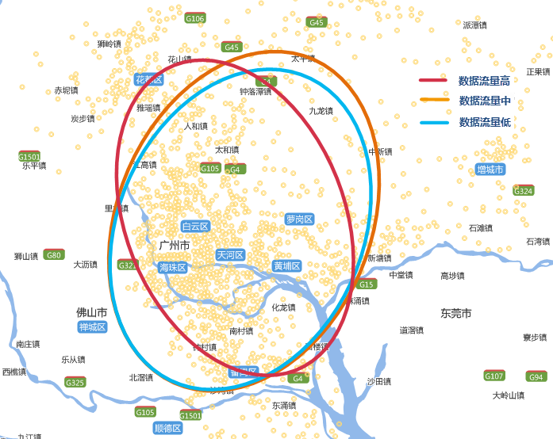
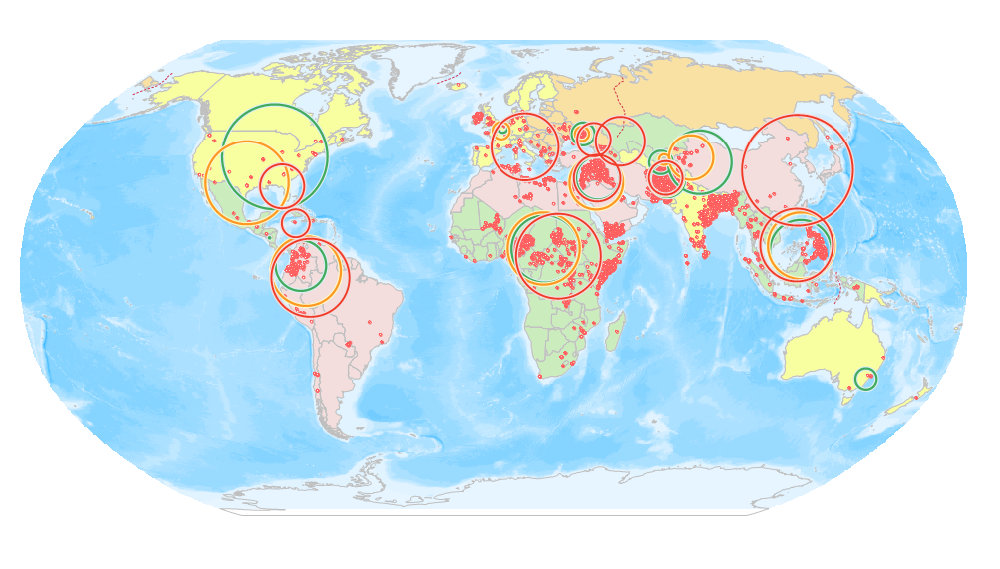

title: 度量地理分析
---

　　度量地理分析用于度量一组要素的各类表现分布特征值，例如中心点、方向分布等，可以应用于选址、方向分布走势或对比、事件分布范围等。度量地理分布提供了如下几种功能：中心要素、平均中心、中位数中心、方向分布、线性方向平均值、标准距离。

### 中心要素

　　中心要素可用于点、线、面要素中位于于最中心位置的要素。

##### 分析原理

　　分析过程中，计算每个要素质心与其他要素质心的累积距离，累积距离最小的要素即为最中心的要素。若指定了权重字段，则中心要素为加权后累积距离最小的要素。

##### 应用案例

- 想在城区建立一个新的大型运动场所，可以从所有的街区中来找中心要素，并且可按人口权重进行计算，即可得到距其他所有街区通行代价最小的位置作为候选地址。
- 某连锁超市在城内有多个仓库，如今有一批刚运来的物资，需要分发到各个仓库，为了节约运输成本，查找出中心仓库，即可根据最短路径分发物资。

##### 操作说明

　　Cross 提供了两个功能入口，如下所述：

- 单击菜单栏中的“工具箱”菜单，在“空间统计分析”的二级菜单中，选择“度量地理分析”中的“中心要素”，即可弹出“中心要素”对话框。
- 在“可视化建模”面板中，双击“空间统计分析”→“度量地理分析”→“中心要素”，即可弹出“中心要素”对话框。

##### 主要参数

- **源数据**：设置待分析的矢量数据集，支持点、线、面三种类型的数据集。若为线或面对象，则取对象的质心进行计算，点的权重都为1，线的权重为线长度，面的权重为面积。
- **分组字段**：将分析要素分类别的字段，分类后每一组的对象分别会有一个中心要素，分组字段可以是整型、日期型或字符串类型。若分组字段中我字段值为空，则会将该要素从分析中排除。
- **权重字段**：计算每一个要素到其他要素距离时进行加权，设置权重字段后的距离为：D = W1 x d，其中W1为权重值，d为两要素间的距离。
- **自身权重字段**：即要素到其它要素的自身耗费，设置自身权重后，距离为D = W1 x d + W2，其中W1为权重值，d为两要素间的距离，W2为自身权重值。
- **距离计算方法**：。
- **保留统计字段**：在字段列表框中设置结果数据的保留字段，及字段值的计算方式。列表中显示的字段即为结果数据要保留的字段，字段支持删除、添加、全选、反选等操作，选中字段即可设置其保留值的统计类型。
- **结果设置**：设置结果数据所要保存在的数据源，及数据集名称。

　　设置好以上参数后，单击对话框中的“运行”按钮，即可执行中心要素分析，结果如下图所示，红色点即为每种连锁超市的中心仓库。

　　

### 平均中心

　　平均中心功能可用于识别一组要素质心的密度中心，即地理平均中心。其结果为一个新的点，而不是源数据中的对象。

##### 　　分析原理

　　平均中心的计算方法很简单，直接计算中心点的x坐标和y坐标即可，就是所有点的x坐标和y坐标的平均值，公式如下：

　　

　　若设置了平均中心的加权字段，则中心点的位置需要考虑权重值，计算公式如下：

　　

##### 　　应用案例

- 分析白天与夜间的盗窃事件点的中心点，可对比评估两个时间段案发中心是否有变化，这有助于公安部门更好地分配资源。
- 野生生物学家可以计算某个公园内的麋鹿分布的平均中心，以了解夏季和冬季麋鹿会在何处聚集，从而为公园游客提供更好的信息。

##### 　　操作说明

　　Cross 提供了两个功能入口，如下所述：

- 单击菜单栏中的“工具箱”菜单，在“空间统计分析”的二级菜单中，选择“度量地理分析”中的“平均中心”，即可弹出“平均中心”对话框。
- 在“可视化建模”面板中，双击“空间统计分析”→“度量地理分析”→“平均中心”，即可弹出“平均中心”对话框。

##### 　　主要参数
- **源数据**：设置待分析的矢量数据集，支持点、线、面三种类型的数据集。若为线或面对象，则取对象的质心进行计算，点的权重都为1，线的权重为线长度，面的权重为面积。
- **分组字段**：将分析要素分类别的字段，分类后每一组的对象分别会有一个中心要素，分组字段可以是整型、日期型或字符串类型。若分组字段中我字段值为空，则会将该要素从分析中排除。
- **权重字段**：计算每一个要素到其他要素距离时进行加权，设置权重字段后的距离为：D = W1 x d，其中W1为权重值，d为两要素间的距离。
- **保留统计字段**：在字段列表框中设置结果数据的保留字段，及字段值的计算方式。列表中显示的字段即为结果数据要保留的字段，字段支持删除、添加、全选、反选等操作，选中字段即可设置其保留值的统计类型。
- **结果设置**：设置结果数据所要保存在的数据源，及数据集名称。

　　设置好以上参数后，单击对话框中的“运行”按钮，即可执行平均中心分析，结果如下图所示，红色点即为商场平均中心。

　　
　　
　　　

### 中位数中心

　　中位数中心功能可用于查找使所有要素间的总欧氏距离达到最小的点。其结果为一个新的点，而不是源数据中的对象。

　　平均中心和中位数中心均是中心趋势度量。但是，比较而言，中位数中心对极值（异常值）的敏感程度要低于平均中心。例如，对紧凑性群集点的平均中心进行计算的结果是该群集中心处的某个位置点。如果随后添加一个远离该群集的新点并重新进行计算平均中心，会注意到结果会向新的异常值靠近。而如果要使用中位数中心工具执行相同的测试，会发现新的异常值对结果位置的影响明显减小。

  中位数中心和中心要素都是寻找一个到其他要素距离总和最少的点，其区别在于：中心要素计算出来的结果，必须是要素样本的中的一个原始样本；而中位数中心计算出来的，可以不是原始要素中的一个，可以生成一个新的位置。​

##### 操作说明

　　Cross 提供了两个功能入口，如下所述：

- 单击菜单栏中的“工具箱”菜单，在“空间统计分析”的二级菜单中，选择“度量地理分析”中的“中位数中心”，即可弹出“中位数中心”对话框。
- 在“可视化建模”面板中，双击“空间统计分析”→“度量地理分析”→“中位数中心”，即可弹出“中位数中心”对话框。

##### 主要参数
- **源数据**：设置待分析的矢量数据集，支持点、线、面三种类型的数据集。若为线或面对象，则取对象的质心进行计算，点的权重都为1，线的权重为线长度，面的权重为面积。
- **分组字段**：将分析要素分类别的字段，分类后每一组的对象分别会有一个中位数中心，分组字段可以是整型、日期型或字符串类型。若分组字段中我字段值为空，则会将该要素从分析中排除。
- **权重字段**：计算每一个要素到其他要素距离时进行加权，设置权重字段后的距离为：D = W1 x d，其中W1为权重值，d为两要素间的距离。
- **保留统计字段**：在字段列表框中设置结果数据的保留字段，及字段值的计算方式。列表中显示的字段即为结果数据要保留的字段，字段支持删除、添加、全选、反选等操作，选中字段即可设置其保留值的统计类型。
- **结果设置**：设置结果数据所要保存在的数据源，及数据集名称。

　　设置好以上参数后，单击对话框中的“运行”按钮，即可执行平均中心分析，结果如下图所示，蓝色点即为商场的中位数中心点。

　　

### 方向分布

　　方向分布可以反映要素的分布中心、离散趋势以及扩散方向等空间特征。该方法是由平均中心作为起点对 x 坐标和 y 坐标的标准差进行计算，从而定义椭圆的轴，因此该椭圆被称为标准差椭圆。

##### 应用案例

- 在地图上标示一组犯罪行为的分布趋势可以确定该行为与特定要素（一系列酒吧或餐馆、某条特定街道等）的关系。
- 在地图上标示地下水井样本的特定污染可以指示毒素的扩散方式，这在部署减灾策略时非常有用。
- 对各个种族或民族所在区域的椭圆的大小、形状和重叠部分进行比较可以提供与种族隔离或民族隔离相关的深入信息。
- 绘制一段时间内疾病爆发情况的椭圆可建立疾病传播的模型。

##### 操作说明

　　Cross 提供了两个功能入口，如下所述：

- 单击菜单栏中的“工具箱”菜单，在“空间统计分析”的二级菜单中，选择“度量地理分析”中的“方向分布”，即可弹出“方向分布”对话框。
- 在“可视化建模”面板中，双击“空间统计分析”→“度量地理分析”→“方向分布”，即可弹出“方向分布”对话框。

##### 主要参数
- **源数据**：设置待分析的矢量数据集，支持点、线、面三种类型的数据集。
- **椭圆大小**：用于设置结果椭圆的级别，根据结果包含的数据量范围分为三个级别，不同的标准差等级，得到的结果中心点会有差别。
  - 一个标准差：第一级标准差的结果范围可将约68%的源数据质心包含在内；
  - 两个标准差：第二级标准差的结果范围可将约95%的源数据质心包含在内；
  - 三个标准差：第三级标准差的结果范围可将约98%的源数据质心包含在内；
- **分组字段**：将分析要素分类别的字段，分类后每一组的对象分别会有一个椭圆，分组字段可以是整型、日期型或字符串类型。若分组字段中我字段值为空，则会将该要素从分析中排除。
- **权重字段**：设置一个数值型字段为权重字段，例如：用一个交通事故等级字段作为权重字段，结果椭圆不仅可以反映事故的空间分布，还可以反映交通事故的严重程度。
- **保留统计字段**：在字段列表框中设置结果数据的保留字段，及字段值的计算方式。列表中显示的字段即为结果数据要保留的字段，字段支持删除、添加、全选、反选等操作，选中字段即可设置其保留值的统计类型。
- **结果设置**：设置结果数据所要保存在的数据源，及数据集名称。

##### 结果输出

　　输出的结果数据集中会有五个属性字段：圆心的X和Y坐标、长半轴、短半轴、椭圆方向。

| 字段名称          | 属性意义  |
| :------------ | :---- |
| CircleCenterX | 圆心X坐标 |
| CircleCenterX | 圆心Y坐标 |
| SemiMajorAxis | 长半轴   |
| SemiMinorAxis | 短半轴   |
| RotationAngle | 椭圆的方向 |

　　椭圆方向即长半轴与正北方向的夹角。长半轴反映了离散程度较大的方向，短半轴反映了聚集程度较高的方向。长短半轴的值差距越大（扁率越大），表示数据的方向性越明显。反之，如果长短半轴越接近，表示方向性越不明显。如果长短半轴完全相等，就等于是一个圆了，圆的话就表示没有任何的方向特征。

　　可以对犯罪事件进行分析，可以发现作案的趋势特征，酒吧或作案场地等；也可以分析污染物扩散的方向特征等等。下图为通过该工具得到的手机流量使用的高、中、低分布走势情况：

　　

### 线型方向平均值

　　线性方向平均值可用于分析线对象的主体方向,　一般线状要素通常都会指向一个方向，即从起点的位置指向终点的方向。这样的线在也经常用于表示实际中的一些信息，比如车辆的行车轨迹，每一次转弯，都表示一段行程；或者是飓风运动的轨迹。当然，也有一些线是没有方向的，比如等高线。而还有一类线段，他们可能有方位值，但是没有方向值，如断层线反映断层的延伸方向和延伸规模，这种断层线一般的描述是“具有西北-东南方位”，但是不具有具体的方向性。

##### 应用案例

- 比较两组或多组线。例如，研究河谷中麋鹿和驼鹿迁移状况，野生生物学家们可以通过计算这两个物种迁徙路径，来获得它们迁徙的方向趋势。
- 比较不同时期的要素。例如，鸟类学家可逐月计算猎鹰迁徙的趋势。现在很多动物研究都在样本身上绑上了GPS一类的收集数据的仪器，但是样本一多，就会变得杂乱无章。方向平均值可以汇总多个个体的飞行路径，并对每日的迁移进行平滑处理。这样便可很容易地了解鸟类在哪个月行进得最快，以及迁徙在何时结束。
- 可以用动态和静态的数据进行对比，比如评估森林中的伐木状况以了解该区域天气情况中的风型和风向。
- 在冰川学研究中，分析可以指示冰川移动方式的冰擦痕。
- 在犯罪研究中，可以用来标识汽车失窃及被盗车辆追回的大体方向。

##### 操作说明

　　Cross 提供了两个功能入口，如下所述：

- 单击菜单栏中的“工具箱”菜单，在“空间统计分析”的二级菜单中，选择“度量地理分析”中的“线型方向平均值”，即可弹出“线型方向平均值”对话框。
- 在“可视化建模”面板中，双击“空间统计分析”→“度量地理分析”→“线型方向平均值”，即可弹出“线型方向平均值”对话框。

##### 主要参数

- **源数据**：设置待分析的矢量数据集，支持点、线、面三种类型的数据集。

- **分组字段**：将分析要素分类别的字段，分类后每一组的对象分别会有一个椭圆，分组字段可以是整型、日期型或字符串类型。若分组字段中我字段值为空，则会将该要素从分析中排除。
- **权重字段**：设置一个数值型字段为权重字段，例如：用一个交通事故等级字段作为权重字段，结果椭圆不仅可以反映事故的空间分布，还可以反映交通事故的严重程度。
- **保留统计字段**：在字段列表框中设置结果数据的保留字段，及字段值的计算方式。列表中显示的字段即为结果数据要保留的字段，字段支持删除、添加、全选、反选等操作，选中字段即可设置其保留值的统计类型。
- **结果设置**：设置结果数据所要保存在的数据源，及数据集名称。

##### 结果输出

　　最后会创建一个其中包含一条以所有输入数据的质心的平均中心点为其中心的线要素的新的要素类，线要素的长度等于所有输入数据的平均长度，而且其方位或方向所有输入数据的平均方位或平均方向。

　　新的线要素的属性值如下：

- CompassA -罗盘角（以正北为基准方向按顺时针旋转）
- DirMean -方向平均值（以正东为基准方向按逆时针旋转）
- CirVar -圆方差（用于测量线方向或方位偏离方向平均值的程度）
- AveX和 AveY - 平均中心 X 和 Y 坐标
- AveLen - 平均线长度

  其他的估计都比较好理解，但是这个工具引入了一个叫做“圆方差”（thecircular variance）的概念，啥叫“圆方差”呢，这是一个与标准差类似的概念，圆方差用来表示，你要进行分析的这些数据的方向的变异程度。圆方差范围为 0 至 1。如果所有分析数据具有完全相同（或非常相似）的方向，则圆方差将很小（接近于0）。当输入的数据方向跨越整个罗盘时，圆方差将很大（接近于1）。——圆方差越大，分析的数据之间的方向变化越明显。

### 标准距离

　　用于分析一组要素在平均中心附近的离散或者就集中的程度。结果数据为圆，该圆是以所有样本数据的平均中心为圆心，以所有数据的标准距离为半径的一个圆。结果圆代表的就是所有数据对平均中心的聚集程度，半径越小，集中程度越高。

##### 应用案例

- 可以对多种采样值的分布情况进行比较。例如：在犯罪分析领域里面，犯罪分析家可以对袭击行为和偷窃行为的紧密度进行比较。了解不同犯罪类型的分布情况可能有助于警察制定出应对犯罪
- 行为的策略。如果特定区域内的犯罪行为分布很紧凑，那么在该区域中心附近配置一辆警车也许就足够了。但如果分布较分散，则可能需要几辆警车同时巡查该区域，才能更有效地对犯罪行为做出响应。
- 还可以对同一类型要素在不同时间段内的分布情况进行比较。例如，犯罪分析人员可以对白天盗窃行为和夜间盗窃行为进行比较，以了解白天与夜间相比，盗窃行为是更加分散还是更加紧凑。
- 还可将要素分布与静态要素进行比较。例如，可以针对某个区域内各响应消防站在几个月内接到的紧急电话的分布情况进行度量和比较，以了解哪些消防站响应的区域较广。

##### 操作说明

　　Cross 提供了两个功能入口，如下所述：

- 单击菜单栏中的“工具箱”菜单，在“空间统计分析”的二级菜单中，选择“度量地理分析”中的“标准距离”，即可弹出“标准距离”对话框。
- 在“可视化建模”面板中，双击“空间统计分析”→“度量地理分析”→“标准距离”，即可弹出“标准距离”对话框。

##### 主要参数
- **源数据**：设置待分析的矢量数据集，支持点、线、面三种类型的数据集。
- **椭圆大小**：用于设置结果椭圆的级别，根据结果包含的数据量范围分为三个级别，不同的标准差等级，得到的结果中心点会有差别。
  - 一个标准差：第一级标准差的结果范围可将约68%的源数据质心包含在内；
  - 两个标准差：第二级标准差的结果范围可将约95%的源数据质心包含在内；
  - 三个标准差：第三级标准差的结果范围可将约98%的源数据质心包含在内；
- **分组字段**：将分析要素分类别的字段，分类后每一组的对象分别会有一个椭圆，分组字段可以是整型、日期型或字符串类型。若分组字段中我字段值为空，则会将该要素从分析中排除。
- **权重字段**：设置一个数值型字段为权重字段，例如：用恐怖袭击的死亡人数字段作为权重字段，结果可根据恐怖袭击的严重程度反映事件的空间分布。
- **保留统计字段**：在字段列表框中设置结果数据的保留字段，及字段值的计算方式。列表中显示的字段即为结果数据要保留的字段，字段支持删除、添加、全选、反选等操作，选中字段即可设置其保留值的统计类型。
- **结果设置**：设置结果数据所要保存在的数据源，及数据集名称。

##### 　结果输出

　　结果圆表示了采样数据在平均中心的离散或聚集程度。下图为标准距离的结果示意图，图中对比了2014年、2015年、2016年各地区恐怖袭击事件发生的离散程度，及恐怖袭击事件的中心点变化。图中绿色、橙色、红色分别表示2014、2015、2016年结果，以南美为例，对比结果可知2015年恐怖袭击事件比2014年离散程度要大，而2016年的离散程度比2015年要大，说明恐怖袭击事件影响区域在变大。

　　　　

### ![]../(img/seealso.png) 相关主题

　　 [基础词汇](BasicVocabulary.html)

　　 [聚类分析](Clusters.html)

　　 [空间关系建模](SpatialRelationshipModeling.html)

　　 [分析模式](AnalyzingPatterns.html)

