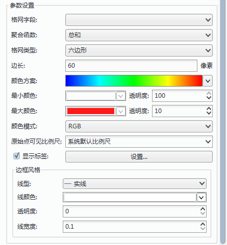

  
### 什么是网格图？  
   
网格图简单说就是一种使用空间聚合方法，表现空间数据的分布特征和统计特征。它的基本原理是基于网格聚合算法，将空间区域划分为规则形状的网格单元，每个网格单元又划分为多个层次，高层次的网格单元被分为多个低层次的网格单元，每个网格单元都具有统计信息。

SuperMap 支持对空间点数据构建网格聚合图，并且提供了两种形状的网格进行聚合显示，一种是矩形网格，一种是六边形网格。通过网格对地图点要素进行网格划分，然后，计算每个网格单元内点要素的数量，并作为网格的统计值，也可以引入点的权重信息，考虑网格单元内点的加权值作为网格的统计值；最后基于网格单元的统计值，按照统计值大小排序的结果，通过色带对网格单元进行色彩填充。

一幅完整的网格聚合图包含以下几个要素：    

+ **网格**：每个网格单元为一致大小的格网，可以为四边形或者六边形，并且地图比例尺的变化，网格单元的大小固定不变；网格用来统计落入每个网格单元内的点对象数目。  
+ **标签**：每个网格中心具有一个标签，该标签为网格单元的统计值，该统计值可以是落入每个网格单元内的点对象数目，也可以是落入每个网格单元内的点的加权值。   
+ **网格渲染风格**：网格单元的填充颜色表示网格统计值的分布趋势，其颜色由深到浅，表示网格单元的值从大到小。另外，还可以设置网格矩形边框的风格。 

  
### 如何制作网格图？    
  
1.**选择数据并新建网格图层** ：    

   +  在图层管理器中选中要制作网格图的点数据图层，然后单击“专题图”选项卡，选择“聚合图”中的“网格图”，制作一幅默认风格的网格图。创建完成的网格图将自动添加到当前地图窗口中作为一个专题图层显示，同时在图层管理器中也会相应地增加一个专题图层。   
   +  在图层管理器中选中网格图层，右键单击“图层属性”按钮，在弹出的“图层属性”窗口中显示了当前网格图的设置信息。   

　　  
       
      
2.**设置格网字段**：  

  格网字段可以不指定，此时，网格图每个格网单元的统计值默认为落在该单元格内的点对象数目；如果指定了一个格网字段，那么该字段值将作为点的权重信息，此时，网格图每个格网单元的统计值为落在该单元格内的点的加权值。加权值的计算方式即为选择的聚合函数类型。另外，所指定格网字段必须为数值型字段。  

  
3.**设置格网类型**    

格网类型:SuperMap提供了两种形状的网格进行聚合显示，一种是四边形网格，一种是六边形网格。根据制图需要选择合适的格网类型。 
   
 
4.**设置渲染色带**    
  
+ 颜色方案组合框下拉列表中列出了系统提供的颜色方案，选择需要的配色方案，则系统会根据选择的颜色方案自动分配每个渲染字段值所对应的专题风格。   
+ 分别设置最大值颜色和最小值颜色。通过最大值颜色和最小值颜色构建一个渐变色带，最大值颜色用来渲染网格聚合图中统计值最大格网单元，最小值颜色用来渲染网格聚合图中统计值最小格网单元，其他格网单元使用渐变色带中的其他颜色渲染，并遵循统计值越大渲染颜色越靠近色带中的最大值颜色一端。   
+ 调整颜色的透明度，点击最大最小颜色框的右侧按钮设置颜色透明度，从而制作半透明效果的网格聚合图，便于与底图数据叠加显示。  

5.**设置格网风格**：网格聚合图的格网风格主要包含以下几方面：  
  
+ 格网大小：设置格网单元大小，对于六边形格网，通过指定边长来确定大小；对于矩形格网，通过指定长度和宽度来确定格网大小。数值单位为：屏幕坐标。   
+ 格网边框：A）设置网格单元矩形边框线的线型，有三种情况：无边框、实线边框、虚线边框。B）设置边框线宽度。C）设置边框线颜色，并支持半透明效果设置。  
+ 格网标签：设置网格单元内统计值标签的风格。  
  
5.通过以上参数通一幅基于点数据集的网格图制作完成。
  
### 示例   
  
分别用四边形网格和六边形网格制作北京学校分布网格图和杭州市旅游景点分布网格图：  
  
示例数据：安装目录\SampleData\\AggregationMap\GridAggregationMap\Beijing.smwn  

四边形网格图：选择点数据集：School_P 生成网格图层，未指定格网字段，网格图每个格网单元的统计值默认为落在该单元格内的点对象数目。调整显示风格得到如下图所示的效果图：
  
　　     
    
六边形网格图：选择点数据集：Attraction_P 生成网格图，未指定格网字段，网格图每个格网单元的统计值默认为落在该单元格内的点对象数目。调整显示风格得到如下图所示的效果图：
    
　　   

  

