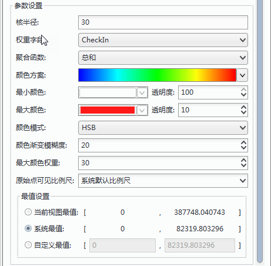
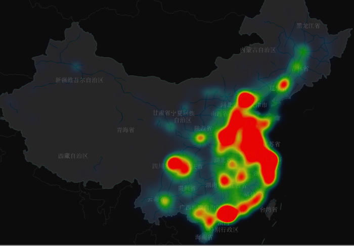

### 什么是热力图？    

热力图是通过颜色分布，描述诸如人群分布、密度和变化趋势等的一种地图表现手法，因此，能够非常直观地呈现一些原本不易理解或表达的数据，比如密度、频度、温度等。  
  
SuperMap热力图只针对点数据制作热力图，并生成热力图层。热力图图层可以将点要素绘制为相对密度的代表表面，并以色带加以渲染，以此表现点的相对密度等信息，一般情况下，从冷色（低点密度）到暖色（高点密度）来显示热力图图层中的点密度状态。热力图的成图原理，需要开启地图中Alpha通道。 

热力图图层除了可以反映点要素的相对密度，还可以表示根据属性进行加权的点密度，以此考虑点本身的权重对于密度的贡献。

热力图图层将随地图放大或缩小而发生更改，是一种动态栅格表面。例如，绘制全国旅游景点的访问客流量的热力图，当放大地图后，该热力图就可以反映某省内或者局部地区的旅游景点访问客流量分布情况。  
  
### 如何制作热力图    
  
1.**选择数据并新建热力图层** ：  
  
  +  在图层管理器中选中要制作热力图的点数据图层，然后单击“专题图”选项卡，选择“聚合图”中的“热力图”，制作一幅默认风格的热力图。创建完成的热力图将自动添加到当前地图窗口中作为一个专题图层显示，同时在图层管理器中也会相应地增加一个专题图层。   
  +  SuperMap热力图只针对点数据制作热力图。不仅支持已有的UDB文件型数据源、数据库型数据源，还新增支持ES（Elasticsearch）数据，具有更高效的数据访问特点，满足大数据可视化应用。  
  +  在图层管理器中选中热力图图层，右键单击“图层属性”按钮，在弹出的“图层属性”窗口中显示了当前热力图的设置信息。   

　　  
       
      
2.**设置核半径**：核半径在热力图中所起的作用如下所述：  
  
+  热力图将根据设置的核半径值对每个离散点建立一个缓冲区。核半径数值的单位为：屏幕坐标；  
+  对每个离散点建立缓冲区后，对每个离散点的缓冲区，使用渐进的灰度带（完整的灰度带是0~255）从内而外，由浅至深地填充；  
+  由于灰度值可以叠加（值越大颜色越亮，在灰度带中则显得越白。在实际中，可以选择ARGB模型中任一通道作为叠加灰度值），从而对于有缓冲区交叉的区域，可以叠加灰度值，因而缓冲区交叉的越多，灰度值越大，这块区域也就越“热”；  
+  以叠加后的灰度值为索引，从一条有256种颜色的色带中（例如彩虹色）映射颜色，并对图像重新着色，从而实现热力图。  
  
3.**设置点权重**    

上文所述，根据离散点缓冲区的叠加来确定热度分布密度，而权重则是确定了点对于密度的影响力，点的权重值确定了该点缓冲区对于密度的影响力，即如果点缓冲区原来的影响系数为1，点的权重值为10，则引入权重后，该点缓冲区的影响系数为1*10=10，以此类推其他离散点缓冲区的密度影响系数。  
那么，引入权重后，将获得一个新的叠加后的灰度值为索引，在利用指定的色带为其着色，从而实现引入权重的热力图。这里，通过指定一个字段作为权重，并且作为权重的字段必须为数值型字段。   
 
4.**设置颜色方案**    
  
+ 组合框下拉列表中列出了系统提供的颜色方案，选择需要的配色方案，则系统会根据选择的颜色方案自动分配每个渲染字段值所对应的专题风格。  
+ 分别设置最大颜色值和最小颜色值。通过最大值颜色和最小值颜色构建一个色带，最大值颜色用来渲染热力图中灰度值最大的部分，也就是最热区域，最小值颜色用来渲染热力图中灰度值最小的部分，也就是最冷区域，以此类推来渲染热力图。  
+  调整颜色的透明度，点击最大最小颜色框的右侧按钮弹出设置颜色透明度的滑块，用滑块调节透明度；也可直接输入0-100的数字，默认透明度为 0，表示完全不透明；最大值为 100，表示完全透明。制作出半透明效果的热力图，便于与底图数据叠加显示。   
+  **颜色渐变模糊度**：主要调整热力图中颜色渐变的模糊程度，以此调整色带的渲染效果。   
+  **最大颜色权重设置**：确定渐变色带中最大值颜色所占的比重，该值越大，表示在色带中最大值颜色所占比重越大。   

5.**原始点可见比例尺**   
 
此处对热力图图层原始点可见比例尺进行设置后，当热力图缩放至设置的某个固定比例尺，将不再显示热力图层而以原始点显示。   
  
6.**最值设置**    
  
设置热力图显示时的最大值和最小值，其中最大值对应最大值颜色，最小值对应最小值颜色，根据两者的关系构建渲染色带，而其他大于最大值的部分将以最大值颜色渲染，小于最小值的部分将以最小值颜色渲染。    
  
+  当前视图最值： 将当前视图窗口内的最大值和最小值作为热力图最大值颜色和最小值颜色，从而程序会按照当前视图的最大值颜色和最小值颜色构建色带，对热力图进行色彩渲染。（当前视图最大值和最小值将根据视窗的放大缩小而发生变化。） 
+  系统最值：默认状态下，系统会基于当前地图比例尺计算热力图的一个默认最大值和最小值（系统最大值和最小值将根据地图比例尺的变化而发生变化）。 
+  自定义最值：通过自定义最大值和最小值的方式调整热力图的最大值颜色和最小值颜色的分布。按照最大值对应用户设置的最大值颜色，最小值对应最小值颜色的关系构建渲染色带，对热力图进行色彩渲染。   
  
7.通过以上参数通一幅基于点数据集的网格图制作完成。
  
### 示例   
  
以全国教育文化资源制作热力图：  
  
示例数据：安装目录\SampleData\\AggregationMap\HeatMap.smwn   
 
选择点数据集：CultureService_P 生成网格图层，未指定格网字段，网格图每个格网单元的统计值默认为落在该单元格内的点对象数目。调整显示风格得到如下图所示的效果图：
  
　　     
  

