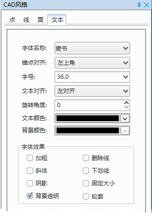
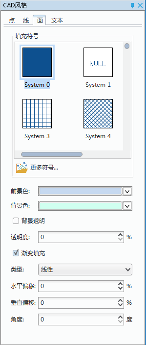

“风格设置”选项卡是上下文选项卡，与地图窗口绑定。只有当应用程序中当前活动的窗口为地图窗口时，该选项卡才会出现在功能区上。

使用“风格设置”选项卡中的功能控件设置对象风格时，只针对当前图层进行设置，因此必须先将待设置风格的图层设置为当前图层。在设置对象风格时，用户的设置结果会实时的反映到当前图层，实现所见即所得的效果。

“风格设置”选项卡包含有对象风格和图层风格设置的功能：  
 
### 点图层风格设置   
 
点图层风格设置方式有两种：  
  
+ 方式一：在图层管理器中，选择预修改风格的点图层，双击该图层，即可弹出“点符号管理器”，用户可在点符号管理器中设置和修改该点图层的风格。 
+ 方式二：在图层管理器中，选择预修改风格的点图层，单击“风格设置”选项卡中的“图层风格”按钮，即可弹出“点符号管理器”，用户可在点符号管理器中设置和修改该点图层的风格。   
  
有关“点符号管理器”的详细说明，请参看“管理符号资源”。

### 线图层风格设置   
  
线图层风格设置方式有两种：  
  
+ 方式一：在图层管理器中，选择预修改风格的线图层，双击该图层，即可弹出“线符号管理器”，用户可在线符号管理器中设置和修改该线图层的风格。 
+ 方式二：在图层管理器中，选择预修改风格的线图层，单击”风格设置”选项卡中的“图层风格”按钮，即可弹出“线符号管理器”，用户可在线符号管理器中设置和修改该线图层的风格。   
  
有关“线符号管理器”的详细说明，请参看“管理符号资源”。   
  

### 面图层风格设置    
  
+ 方式一：在图层管理器中，选择预修改风格的面图层，双击该图层，即可弹出“面符号管理器”，用户可在面符号管理器中设置和修改该面图层的风格。 
+ 方式二：在图层管理器中，选择预修改风格的面图层，单击“风格设置”选项卡中的“图层风格”按钮，即可弹出“面符号管理器”，用户可在面符号管理器中设置和修改该线图层的风格。   
  
有关“面符号管理器”的详细说明，请参看“管理符号资源”。  
  

### 文本风格设置   
  
1. 设置文本图层中的文本对象风格，只有当地图窗口中有选中的文本对象，且文本图层为可编辑状态时，才可进行设置。可同时设置某一个或几个文本对象的文本风格。  
2. 单击“风格设置”选项卡中的“对象风格”按钮。弹出选中文本对象的属性窗口，在属性窗口中，可查看或重新设置选中文本对象的各项风格参数。  
  
　　         
  
+ 字体名称：用来设置文本图层中文本对象的字体，该标签控件右侧的组合框下拉列表中提供了丰富的字体供用户选择。用户既可以在文本框中输入字体，也可以点击右侧的下拉按钮在弹出的下拉列表中选择所需字体。此外，点击下拉按钮后，在文本框中输入字体的首字母也可以迅速定位到该字母开头的字体。   
+ 锚点对其：用来设置文本图层中文本对象的对齐方式，系统提供了12种文字对齐方式：左上角、中上点、右上角、左基线、中心基线、右基线、左下角、中下点、右下角、左中点、中心、右中点。点击该按钮，用户可在下拉列表中选择所需的文字对齐方式。   
+ 字号：用来设置文本图层中文本字体的大小，用户既可以输入字体大小的数值，也可以从该标签控件右侧的组合框下拉列表中选择合适的字体大小。  
+ 文本对其方式：用来设置文本图层中文本对象与页边距的对齐方式，从左到右依次为左对齐、居中对齐、右对齐、两端对齐。用户可点击相关类型，设置文本在页边距中的对齐方式。   
+ 旋转角度：用来设置文本图层中文本对象的文字旋转角度。用户可在弹出的文本框中输入文本的旋转角度，也可通过文本框右侧的微调按钮设置文字旋转角度的大小。   
+ 文本颜色：用来设置文本图层中文本对象的颜色。该标签控件右侧下拉按钮弹出颜色面板，用户可选择设置合适的颜色，也可单击颜色面板底部的“其它色彩…”按钮，在弹出的“颜色”对话框中自定义所需的文字颜色。   
+ 背景颜色：用来设置文本图层中文本对象背景的颜色。该标签控件右侧下拉按钮弹出颜色面板，用户可选择设置合适的颜色，也可单击颜色面板底部的“其它色彩…”按钮，在弹出的“颜色”对话框中自定义所需的背景颜色。   
+ 字体效果： 可勾选复选框按钮设置字体加粗、删除线、斜体、下划线、阴影、固定大小、背景透明以及轮廓等效果。 

 

### CAD 复合数据集风格设置  
  
CAD 复合数据集中，可包含二维点、线、面对象及文本对象等。将 CAD 复合数据集在地图窗口中打开，在可编辑状态下可设置对象的显示风格。  
  
单击“风格设置”选项卡中的“对象风格”按钮。弹出 CAD 属性窗口，在属性窗口中，可查看或重新设置选中点、线、面及文本对象的各项风格参数。  
  
+ 点对象风格设置：在地图中选中一个或多个 CAD 图层中的点对象，单击 CAD 属性窗口中“点”标签页，设置点对象的符号风格，具体操作与说明请参见设置点图层的风格。
  
+ 线对象风格设置：在地图中选中一个或多个 CAD 图层中的线对象，单击 CAD 属性窗口中“线”标签页，设置线的对象的符号风格，具体操作与说明请参见设置线图层的风格。

+ 面对象风格设置：在地图中选中一个或多个 CAD 图层中的面对象，单击 CAD 属性窗口中“面”标签页，，设置面的对象的符号风格，具体操作与说明请参见设置面图层的风格。    

+ 文本对象风格设置：在地图中选中一个或多个 CAD 图层中的文本对象，单击 CAD 属性窗口中“文本”标签页，设置文本的对象的符号风格，具体操作与说明请参见设置文本图层的风格。    

  
　　    

 