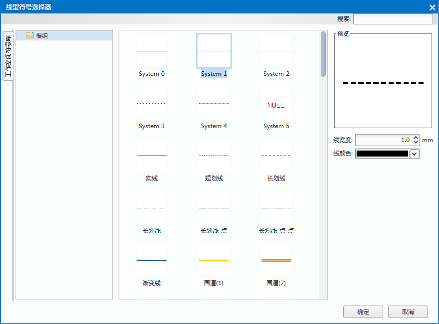

　　SuperMap 通过符号库对各种符号资源进行组织和管理，符号分为三种类型：点符号、线符号和填充符号，因此，相应地有点符号库、线符号库和填充符号库，这三种符号库分别管理相应类型的符号资源。  
　　应用程序通过符号库窗口管理各种类型的符号库，进而管理符号库中的符号资源，符号库窗口可以管理点符号库、线符号库和填充符号库，但是，符号库窗口当前只能管理一种类型的一个符号库及其中的符号资源。

### 打开符号库窗口的方式 
  
在应用程序中，符号库窗口有两种表现形式，一种为“符号库”窗口，主要用于加载、浏览、管理符号库文件；另一种为“风格设置”窗口，既可用于设置点、线、面对象的风格，也可加载、浏览、管理符号库文件。这两种类型的符号库窗口的界面和操作方式基本相同，若无特殊之处不作另外的介绍。

打开符号库窗口的途径有以下几种：  
  
1. **通过工作空间管理器打开符号库窗口**： 在工作空间管理器中，展开资源结点，其下有三个子结点，分别为：符号库、线型库和填充库，分别对应管理点符号、线符号和填充符号，而符号库窗口则可以通过任意子结点的右键菜单打开，具体如下：  
  
	+ 右键点击符号库子结点，在弹出的右键菜单中选择“加载点符号库...”，打开的符号库窗口中默认加载的是系统提供的预定义点符号库；  
	+ 右键点击线型库子结点，在弹出的右键菜单中选择“加载线符号库...”，打开的符号库窗口中默认加载的是系统提供的预定义线符号库；  
	+ 右键点击填充库子结点，在弹出的右键菜单中选择“加载填充符号库...”，打开的符号库窗口中默认加载的是系统提供的预定义填充符号库。 

2. **通过图层管理器打开风格设置窗口**： 在图层管理器中，双击某个图层结点的符号图标，可以打开符号库窗口。  
  
	+ 双击点类型图层的符号图标，弹出风格设置窗口，默认加载的是系统提供的预定义点符号库；   
	+ 双击线类型图层的符号图标，弹出风格设置窗口，默认加载的是系统提供的预定义线符号库；  
	+ 双击填充类型图层的符号图标，弹出风格设置窗口，默认加载的是系统提供的预定义填充符号库。   
	  
3. **通过功能区中的“图层风格”选项卡打开风格设置窗口**：功能区中与地图窗口（或布局窗口）关联的“图层风格”选项卡可用于设置地图图层（或布局元素）的符号风格，在设置符号风格时也可以打开风格设置窗口  
  
### 点符号风格设置
 
　　  

1. 选择点符号： 在符号库窗口中，找到需要的点符号，然后，选中该符号。  
2. 设置符号的显示风格： 符号库窗口符号风格设置区域中的“预览”区来预览用户所设置的符号风格。  
3. 在符号库窗口符号风格设置区域中，可以设置选中点符号的风格样式，包括以下参数：    
   
 + 显示大小：该区域用于设置点符号的大小。  
	+ 符号宽度：设置点符号的宽度。用户可以在其右侧的数字显示框中输入数值；也可以点击数字显示框右侧的箭头，使用弹出的滑块调整符号的宽度。单位：0.1mm。   
	+ 符号高度：设置点符号的高度。用户可以在其右侧的数字显示框中输入数值；也可以点击数字显示框右侧的箭头，使用弹出的滑块调整符号的高度。单位：0.1mm。   
	+ 锁定宽高比例：该复选框用于设置是否在改变符号宽度或符号高度时，固定符号的宽度与高度的比例。系统默认为勾选该复选框。若勾选该复选框，则无论对符号宽度和符号高度两个参数中的哪一项进行设置，另一项会相应改变。注意：此项设置只对栅格符号有效，即对矢量数据，无论是否勾选该复选框，符号的宽高比例都固定。  
	+ 旋转角度：设置点符号的旋转角度值，用户可以在其右侧的数字显示框中输入数值来设置；也可以点击数字显示框右侧的箭头，使用弹出的滑块来调整角度数值。点击Enter （回车）键或当该文本框失去焦点时，即可应用点符号角度的设置。旋转角度为正值时，逆时针旋转；否则顺时针旋转；   
	+ 符号颜色：设置点符号的颜色，点击其右侧的下拉按钮，用户可以在弹出颜色面板中选取默认颜色，或点击颜色面板底部的 “其它色彩...”按钮，获取更多自定义颜色。   
  
4. 设置完成后，点击符号库窗口中的“确定”按钮，应用所做的符号设置。   
  
### 线符号风格设置  
 
　　    

1. 选择线符号：在符号库窗口中，找到需要的线符号，然后，选中该符号；  
2. 设置符号的显示风格：符号库窗口符号风格设置区域中的“预览”区来预览用户所设置的符号风格。  
3. 在符号库窗口符号风格设置区域中，可以设置选择的线符号所使用风格样式，包括以下几方面：  
  
	+ 线宽度：设置线的粗细，用户可以在其右侧的数字显示框中输入数值来设置；也可以单击数字显示框右侧的箭头，使用弹出的滑块来调整线宽。  
	+  线颜色：设置线符号的颜色，单击其右侧的下拉按钮，用户可以在弹出颜色面板中选取默认颜色，或单击颜色面板底部的 “其它色彩...”按钮，获取更多自定义颜色。 
  
4. 设置完成后，单击符号库窗口中的“确定”按钮，应用所做的符号设置。   
  
### 填充颜色方案  
  
　　  
      
1. 选择填充符号：在符号库窗口中，找到需要的填充符号，然后，选中该符号。  
2. 设置符号的显示风格： 符号库窗口符号风格设置区域中的“预览”区来预览用户所设置的符号风格。  
3. 在符号库窗口符号风格设置区域中，可以设置选择的填充符号所使用风格样式，包括以下几方面：  
   
	+ 前景颜色：设置填充符号填充内容的颜色，单击其右侧的下拉按钮，用户可以在弹出颜色面板中选取默认颜色，或单击颜色面板底部的 “其它色彩...”按钮，获取更多自定义颜色。   
	+ 背景颜色：设置填充符号非填充内容的颜色，单击其右侧的下拉按钮，用户可以在弹出颜色面板中选取默认颜色，或单击颜色面板底部的 “其它色彩...”按钮，获取更多自定义颜色。   
	+ 背景透明：勾选该复选框后，填充符号的非填充内容将设置为透明效果，此时“背景颜色:”的设置无效。     
	+ 线型选择：设置填充符号的边框线风格。单击其右侧的按钮，将弹出另一个符号库窗口，显示所加载的线符号库，在此设置填充符号的边框线风格，具体参见 线符号风格设置。 
	+ 透明度：设置填充符号的透明效果。用户可以在其右侧的数字显示框中输入数值来设置；也可以单击数字显示框右侧的箭头，使用弹出的滑块来调整透明度。透明度的数值为 0 至 100 之间的任意一个整数，0 代表完全不透明；100 代表完全透明。    
	+ 渐变填充：勾选该复选框后，将使用渐变颜色作为填充符号的填充内容，此时，填充符号的填充内容为颜色，即用户在第 1 步中选中的填充符号无效。在渐变填充模式下， “前景颜色”和“背景颜色”将作为渐变的两种颜色，即渐变模式为双色渐变，从前景色渐变到背景色。   
	+ 渐变填充的其他参数设置：如果勾选了“渐变填充”复选框，则复选框下面区域的功能变为可用状态，用来设施渐变的参数： 
		+ 类型：设置渐变的方式。包括以下五种方式：  
		  
		（1）无渐变：不使用渐变颜色作为填充符号的填充内容，而是使用第 1 步所选中的填充符号的填充内容；

		（2）线性：渐变为线性渐变；

		（3）辐射：渐变为辐射状渐变，从中心向周围渐变；

		（4）圆锥：渐变为圆锥体方式渐变；

		（5）方形：渐变为方形渐变。  
  
　　       
	  
+ 角度：设置渐变填充的旋转角度。  
+ 水平偏移：设置渐变填充中心点相对于填充范围中心点的水平偏移百分比。用户可以在其右侧的数字显示框中输入数值来设置；也可以单击数字显示框右侧的箭头，使用弹出的滑块来调整数值。   
+ 垂直偏移：设置渐变填充中心点相对于填充范围中心点的垂直偏移百分比。用户可以在其右侧的数字显示框中输入数值来设置；也可以单击数字显示框右侧的箭头，使用弹出的滑块来调整数值。
  

4. 设置完成后，单击符号库窗口中的“确定”按钮，即可应用符号风格的参数设置。 

