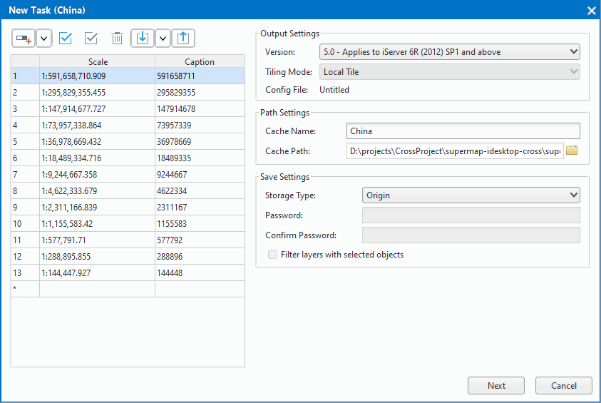
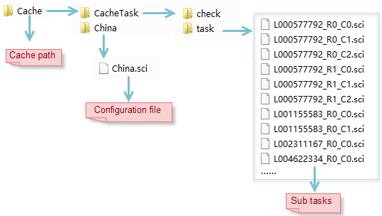
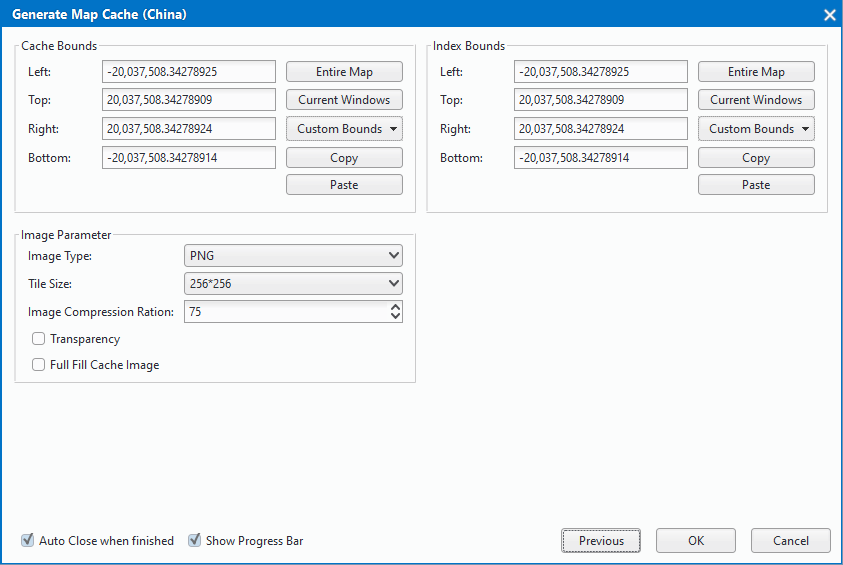
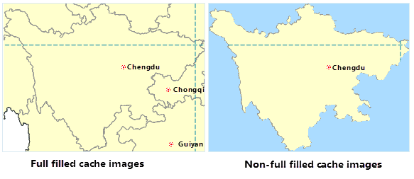
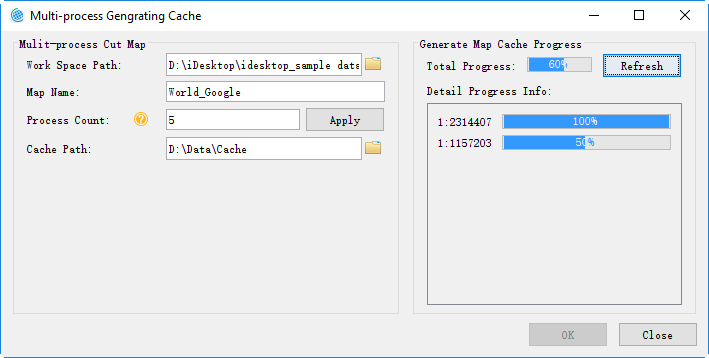

title: New map cache (multi-process)
---
　　“**Multiple Tasks**”, creates mult-process cache tasks which can be executed on several computers at the same time to improve efficiency.Multi-process cut need to split the map cache into multiple sub-tasks, which is easy to obtain multiple processes, and it is divided into two steps: create a map cache task, execute multi-process cut, the specific description is as follows:

### Basic Steps    　　

  1. Once you have prepared the map to be cached, save the map, click the right mouse button at the &quot;Data Source&quot; node, select &quot;Re-read Open&quot;, set the data source to read-only, and save the workspace. At this time, reopen the map to be cached in the map window.

  2. Click"Maps->Mapping->Multiple Tasks" to show "Cache Type" dialog. Three types of operations are provided here:"New Cache Task","Execute Map Cache Task","Update/Append Cache Task".
  3. Select "New Cache Task" and Click "Next" to show the dialog "New Task".Set scale, path, storage type other parameters in this dialog.The specific description is as follows:
　
    

  4.  **Scale**:By default,the scales are the display scales of the map. Users can add, delete scales, and can import and export them.    
  5.  **Output settings**: different versions of the map cache, you need to match the corresponding version of the server version to facilitate the map slice in the server to publish. The system provides six versions of the map cache generation, which, 5.0 version of the cache uses a high-precision calibration method, for users who generate a map cache for the first time, recommend the use of 5.0 version of the cache program.You can only set the split mode when you choose version 5.0. There are two ways to divide: local and global. **Note**: Global profiles are only available if the map coordinate system is WGS 1984. 
  6.  **Path settings**: path settings include two parameters which are cache name and cache path, the specific description is as follows: 
  
      - **Cache Name**: After setting the cache name, the new task will generate a cache name folder in the cache path and generate the map's cache configuration file (* .sci) file in this folder. The * .sci file records the relevant cut map range, cut the scale, tile storage type, tile settings, database information, cache path and other parameter information of the entire file the map cache, and you can open the file on the desktop to browse the entire map cache.  
      - **Cache path**：sets the map cache file and subtask storage path, when the task is split, the path will generate a cache name named folder, as shown in the China folder, used to store the cache configuration file (*. sci), after the cut cache you can directly open the *. sci file to view the China map cache; cache path will generate a"CacheTask"; folder, which contains check, task two folders, and folders stored as follows:  
       
       - **check**：store check.udb, check.udd, for the cache check, and check whither exist white and empty files and so on after the cut map.
       - **task**：used to store the map cache split subroutine file (* .sci).
    
  7.   **Save Settings**：used to set the map cache type, the program provides three types of cache, including: original, compact, MongoDB. 
  
       - **Primitive**：The primitive cache slice file is stored on a disk in a separate image file format and does not compress the data. The main features are: can read directly; take up a lot of disk space, not easy to manage, and copy and transfer is not convenient; for high-level data, can not set the password.　　
       - **Compact**: Compact cache will be the original slice file using a certain compression and encryption mechanism, replace the original image format in the structure of a group of files. At the same time, the cache data under the different scale folders will be stored as a set of files, including two parts: the index file (* .sci), a set of data files (* .sc00 and * .lock). Compared with the original type, compact storage has the following advantages: reduce the number of files, conducive to a large number of cache data transmission and copy; shorten the time to create the cache; data supports encryption.
       - **MongoDB type**:the generated cache slice file, stored in a distributed format in the server's database, will generate an index file (* .sci) locally. Select MongoDB type, need to set the server name, database name, user name and other parameters. **Note**: If the MongoDB cache needs to use multiple machines to cut the map, and the server is the machine of splitting the task, the server address needs to write IP address, and other machines can be normal access to server where the MongoDB is.
       - **MongoDB type storage has the following advantages**： slices stored in the server, and map slices save and get faster; store in a distributed format, and tile data support direct copy and distribution, which is conducive to data transmission and backup.
      
       - **Note**：If you use multi-process cut and output the cache to the MongoDB database, you need to create a MongoDB library. The information for creating the MongoDB database is specified by the MongoDB information in the cache configuration file that is passed from the command line. Also, generates a new * .sci file in the sibling directory according to the specified cache configuration file (* .sci).  
 8. 	After finishing setting the above parameters, click "Next" to set cache range parameter, index range, image type and so on in dialog, as shown in following picture：   
   
    
 
   - **Cache range**：set the scope of the map where it need caching. Four settings are provided including the entire map, the current window, drawing range, copy and paste.	  
 
   - **Index range **：It is Basis of Map Cache tile cut rules. When the index range is determined, the tile cut rule can be determined. Map caches with the same index range can be merged. The system provides four ways to create an index range: the entire map, the current window, drawing range, copy and paste. Note: Only maps with the same index range can be added successfully. 
   - **Tile type**：Two tile types are provided: Grid Tiles and Vector Tiles. Choose tile type by your map data.
   - **Image type**：Format: .png, .gif, .jpg, PNG_JPG and PNG8 are supported.When the map cache format is JPG and PNG mixed form, the application can automatically determine which format to use according to whether the tile contains invalid data pixels. The invalid data pixels are tiles that do not contain any data content.For the slices (map boundaries) which contain invalid data pixels, the file format is PNG, otherwise JPG. When using the JPG_PNG image type, the background transparency option is checked by default. Using a mixed image type, you can greatly reduce the size of the cache data, thus optimizing the data download time.
   - **Tile Size(pixel)**：The resample size for generating tiles after caching. The unit is pixels*pixels. Five options are provided: 1024*1024, 512*512, 256*256, 128*128, 64*64, default size is 256*256.  
   - **Compression**: The ration by which the tile is compressed. The value ranges from 0 to 100 and the default is 75.  
   - **Transparent**: Transparent: When the background color is set for the map, check this option to automatically set the background color to be transparent when generating the map cache; otherwise, keep the background color of the map.
   - **Fill Margins**: When the map cache range is set to the selected object range, the check box is available, whether to completely fill tiles generated by specifying the cache extent through objects. If checked, the cache extent will be completely filled. If not checked, only the extent of the selected object will be filled, with margins not filled. Blow shows the effects of the function.　　  
     
  　  
 9. After setting the above parameters, click "Next" to divide the whole map cache task into bunches of tasks. Tasks will be put in directory like this："Cache Path"/task. Note: To generate cache by several computers, this directory should be a shared directory.　　

10.After cache tasks have been successfully created, dialog "Mutil-process Generating Cache" will pop up and automatically sets the parameters according to the parameters automatically set, automatically fills in several parameters including the workspace path, map name, cache storage path. Click "OK" button in the dialog box to perform multi-process cut operations on the machine. If you do not need to perform the cut operation, the dialog box can be closed.  
 
   

   
   
　　 　　
   
 
   
