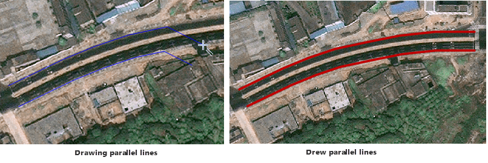
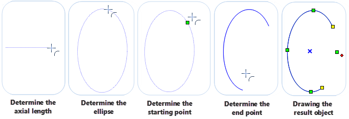

　　Line object is mainly used to represent line features, like river, railway, road, wire etc. The application also provide multiple kinds of methods to draw polylines. 

### Straight Line

**Drawing Straight Line**

1.  Click on "Object Operation" > "Object Drawing" > "Line" > "Straight Line" and line cursor is shown. 
2.  Move mouse in the map window, then left-click mouse on an appropriate position to determine starting point.
3.  Move mouse again to determine another point, and then left-click mouse to draw a line, right-click mouse to finish current operation.

**Drawing Polyline**

1. Click on "Object Operation" > "Line" > "Polyline".
2. Move mouse in the map window, then left-click mouse on an appropriate position to determine starting point.
3. Move mouse again to determine another point, and complete the drawing for first segment.
4. Continue to move cursor to an appropriate position, and left-click mouse to determine node position, repeat the steps to complete the drawing.

**Drawing Parallel Lines**

1.  Click on "Object Operation" > "Line" > "Parallel Lines"
2. Move mouse in the map window, after left-clicking mouse on an appropriate position, continue to move mouse for determining the spacing between parallel lines, then clicking mouse again.
3. You can preview parallel lines real time effect by moving mouse and left-click mouse in a proper position to determine direction and length of parallel lines.
4. Steps for drawing of other segments is similar to polyline, width of parallel lines is the same with the width in last step.

### Drawing Curve

　　The application supports several kinds of curves, like bezier curve, B-splint curve, cardinal curve, or freehand line.

**Drawing Bezier Curve**

　　The direction of bezier curve is controlled by two starting points and two ending points that are not on the curve, the midpoints are fit out by the other control points on the curve. At least 6 control points are needed to draw a bezier curve.

1.  In the Object Operations menu, select Bezier in sub menu of "Curve", and the bezier curve cursor appears.
2.  Move mouse in the map window, then left-click mouse on an appropriate position to determine first control point.
3.  With the same way to determine second to fourth control points, the first four control points confirm direction of bezier curve.
4.  When the fifth control point is confirmed, a blue dotted line will appear between the third control point and the fourth control point, it is the first line segment fitted on the bezier curve.
5.  Input the coordinate of the sixth control point to draw the second line segment on the bezier curve.
6.  Repeat the steps above to draw other line segments on the bezier curve.

**B Splines**

　　B Splines are drawn with a start control point, an end control point and medium control points not on curve. The other points on the curve are all fit by the medium control points on the curve. At least 4 control points are needed to finish the drawing of a B-spline.

1.  In the Object Operations menu, select "B Splines" in sub menu of "Curve", and the corresponding cursor appears.
2.  Move mouse in the map window, then left-click mouse on an appropriate position to determine first control point.
3.  Move mouse to determine the second and third control points, at the same time, a curve is fitted between these two points representing the first line segment on the B Spline curve.
4.  Determine the forth control point on the curve, a blue dotted line will appear between the third control point and the fourth control point representing the second line segment of the B Spline curve.
5.  Repeat the steps above to draw other line segments on the B Spline curve. Right click to finish the current drawing.

**Cardinal Curve**

　　Cardinal curves are determined by the control points on the curve, the other points on the curve are fitted by all the control points. At least 3 control points are needed to finish the drawing of a Cardinal curve.

1.  In the Object Operations menu, select "Cardinal Curve" in sub menu of "Curve", and the Cardinal curve cursor appears.
2.  Move mouse in the map window, then left-click mouse on an appropriate position to determine first control point.
3.  With the same way to determine the second control points, a curve is fitted between the two points.
4.  Move the cursor, confirm the third control point, the second blue dotted line appears between the second control point and the third control point.
5.  Right click to finish the current drawing.

**Freehand Line**

　　Freehand Line is got by dragging the cursor freely. It is very useful for creating irregular boundary and tracing with digitizer.

1.  In the Object Operations menu, select "Freehand Line" in sub menu of "Curve", and the Freehand Line cursor appears.
2.  Move the cursor to the location of creating Freehand Line, click, hold the left mouse key and move the cursor to draw a curve the same with the path of the cursor.
3.  Right click to finish the operation.

### Arc

**3-point arc**

1.  Set the current layer as editable. In the Object Operations menu, select "3-Points Arc" in sub menu of "Arc", and the cursor appears.
2.  Move mouse in the map window, then left-click mouse on an appropriate position to determine starting position.
3.  Determine another two points by moving mouse again, and complete the drawing, right click mouse to cancle current operation. 

**Drawing Ellipse Arc**

1.  Set the current layer as editable. In the Object Operations menu, select "Ellipse Arc" in sub menu of "Arc", and the Ellipse Arc cursor appears.
2.  Determine the starting point, end point and an axial length of ellipse by moving and left-clicking mouse.
3.  Move mouse and left-click it at an appropriate position to complete the drawing.
4.  Confirm the starting point of ellipse arc by moving and left-clicking mouse, an ellipse arc is shown in real time by moving mouse, and then left-click again to finish drawing ellipse arc.

