　　Edit operation includes: group, union, Xor, erase, donut, Object Split, Ungroup, etc.

### Combination

　　Combine objects in the current layer as a compound object.

-   It groups objects with the same or different types together to generate a new compound object. For line and region layers, objects of the same type can be grouped together. For CAD compound layers, different types of objects can be grouped together. 
-   The system field (except SmUserID) values in the attribute information of the newly generated compound object are assigned by the system. The SmUserID and non-system fields will inherit the corresponding information of the object that has the minimal SmID value involving in the group operation.
-   It supports the group operation for cross layer geometric objects.
-   It doesn't support to group points.
-   When the number of overlayed regions is even, the overlapped area after being grouped will be white, and is a part of the result.

　　The detail steps are: select one or more objects in an editable layer, group it or them by clicking on "Object Operations" > "Object Editing" > "Object Operation" > "Combination", also you can select "Group" on the context-menu.

**Difference Between Group and Union**

-   The union operation can only be performed on objects of the same type to generate complex objects; the group operation can be performed on different types of objects to generate compound objects.
-   The union operation cannot be performed on point, line objects; the group operation can be performed on text objects, and point, line objects in compound datasets. 
-   Union applies to region layer, and CAD layer (object of the same type), group applies to line layer, region layer, text layer and CAD layer.
-   Union can only applies to the object of the same type to create complex object, but group can apply to different type of object to create compound object.
-   The source object in the union operation is dissolved as a sample or complex object; but the source object in the group operation is group to a block and become a compound object, and not dissolved.
-   In the union computing, non-system field and field  SmUserID is processed in multiple methods (retain the first, null, sum and average); In the group, non-system field SmUserID will retain the attribute value of the SmID field of the source object.

　　

**Note**

-   When performing union on the region layer, the overlapped part is in white as a part of the result, not missing. 
-   If one region feature is contained by another region feature when you union them, the result will be a region like a donut.

### Union

　　In practice, we may need to merge two or more objects as one object.

　　During the union operation, there will be a variety of special circumstances. These cases are described separately as follows. 

1. Current layer is region layer.

- If the region objects involved in an object operation intersect at points or these objects are neither intersectant nor adjacent, then these region objects will be merged into a complex region object.

  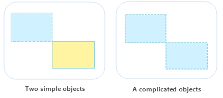

- If the region objects involved in an object operation intersect at lines, adjacent edges of these region objects will disappear, and the objects will be merged into a simple region object.

  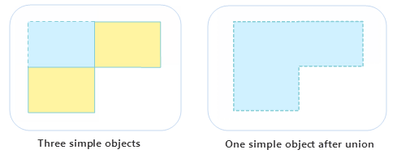

- If the region objects involved in an object operation intersect at regions, these region objects will be merged into a simple region object.

  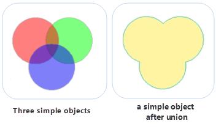

2. Current layers are compound layers.

- In CAD layers, when line objects, curve objects, elliptic arc objects and arc objects are involved in an operation, the type of the newly generated object will be a line object; when region objects, rectangle objects, circle objects and oblique ellipse objects are involved in an operation, the type of the newly generated object will be a region object.
 
**Basic Steps**

1. Select one or more objects in an editable layer, then click on "Object Operation" > "Object Editing" gallery > "Object Operation" group > "Union", and the Union dialog box pops up.
2. Set how to assign value to attribute of result object, there are four methods:
- Null: means the value of this field is Null in the result union object.
- Sum: means the value of this field in the result union object is the sum of corresponding fields of all union objects. Numeric fields are directly summed. For text fields, the text of multiple objects is automatically connected by SmID order.
- Weighted Mean: means the value (must be a numeric field) of this field in the result union object is the average of corresponding fields of all union objects. It can calculate the simple average or weighted average. The default mode is calculating simple average. 

　　Select the Weighted Mean radio button, click the right drop-down button and select the No Weighted Field (Mean) item. It means that when weighted fields are not used, a simple average value would be calculated, i.e. sum all selected fields of original objects and then divide by the total number of original objects.

　　If a field is selected in the drop-down menu on the right side of the Weighted Mean radio button, it means this field is used to calculate weighted averaged with the selected filed in the list box.

- Save Geometry: specify the field value for the result object which is the same with the field value of a selected object.

3. After finishing to set the parameters, click OK button to complete the operation.

### Intersect

　　Delete the parts that are not common to two or more objects. Please note that it do not support the intersect between two lines.

**Instructions**

- If the intersection of the region objects involved in an object operation is not an empty set, a simple object of the mutual intersection part will be generated after these objects intersecting each other. 
- If the intersection of the region objects involved in an object operation is an empty set, all the original objects will be removed and no object will be generated after these objects intersecting each other.
- The generated object need to be set whose property information it will retain and what operation will be done to field value. For instruction of each parameter, please reference [Union](#Union)
- In CAD layers, when region objects, rectangle objects, circle objects and oblique ellipse objects are involved in an operation, the type of newly generated object is a region object.

**Basic Steps**

1. Select objects in an editable layer, then click on "Object Operations" > "Object Editing" > "Object Operation" > "Intersect", and Intersect dialog box pops up.
2. Set how to assign value to attribute of result object, and then click OK.

### XOR

　　Get the union of two or more objects after removing the common parts. During the XOR operation, there will be a variety of special circumstances. These cases are described separately as follows.

- If the objects involved in an operation intersect only at points or don't intersect, these region objects will be merged into a complex object.

　　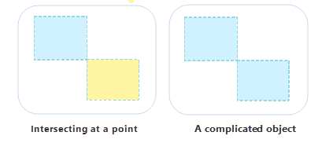

- If the objects involved in an operation intersect only at lines, adjacent edges of these objects will disappear, and the objects will be merged into a simple object.

　　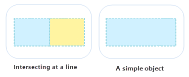

- If the objects involved in an operation intersect each other at regions (not coincide), the mutual intersection part will be removed, and the objects will be merged into a complex object.

　　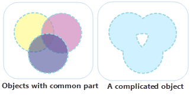

- If the objects involved in an operation intersect each other at regions without mutual intersection (common intersection part), all objects involved in the operation will be merged into a simple region object. 

　　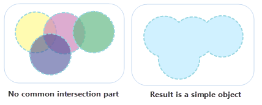

- If the objects involved in the operation coincide with each other, all objects involved in the operation will be deleted. 

Basic Steps:

1. Select one or more objects in an editable layer, then click on "Object Operations" > "Object Editing" > "Object Operation" > "XOr", and XOr dialog box pops up.
2. Set how to assign value to attribute of result object, and then click OK.

### Erase

　　You can erase a portion where an object overlaps another object, also you can delete the other section besides the overlapping portion according to object range. The instruction of Erase is detailed below.

- Only a selected region object can be as an erasing object. The layer where target object locates must be editable.
- The erase functionality only supports line, region and CAD layers.
- The Target object and the erasing object can't be the same object.
- The target object can be multiple line objects or region object, but the erasing object must be a region object.
- Erase operation data standardization has certain requirements. It is recommended that check data topology before the erase operation.

　　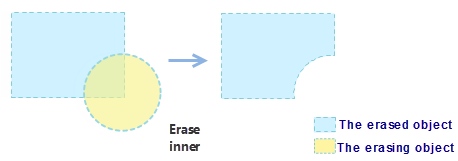

　　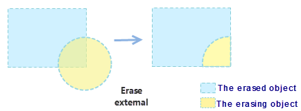

　　Basic Steps:

1. Select a object as the erasing object.
2. Click "Object Operations" > "Object Editing" gallery > "Object Operation" > "Erase".
3. Moving mouse into map window and selecting the target object to perform Erase operation, the switch of erasing sections can be achieved by pressing Ctrl.
4. Multiple selected objects can be erased at the same time, then right-click to complete the operation.

### Object Split

　　Split the line or region object by the selected object.

- The "Object Split" can be available when one or more objects are selected in an editable layer.
- This function applies for line objects or region objects  in line layer, region layer or CAD layer.
- A line or region object can be split only when the splitting line is across the object wholly if an object split by a line object.

　　Basic Steps:

1. Select one or more objects to split in an editable layer.
2. Click "Object Operations" > "Object Editing" gallery > "Object Operation" > "Object Split".
3. When moving the mouse to the current map window, it prompts &quot;Please select split object&quot;, select a line or region object, according to the intersection of two objects, the object will be segmented.

　　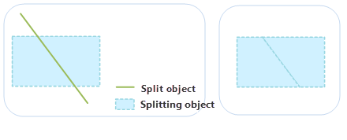

### Doughnut and Island Polygon

　　This kind of polygon is a complex geometry object type. In the status of &quot;Editable&quot;, operate two or more region objects that have inclusion relation in the overlap regions (Delete or reserve). A doughnut and island polygon is created. If there is s lake in a region, a doughnut and island polygon is created.

**Instructions**

- The doughnut and island polygons is used in region layer or the CAD layer.
- Select two or more region objects to conduct doughnut and island polygons, as shown below:  
  - If the selected regions don't interact or intersect at a point, a complex object will be created.
  - If the selected region objects intersect in line, these region objects will be merged to a complex object.
  - If the selected region objects interact in region and don't overlay, when the region number is odd number, the intersection of regions is reserved and a complex object is created. When the region number is even number, the intersection of regions is deleted and a complex object is created.
   
　　
  - If the selected region objects fully coincide and the number is odd number, a region object will be crested; When the number is even number, all the region objects will be deleted. For example: Conduct the doughnut and island polygons for three overlapped circles, finally a circle region is created; If there are only two circles. the result is null.

**Basic Steps**

1. Select one or more region objects in an editable layer, and then select click "Object Operations" > "Object Editing" gallery > "Object Operation" group > "Donut and Island Polygons".
2. Set property information of result object in the pop-up dialog box, you can reference "**Union**" for detail instruction.
3. Click OK button to perform the operation.

　　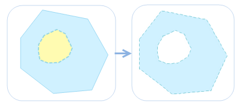

### Split

　　Split one or more compound objects into simple or compound objects.

- The Split function applies to line layers, region layers and CAD layers.
- It can only be performed for complex or compound objects; simple objects cannot be split.
- For complex objects (the object that contains multiple sub objects) ungrouping, all generated single objects are simple objects. For compound objects, after multiple single objects are generated, if there is still any compound object exists among these result single objects, you can continue perform the ungroup operation until all result objects become simple objects. The figure below shows a hole polygon. After performing the ungroup operation two single objects are generated:
- In the attribute information of the newly generated object, values of the SmUserID field and non-system field will keep that of the original object, and the other system field values are assigned by the system. 

Basic Steps:

1. In an editable layer, select one or more complex objects or compound objects.
2. Click "Object Operations" > "Object Editing" gallery > "Object Operation" group > "Ungroup" to perform the operation.
3. If there is still any compound object exists among the ungrouped resulting objects, you can continue perform the ungroup operation until all result objects become simple objects. As shown below:

　　

### Protection Decomposition

　　It is to decompose the region object which has multi-layers Island hole nesting relationship into only one layer. The difference between protective decomposition and decomposition is: if the region has Island hole nesting relationship, protective decomposition will keep the simplest layer, but decomposition will not.

- It can be used for a region or CAD layer.
- Only a complex object or compound object can be decomposed, simple objects can not be decomposed.
- For complex objects (objects that contain multiple sub objects), the generated objects are single objects (except the island hole region); for the compound object, firstly it is decomposed into multiple objects, if the object is still a compound object, it will be decomposed again into simple objects. As shown in the following diagram it is a combination of an island hole object with another object, after the protection decomposition, the new objects are obtained as a island hole object and a single object:

　　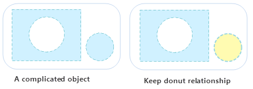
### Fill Gap    

  Fill gaps between two objects and the gaps will be merged into one of the two objects.
  
+  To perform the operation, you need to select a basic region.
+  You must set your layer editable where the filled object is located in. The operation supports cross-layers.

Basic Steps

1. Set your layer editable. In the "Object Operations" tab, in the "Object Editing" Gallery control, click "Fill Gap" button .
2. Select a base region object as the filled object.
3. Draw the filling range. Please note:

 + The polygon drawing region must be intersected with the filled region object. Otherwise, you need to redraw the range.
 + When the range is intersected with other objects, the overlayed parts in the range will be deleted and other parts in the range will be retained as the filling range.

4. Right click your mouse to finilize the operation. Then the filling range and the base region will be merged into an object.

　  

### Split lines or regions with lines  

Draw a temporary polyline to split region objects. The Line Split command is only active if there is an editable layer in the current map window. 

Basic Steps

1. Set the layer in which the region objects to be split editable. 
2. Select the region objects to be split by clicking the objects while holding down the Shift or Ctrl key, or by dragging a box. When there are region objects selected, only the selected objects will be split when implementing the split operation. However, all objects crossed by the temporary line you draw will be split if no objects are selected. 
3. Click "Object Operations" > "Object Editing" gallery > "Object Operation" group > "Line Split".
4. Draw a temporary polyline on the map. 
5. Right click to finish the polyline and implement the split operation. 
6. The selected region objects are split if you have selected region objects select before drawing the polyline to split; all region objects crossed by the temporary polyline are split if you didn't select region objects before.
7. Repeat step 4 for another split operation. If you want to split data in another dataset, add the dataset to the map, set the relative layer editable, and then repeat the step 4.

 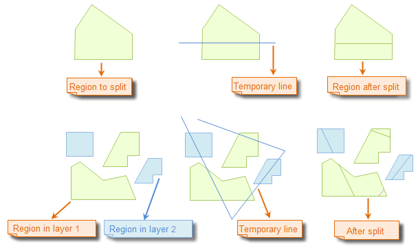  
  
### Split lines or regions with regions    
  
Draw a temporary region to split regions or lines crossed by the region. The Region Split button is available only when there is an editable layer in the current map window.
  
Basic Steps:   
  
1. Set the layer in which you want to split line or region objects editable.
2. Click "Object Operations" > "Object Editing" gallery > "Object Operation" group > "Region Split".
3. Draw a temporary region that is used to split region objects.</li>
4. Right-click the mouse to end the drawing. At this time, the split operation will be performed while the temporary split region disappears.</li>
5. To continue a next split operation, repeat the step 4; If you want to split line or region objects from other dataset, add the data and set corresponding layers editable, and then repeat step 4.</li>
6. To end the region split operation state, simply click the Region Split button to make it in an unclicked state. </li>
  
     

  
 

  

