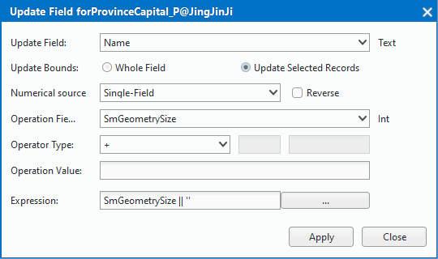

　　In the "Properties" tab on the "Edit" group, organize some edit functions to attribute tables. You can update rows or columns of an attribute table in batch.

### Delete Record  
  
Delete one or more rows in an attribute table.
  
**Basic Steps**  
  
1. Open your attribute table. 
2. Select one ore more rows or cells you want to delete.
3. Right click and select "Delete Record", or you can click "Delete Record" on the "Properties" tad in the "Edit" group.   
4. A prompt window will pop up saying "Once deleted, the records cannot be retrieved, continue?", if you click "Yes", the rows you select will be deleted.
  
**Note**    
    
+ Once a row in an attribute table is deleted, the relative geometrical object will be deleted from dataset.
+ Only when a vector dataset or a tabular dataset is not read-only, the "Delete Record" button can be available.

  
### Add Record
  
Add records into a tabular dataset.

**Basic Steps**   
  
1. Open your tabular dataset. 
2. Click "Add Record" and then an empty record will be added at the last row.
  
**Note**   
 
+ If the attribute table of a vector dataset is opened, the "Add Record" button is not available.
+ Only when a tabular dataset is not read-only, the "Add Record" button can be available.
  
### Update Field 
  
The "Update Field" command helps you uniformly enter and modify the values of part of records or all records in a specified field (column) according to a certain condition or rule.

  
  
**Basic Steps**  
  
1. Open your attribute table which can be either the attribute table of a vector dataset or a tabular dataset.
2. To update the contents of the selected cell, you need to first select the cells to be updated in the attribute table. Click Update Field in the Properties tab, or click the right mouse button and select Update Field. The Update Field dialog box is displayed. As shown below: 
     
3. Update Bounds: Specify to update whole field or only selected records. 
  + Whole Field: Update all field values in the specified field.    
  + Update Selected Records: Updates the selected records in the specified field as a certain rule.    
    
4. Numerical Source: To specify the value of the source used to update the attribute table field values, specific instructions, see following table.   
Numerical Source|Description  
-|-  
United Value Settings|By specifying a value, the value of the cell within the specified update range is updated to this value.
Single-Field |Constructs a simple mathematical expression for a specified field with a specified value.
In the specified update range, for a record to be updated cells, get the specified field attribute value and the user-specified value, operation, construction calculation equation operation, the return value is the cell value after the update.
Double-Field |Constructs a simple mathematical expression based on the specified two fields and the specified operation.
In the specified update range, for a record to be updated cells, get the specified two fields of the attribute value and user-specified operation, the construction of computing equations to operate, the return value is the cell value after the update.

Function|Constructs a function expression for a field based on a specified field, according to a user-specified function rule.
In the specified update range, for a record to be updated cells, get the specified field attribute values and user-specified operation function, build a function expression to operate, the return value is the cell value after the update.
   
5. Reverse: When the Numerical Source is Single-Field or Double-Field, check this box to exchange the position of the parameter on both sides of the expression, and then perform the operation of the expression.   
6. Operation Field: When the Numerical Source is Single-Field or Function, Operation Field is used to specify a field used to construct a mathematical expression or function expression.
7. Operation Field 1, Operation Field 2: When you set the "Numerical Source" as Double-Field, the two commands is used to specify two fields which will be used to constructing operation expressions.
8. Operator Type: When the Numerical Source is Single-Field or Double-Field, the Operator Type is used to specify the algorithm between Single-Field and Operation Value or two fields. 
Operator Type|Description
-|- 
＋ |On the numeric parameters, the value is added to the two, return a value; character parameters, is to connect two characters, in front of the new parameters in front of the characters, only "+" operation between character parameters.  
－ |Only numerical parameters have this operation, the operator in front of the value minus the operator behind the value.
× |Only numerical parameters have this operation, the operator in front of the value multiplied by the value of the operator.
/ |Only numerical parameters have this operation, the value preceding the operator is divided by the number following the operator, when the divisor is zero, the operation can not be performed and the value of the dividend is returned.
％ |Only numerical parameters have this operation, the value preceding the operator is divided by the number following the operator, and the remainder is returned. When the divisor is zero, the operation can not be performed and the value of the dividend is returned.
 
9. Function: When the Numerical Source is Function, it is used to specify the operation function.  
  
  + The two text boxes at the right of the "Function" can be used to specify other parameter information for the function. See Math Functions page for instructions. 
  <!-- Also you can click "..." in the drop-down list of Function, and customize expressions in the pop-up SOL Expression dialog box. -->
10.  Expression: Used to display and edit the expression to be constructed. Click the button on the right side of the combo box to bring up the SQL Expression dialog box. You can either construct a field expression in the dialog box that pops up or enter a field expression directly in the Expression text box.   
11.  Click Apply to update the attribute table.    
  
### Undo/Redo 
  

