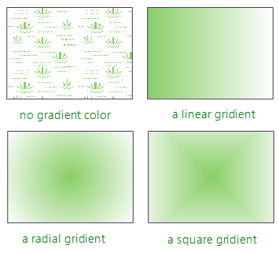
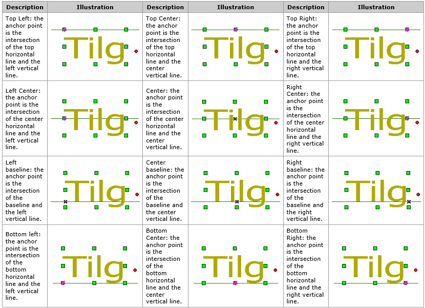
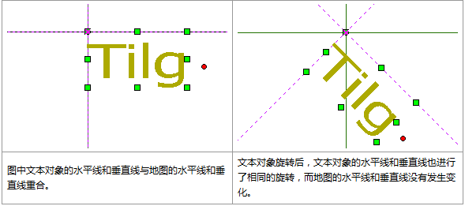

　　Abundant symbols and rendering styles are provided and supported by SuperMap iDesktop Cross, the display effect of maps can be optimized by setting parameters such as types, colors and tranparency of layers.

　　The settings are done in the symbol selecter which can be opened by two ways:

- The first way: Click the layer in the Layer Manager that you want to set to open the dialog box.
- The second way: Select a layer in the Layer Manager that you want to set, to open the dialog box, you can right click the layer and select "Layer Setting" or in the "Style Settings" tab which is beside "Maps" tab click "Layer Style" on the Style group.
　
　
### Marker Symbols

　　The settings type of marker symbols includes choosing symbols, symbol colors, rotation angle, transparency, etc. You can preview the symbol's display effect in the "Preview" frame.

- **Choose Symbols**

　　Select the corresponding directory at left of the "Marker Symbol Selector" which shows the symbol contents by default and from the worksapce, then choose the symbol you need.

- **Dispaly Size**

　　Set the width and height of a marker symbol, you can enter values into text boxes directly, also you can adjust the symbol's size by clicking the arrow at right, the unit is 0.1mm. If the selected symbol is a raster symbol, you can check or uncheck the "Lock Aspect Ratio" box to determine whether to fix the ratio of height and width, which means when you change the width(height), the height(width) is changed automatically.

- **Color**

　　Used to set the color of a symbol, click the drop-down arrow to open the color panel, you can choose a color from the color panel, or you can click "Other Color" in the bottom of the color panel to get more custom colors.

- **Rotation**

　　Used to set the rotation of a symbol, the rotation direction is counterclockwise, the value range is [0，360].

　　Click "Apply" button and you can view the display effect of the point layer in the map. If you are not satisfied with the result, you can reset the style.

### Line Symbol

　　Used for setting the line symbol, line width, line color and so on.

- **Choose Line Symbol**

　　Select the corresponding directory at left of the "Line Symbol Selector" which shows the symbol contents by default and from the worksapce, then choose the symbol you need.

- **Width**

　　The width of a line. You can enter a value into the text box directly, also you can adjust the width value by clicking the arrow at right, the unit is 0.1mm.

- **Line Color**

　　Used to set the color of a line symbol, click the drop-down arrow to open the color panel, then you can choose a color from the color panel, or you can click "Other Color" in the bottom of the color panel to get more custom colors.
　　
### Filled Symbol

　　Used for choosing a filled symbol and setting the color, boundary line style, transparency, gradient filling for the symbol.

- **Choose Symbol**

　　In the "Fill Symbol Selector" dialog box, find out an appropriate symbol from a directory and click it, then you can set the style of it.

- **Foreground**
 
　　Set the color of the filled content, click the drop-down button at right to open the color panel where you can choose a color from or click "Other Color" at the bottom of the color panel to get more custom color.

- **Background**
　　Set the color of the unfilled content, click the drop-down button at right to open the color panel where you can choose a color from or click "Other Color" at the bottom of the color panel to get more custom color.
 
- **Transparency**
　　Check the check-box to set the unfilled content transparency, meanwhile the setting of the background color is invalid.
 
- **Line Symbol**
　　Set the boudary style of filled symbol. Click the button at right of the label to open the Line Symbol Selector for you to set the boundary style.
    
- **Transparency**
　　Set the transparency effect of the filled content. You can enter a value into the text box directly, also you can adjust the transparency by clicking the up/down arrows at right. The value is an integer from 0 to 100, 0 means opaque, 100 represents completely transparent.
 
- **Gradient Fill**
　　Check the checkbox to take a color gradient (gradiently changing from the foreground color to the background color) as the filled content, at the same time, the parameters under the checkbox are available, including: 
  - Type: The ways of how to produce a color gradient. 

　　1. Linear: The type of gradient is a linear gridient.
　　2. Radial: The type of gradient is a radial gradient, the change in the colors radiating outwards from the center.

　　3. Square: The shape of the gridient is square.

　　

   - Rotation: Set the rotation angle for color gradient.

   - Offset X: Set the offset percent in the horizontal direction that the center of color gradient is relative to the center of filled range. You can enter a value into the text box directly, also you can adjust the value by clicking the up/down arrows at right.

   - Offset Y: Set the offset percent in the vertical direction that the center of color gradient is relative to the center of filled range. You can enter a value into the text box directly, also you can adjust the value by clicking the up/down arrows at right.

### Text Object

　　Set different display styles for text objects to mark the features with different characteristics. When the text layer is editable, select a text object and click "Style" button in the "Style" group on the "Style Settings" menu to open the CAD Style panel, where you can set the display style of the object. Also, you can double click a text object to open the Properties panel, and in the Text Info tab, you can set the style for the object.

- **Font**: Click the drop-down button and choose a font from the list as the text font. Note: By typing a letter from the keyboard to locate to the font quickly.
- **Achor Alignment**: Alignment uses an anchor point as the base point. The text object will move relative to the anchor point when the alignment is changed. There are three kinds of base line alignments in the 12 kinds. Base line is mainly used for English character, it is the second line in the three-line writing, for instance, abcde, all the capital letters are on the base line and the lowercase letters like gypj have a part under the base line. 

<!--Font Size在组合控件中选择或直接输入字号大小，作为同类文本的标准。例如选择或输入字号为“10.5”且不改变字高和字宽值，则当前文本图层中同时满足其他标准的所有字号为10.5的文本为同类文本。-->
<!--Alignment单击右侧下拉按钮，可从中选择某一种对齐方式作为同类文本的标准，例如选择“左上角”，则当前文本图层中所有满足其他条件的对齐方式为左上角的文本对象为同类文本。-->
<!--Rotation从中选择或直接输入角度值作为旋转角度相同的标准，单位为度，例如选择或输入角度为“45”，则当前文本图层中符合其他标准且旋转角度为45°的所有文本为同类文本。应用程序提供了 0，45，90，135，180，225，270，315 共 8 种常用的角度值。也可以直接输入任意角度值，系统将会把输入值换算至0-360之间，如-180，720被换算为180和0。-->

　　

- **Text Color**: Is used to set the text color. You can choose a color from the color panel shown by clicking the drop-down button, also you can use the function Pick Color to pick a color and then set it as the text color, or you can click "Other Color" to open the "Choose Color" dialog box where you can specify the text color.
- **Background**: Is used to specify the text color (without checking the transparency) or the outline color (the transparency is checked). 

　　

- **Font Effects**: Includes following items, check a item to enable related effect that you can preview on the Preview area (located in Properties panel on Text Info tab).
  - Bold: Is used to set whether to make the text bold.
  - Strikeout: Is used to set whether to turn a text into a strikethrough text.
  - Italic: Is used to set whether to make the text italic.
  - Underline: Is used to set whether to add a underline for a text.
  - Shadow: Is used to control whether words in a text object have shadows. 
  - Fixed Size: Is used to control whether the text size of text object is fixed. When the checkbox is checked, the text size does not change when zooming in or out on a map.
  - Transparency: Is used to set whether a text has background. Check it and the text has no background, and the "Outline" checkbox is enabled.
  - Outline: Is used to set whether to outline a text. Checking it means the text has an outline and the outline color is the same as the background color. Only when the background is transparency, the Outline function can be available.

