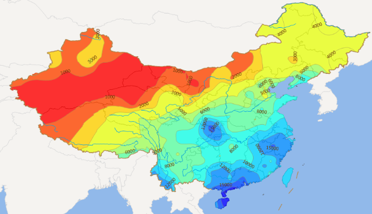
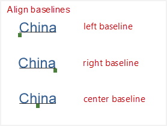
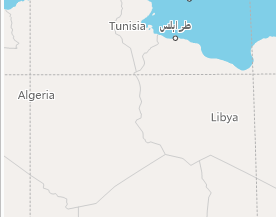
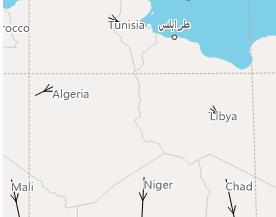
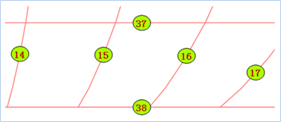
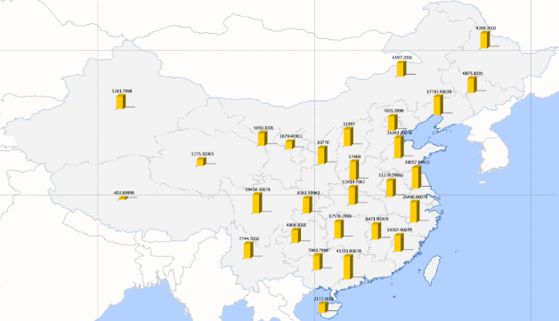
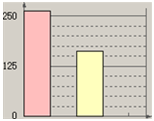
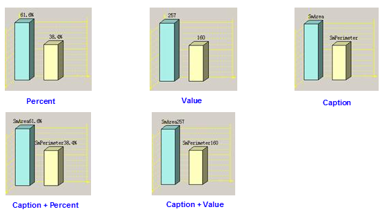

　　Both the vector data and the raster data can be used to create the thematic maps, but the difference is the thematic map of vector data is based on the attribute information in its attribute table, but the thematic map of raster data is based on the pixel value. The thematic map is applicable to the point, line, region, raster and complex datasets except the text and image datasets.

　　The datasets applying to vector data include: Unique Values Map, Ranges Map, Label Map, Graph Map, Graduated Symbols Map, Dot Density Map, Custom Map. The Grid Unique Values Map and Grid Ranges Map are applied to raster data. The features of thematic maps are as follows:

- A thematic map as an independent layer is shown on a map, you can adjust its order as your needs.

- You can produce multiple thematic maps in different types or the same type with a dataset.

### Unique Values Map

　　Classify the features with the same thematic value as a class, set a rendering style for every class to differentiate categories, such as colors or symbols. The thematic variable could be either a non-numeric attribute such as the name, type and state of a feature, or a numeric attribute which is used to identification, such as ID, the type identification number of land use and so on. Certainly, it also could be the numeric attribute which is used to represent quantity, at the time, the features with the same value are assigned a style, if there are a lot of different values, the method is not recommended.

　　The production of a unique thematic map aims to present the qualitative differences of phenomenon mainly. It can be used for a geological map, a geomorphologic map, a vegetation map, a land use map, a political map. For instance, to present the distribution area and range of different types of land (grassland, woodland and residential areas),  the same type of land will be given the same color or filled style.
  

### Ranges Map

**1.Overview**

　　Divide the thematic value into several ranges according to a method, the objects whose attribute values are within a range are presented by the same color, the same filled symbol or the same marker. The thematic variable for a range map must be numeric. The range maps is best used for reflecting the characteristic in quantity and degree for continuous distribution phenomenon, such as precipitation distribution or soil erosion intensity.

　　How are the intensity levels of soil erosion presented intuitively on a map when you produce a soil erosion intensity map? The best answer is classifying the intensity of soil erosion, such as classify it into 6 ranges (range from: &lt;500; 500-2000; 2000-6000; 6000-10000; 10000-20000; &gt;20000),  and then give a different color for every range, for example, you can set the objects whose values are less than 200 are light red, and the features whose values are within 500-2000 are red, and so on.

　　Following sketch is about precipitation distribution.

  

**2.Style Settings**

　　The best advantage of a range map is the reflection of different degrees between ranges by colors, such as by the changing of colors from green to red presents the changing of precipitation. SuperMap has provided some style settings (colors, line types, filled, etc) for you to render the style of every range.

**3.Method**

　　6 ways are provided by SuperMap to classify the thematic value, including: Equal Interval, Square Root Interval, Standard Deviation Interval, Logarithmic Interval, Quantile Interval, Custom Interval. Adopting different methods, the results are different. When the number of ranges is different, the produced thematic maps are also different.

　　The standard determining whether the thematic variable has been classified very well is all the objects with the similar values belong to the same category. The method and the number of ranges are the two important factors to decide the presentation of a range map. 

### Label Map

**1.Overview**

　　Labels are indispensable on a map which not only helps you better distinguish objects, but also presents some important attributes, such as the name of river, tourist sites, institutions and the altitude of contour line, etc. With SuperMap, you can add labels on a map easily.

　　It mostly is used for labeling point, line or region objects, the thematic variable should be chart or numeric field (road names, address names, river levels, river width, etc.). But the drawing elements such as the legend, map name, scale and others will not be labeled.

　　In a label map, you can set the display style and position of labels together, or set the display style for every label or labels within a range separately.

　　The advantages of the label maps are: the settings of range styles are supported in a label map, you can set a range field expression to divide all objects into several classes, and then set different styles for the labels of objects within different classes; when zooming labels in or out on a label map, the text can be displayed only between the maximum and minimum.

  

**2.The control of label position**

　　The position of a label is very important considering these problems, how to place labels can make a map more beautiful, how to avoid overlap phenomenon, how to better identify the relationship between labels and objects.

-   **Inner point**

　　Under the default and uniform setting situation, the anchor point of a label in a label map is the inner point.  Before you know about the position of anchor point, you should know the position of inner point.

　　For different geometric objects, the inner points are different. The inner point of a point object is itself, the inner point of a region point is located in the inside of the region object and close to the center. The inner point of a line object is the inner point of its first sub object, if the number of the nodes of sub object is odd, the middle point is the inner point, but if it is even, the inner point is the center point of the two points in the middle of all nodes.

-   **Anchor point and label position**

　　Generally, by the anchor point of a label controls the position of label. The settings of relation between a label and its anchor point are performed in text style. 12 position relations (alignment types) are provided to control the placing situation of a label around its anchor point. They are: Left Top, Center Left, Bottom Left, Top Center, Center, Middle Bottom, Top Right, Center Right, Right Bottom, Left Baseline, Right Baseline, Center Baseline.

         

-   **Offset**

　　The anchor point of label can have a certain offset which can be set by setting the offset of label in x and y axes. The offset value can be a constant value or a value expressed by an expression (such as the expression is SmID, the SmID equals 2, then the offset value is 2), the unit of offset is the map unit. You can fix the offset value (means that the value doesn't change when zooming in/out on a map).

- **Effects and special processes**

　　In the settings of label position, SuperMap has provided various settings for you to meet your needs of labels, at this point the anchor point may have no connection with the inner point, including: Flow, No Overlap, Show Leader Line, Alongline Labeling, etc, among them, the Flow function only applies to label line or region elements, and the Alongline Labeling is only worked for line elements.

   -   **Flow**: It is used for displaying the labels of geometric objects, in case part of them are displayed on the current window while their labels can be viewed only by panning the map (if the labels' position is fixed), when the function is opened, the labels will be moved with the panning of the map. Following pictures shows the comparison before and after opening "Flow". **Note**: The function can not be available for the thematic maps which were created based on point layers.

      

   - **No Overlap**: Under the situation that the objects are too close to each other and the space of every object is too small, the anchor point of label is controlled by the object's inner point with the labels overlap each other which could lead to some labels (at bottom) are hidden. When the function is opened, some overlapped labels will be shown against the position relative to the objects' inner points by default. Certainly, some overlapped phenomenon still can't be avoided when overlapping is severe.

   - **Show Leader Line**: Since a leader line is connected with a object's inner point, by a leader line, the object corresponding with a flowing label can be found out. Following picture shows a thematic map with the function has been opened.

   

   -   **Alongline Labeling**: Some linear features are too long, so when producing a map, it can make the map more beautiful that the labels are placed along them, and the same label can be shown at regular intervals. 

　　5 items are provided for the function: Along the normal of the line; Top to bottom, right to left; Top to bottom, left to right; Bottom to top, left to right; Bottom to top, right to left. If you select the first direction, the labels will be labeled from the starting point to ending point along the line direction. For another 4 items, every item contains of two parts (vertical direction and horizontal direction), according to the line direction determines which part are effective. The direction of a straight line is horizontal if the angle between the line and horizontal direction is less than 60 degree, otherwise, it is vertical. But for an arc, the angle between the tangent at the anchor point and horizontal direction is considered. For the line whose direction is horizontal, the labels will be placed as right to left or right to left, whereas for the line whose direction is vertical, the labels will be placed as top to bottom or bottom to top.

　　**Note**: All labels will be shown as the rotation of font set up in the style settings if the text angle is fixed without considering the labeling direction, but if the text angle is not fixed, both the rotation of font and labeling direction are considered when displaying the labels.

      

   -   **Remove Repeat**: If it has a line object which consists of several segments, when producing a thematic map base on a thematic map, there are multiple repeated labels shown on the map. To resolve this problem, you can check the "Remove Repeat" checkbox, the result is shown as follow.
   -   

   

**3.Label Style**

-   **Text Style**

    　　The style settings of labels include: Font, Alignment, Font Size, Font Height, Rotation, Text Color, Background, etc., in addition, some font effects have been provided, such as: Bold, Italic, Shadow, Outline, Strikeout, Transparency and so on. Among them, when Transparency is not checked, the background is the text background, but both Transparency and Outline are checked, the background is the color of outline. For details, please consult the introductions of label position. Please note that the font size is relative to the font height.

    　　Provide the settings of display precision for number, for example, if the precision is 0.1, the object whose field value is 178.3129 is displayed as 178.3 on the label thematic map. The settings of max height and min height of text are provided, which are used to control the font size when zooming in or out on a map, the function is effective with the premise that the font size is not fixed.

-   **Background Style**

    　　7 types of background shapes of labels: Default, Rectangle, Round Rectangle, Ellipse, Diamond, Triangle, and  Marker Symbol. Among them, the function Marker Symbol allows you to choose a marker symbol from Marker Symbol Selector as the background of labels. The style settings of label background is the same with a region symbol's.

**4.Range Display of Label Thematic Maps**

　　 You can set a range field expression, and compare the values of the field with range values to determine which range an object belongs to, and then set the different styles for objects in different ranges.

### Graph Map

**1.Overview**

　　Used for reflecting the values of fields of objects or records. A graph map can reflect various attributes based on multiple variables, i.e. lots of field values can be drawn on a graph map. The vertical and horizontal comparisons between region itself and each region can be shown by a graph map. A graph map is mostly used for the map with quantitative characteristic, such as GDP, population and so on.

　　Such as, you can take Pop1, Pop2, Pop3, Pop4 (representing the amount of tourists for four quarters) as thematic variables to produce a graph map which is about the tourist amount in the tourist sites of Beijing for every quarter.

  

**2.Deeply Know about a Graph Map**

-   **a Graph Map with a Graph**

    　　They two different concepts. On a graph map, there is a graph representing the thematic value of it in every area. Graphs have various types, currently are supported including: Area, Step, Line, Point, Bar, 3D Bar, Pie, 3D Pie, Rose, Stacked Bar, 3D Stacked Bar and Ring.

   

*   **Graduated By**

　　The graduated mode is mostly used for graph maps and graduated symbol maps. After the size of a graph map and proportion of every thematic variable are determined, the graduated mode will be used to reduce the differences between values. If there is huge difference between values, the appearance of a thematic map can looks more beautiful by using Square Root or Logarithm. Currently, three methods for graduating data are provided. Please have a notice for that if there are negative values, Square Root and Logarithm are not available.

　　　Constant: Graduated by the attribute value.

　　　Square Root: Graduated by the square root of the attribute value. 

　　　Logarithm: Graduated by the logarithm of the attribute value.

-   **How to determine the size of a graph map**

　　The display size of a graph map depends on the combination of extreme values of display, graduated mode and thematic extreme values. The extreme values of display include the maximum and minimum values displaying the graph map. If using a different graduating mode, the size of a graph also is different.

　　Thematic extreme values include the thematic maximum and minimum values. The thematic maximum value can be got by adding maximum values of all thematic variables, similarly, add minimum values of all thematic variables to get the thematic minimum value. For example, a field ID whose maximum value is 25 and a field SmID whose maximum value is 10 are thematic variables, the thematic maximum value is 35.

　　Note: the sum of every thematic value of an object decides the size of the corresponding graph , each thematic value decides the proportion of the object.

　　**Relative Relation**: According to the given display extreme values and thematic extreme values, a linear coefficient can be calculated by use of linear relationship, and then by the coefficient, a linear equation can be calculated which can computer the sizes of every graph. For example, the fields Val1 and Val2 are the thematic variables, the graduating mode is Constant, the given display extreme values are 20 and 10, the thematic extreme values are 10 and 6, and then the calculated linear equation is Y＝2.5X-5. The values of Val1 and Val2 of an object A are 2 and 6, the sum of thematic values of A is 8, according to the equation, the size of graph should be 15 (different types of graphs, the meanings represented by the value are different). For a bar, 15 represents the height of graph corresponding with A is 15, since the proportion of Val1 and Val2 is 1:3, the bar heights representing Val1 and Val2 are 3.75, 11.25 respectively.

　　**Note**: The unit of the above numbers is the same with the map unit. 

-   **The settings of display effect of thematic maps**

　　Similar with a label thematic map, a graph map also can be set whether to open Flow, No Overlap, Show Leader Line, and whether there are offset in the graph map and so on. Besides, the styles of coordinate axes of some graphs and the graphs themselves can be set.

　　(1). **Settings of coordinate axes of a graphs**

   　　You can set whether to display the coordinate axes of a graph, if yes, then the colors of axes and whether to display grids and text labels on the axes can be set. If the text labels are displayed on the axes, you can set styles for them. 

　　　　

　　(2). **Settings of a graph**

   　　You can set whether to fix the graph size, and whether to display the text labels on graphs. If the labels are displayed, you can set the display format and text style of graphs. The display formats include: Percent, Value, Caption, Caption + Percent, Caption + Value.

   

　　(3). **No overlap**

   　　For a graph map and a label map, both of them are produced based the same dataset, when the text labels of the graph map are displayed on current window and overlap the labels of the label thematic map, the former will be hidden, so, you can avoid this problem by the function.

　　(4). **Other settings**

   　　You can set whether to display the data with attribute values are negative. The width of a bar in the Bar, 3D Bar, Stacked Bar or 3D Stacked Bar can be specified, and for a Rose or 3D Rose, you can specify the rose angle. For a Pie, 3D Pie, Rose, 3D Rose, you can specify the starting angle.

### Dot Density Map

　　A dot density map is mostly used for representing distribution range, quantitative characteristic and distribution density of phenomenons by using dots or other symbols. The amount and represented meaning of dots rely on the map contents. In a dot density map, a numeric attribute information of a layer are mapped to different levels, and by using different amount of dots or symbols represents every level to present the differences between different areas. Dot density maps are usually used quantitative data, such as GDP, population, output of grain in different areas, and so on. A dot density map apply to region datasets.

  

**The meaning of dots in a dot density map**: 

-   A dot density map reflects the thematic values corresponded with each area or range by using the amount or denseness of dots, each dot represents a certain phenomena, hence, the thematic value of an area can be got by the number of dots within the area times the amount represented by each dot. For example, the population of a city is 2000000, each dot represents 20000, so the number of dots within the region (the city) is 100.
-   In a dot density map, for the regions that the number of dots are the same, the region with smaller area has denser dots, that's why a dot density map shows the density of phenomenon even though its thematic value is numeric.
-   You can specify the value represented by each dot and its size in a dot density map. If the value is too small or the size is too large, the dots will overlap each other which leads to the distribution is not obvious. Hence, it is very important setting appropriate value representing by each dot and its size.
-   The styles of dots in a dot density map are the same, so you can produce multiple dot density maps with different dot styles based on several attributes to show the distribution characteristics of multiple attributes on a map.
-   The dot distributions are random, no practical significance.

### Graduated Symbols Map

　　By using a group of graduated symbols shown on maps, in a certain way, graduated symbol maps present the relative relation between different features in a quantitative characteristic.  The thematic variable must be numeric when creating a graduated symbols map.

  

　　**How to determine the display size of a graduated symbol**

　　The main factors are: the point symbol size in a graduated symbols map, the datum value of a graduated symbols map, the scale of a statistical value. The point size is different from the display size. For a graduated symbols map, the sizes of all symbols are the same, the thematic values of features are different, hence the display sizes of symbols are different.

　　The graduated modes include: Constant, Square Root, Logarithm. In a graduated symbols map, when adopt different method to graduate attribute value, the values which are used to specify the display size of symbols are different. The datum value is specified by author.

　　**The settings of display effects**: For a graduated symbols map, the functions "Flow", "Show Leader Line", "Offset Setting" are also supported like a label map and a graph map, but the difference is the target object, for a label map. it is a label, for a graph map, it is a graph, but for a graduated symbols map, it is a symbol. Besides, you can set whether to display the objects whose thematic values are negative or 0, and respectively specify the styles of objects when the thematic values are negative, 0, positive.

### Grid Unique Values Map

　　In a grid unique value map, the pixels with the same attribute values are taken as a class, and then different colors will be set for every class to distinguish different categories. Grid unique value maps apply for discrete  raster data and some continuous raster data. The usages of grid unique values maps are meaningless in the continuous data that the grid values are different form each other.

　　A grid unique values map is similar with an unique values map, but the differences are:

1.  For the operation object, in an unique value map, it is vector data, but in a grid unique values map, it is raster data.
2.  For the thematic values, in an unique values map, they are the features' field values or field expression values, but in a grid unique value map, they are the attribute values of pixels in a raster dataset.
3.  For the style settings, in an unique values map, there are: color style settings, filling style settings, symbol style settings, but in a grid unique value map, there is color style settings only.

### Grid Ranges Map

　　In a grid ranges map, all attribute values of pixels are divided into several ranges as a method, the pixels whose attribute values are within the same range are rendered with the same color. It is used to reflect quantity or degree characteristic of continuous distribution phenomena, such as precipitation distribution.

　　A grid ranges map is similar with a ranges map, but the differences are:

1.  For the operation object, in a ranges map, it is vector data, but in a grid ranges map, it is raster data.
2.  For the dividing methods, in a ranges map, all of them are supported, but in a grid ranges map, only four methods are supported, they are: Equal Interval, Square Root Interval, Logarithmic Interval and Custom Interval.
3.  For the thematic values, in a ranges map, they are the features' field values or field expression values, but in a grid ranges map, they are the attribute values of pixels in a raster dataset.
4.  For the style settings, in a ranges map, there are: color style settings, filling style settings, symbol style settings, but in a grid ranges map, there is color style settings only.

