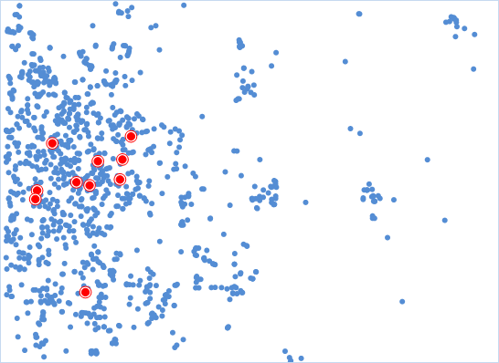

title: Central Feature
---

　　Identifies the most centrally located feature in a point, line, or polygon feature class.

##### 　　How Central Feature works

　　In the process of analysis, the cumulative distance of the center of mass of each factor and the center of other elements is calculated, and the minimum cumulative distance is the most central element. If the weight field is specified, the central element is the element with the smallest cumulative distance.

##### 　　Applications

- In urban areas to create a new large sports venues, can find center from all of the block elements, but also according to the population of the weight calculation, can get away from all the other blocks through the location of the minimum cost as a candidate for the address.
- Have multiple warehouses, a supermarket chain in the city now has just shipped a batch of goods, need to be distributed to each warehouse, in order to save transportation cost, find out the center warehouse, can according to the shortest path to distribute supplies.

##### 　　Operating Instructions

　　Cross provides two functional entrances, as follows:

- Click "Toolbox" - "Spatial Statistical Analysis" - "Measuring Geographic Analysis" - "Central Feature" in the menu bar, and the "Central Feature" dialog box will pop up.
- In the "Visual Modeling" panel, double-click the "Spatial Statistical Analysis"-"Measuring Geographic Analysis"-"Central Feature", and the "Central Feature" dialog box will pop up.

##### 　　Main Parameters

- **Input Feature**:Set up the vector data sets to be analyzed, supports points, lines, and regions three types of datasets. If it is a line or region object, the center of mass of the object is calculated, the weight of the point is 1, the weight of the line is the length of the line, and the weight of the region is the area.
- **Group Field**:Refers to a field that divides the analysis elements into categories. After classification, each group of objects has a central element. The Group Field can be of integer, date, or string type. Records with NULL values for the Group Field will be excluded from the analysis.
- **Weight Field**:Refers to the weighting of each feature to other features. After setting the weight field, the distance is D = W1 x D, where W1 is the weight value and D is the distance between the two elements.
- **Self Weight Field**:Refers to the cost of feature to other features. After setting its own weight, the distance is D = W1 x D + W2, where W1 is the weight value, D is the distance between the two features, and W2 is its weight value.
- **Distance Method**::Currently, Euclidean distance is supported by the linear distance between two elements.
- **Retention Statistics Fields**:Refers to the retention field that sets the result data in the field list box, and the calculation of the field value.The fields shown in the list are the fields that are reserved for the resulting data, and the fields can be used to remove, add, select, and reverse, and select the field to set the statistical type of its retention value.
- **Result Setting**:Set up the datasource for the result data and the dataset name.

　　After setting up the above parameters, click the "Run" button in the dialog box to perform the Central Feature analysis. As shown in the figure below, the red point is the central repository for each supermarket chain.

　　
　

###  Related Topics

　　 [Mean center](MeanCenter.html)

　　 [Median center](MeanCenterResult.html)

　　 [Directional distribution](MeasureDirection.html)

　　 [Linear directional mean](MeasureLinearDirectional.html)

　　 [Standard distance](MeasureStandardDistance.html)

