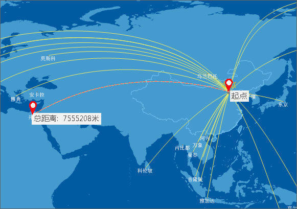
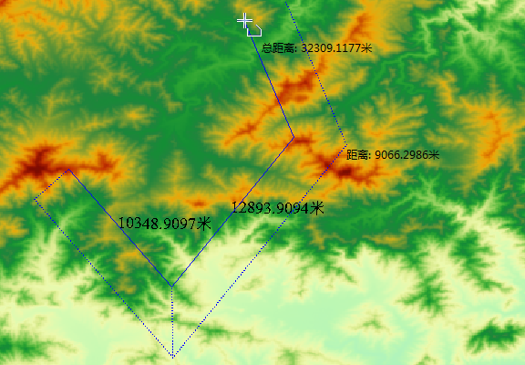
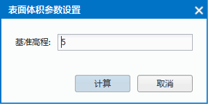

　　Measure distances, areas and angles on a map. You can redo the previous operations by the usage of Ctrl+Z.

　　Before doing the measurement operation, you should define the unit. Click "Unit" in the "Operation" group on the Map menu to open the dialog box "Measurement Settings" in where you can set the units of distances, areas, angles.

### Distance Measure

　　1.  Click "Maps" and on the group "Operations" click "Map Measure", then select "Distance" from the list.

　　2.  When the shape of the mouse pointer turn to a cross wire, click the left key of it at the starting point and then move the mouse, meanwhile there is a constantly changing line appearing in the screen with the distance value.

　　3.  Thera are two values displaying on the map during the operation, one is the distance between the current mouse position and last point, another one is the sum of the distances of all lines. The two values are the same when the first point has been confirmed but the second point has not been confirmed.

　　4.  You can click a series of points to continuously measure distances.

　　5.  The distance measurement will be finished when you click the right key of your mouse, while every distance will be labeled beside the corresponding line, the total distance will be output to the Output Window.

　　6.  You can clear the result from the current map window by clicking "Clear" button in the Operation group on the "Map" menu or pressing "ESC" key.

　　

　**Geodesic Distance**  
  
　　Geodesic Distance is the shortest curve between two points on the Earth's surface. A geodesic can be used to measure the distances of airlines. The measurements cross the eastern and the western hemispheres are allowed.
　　When the distance between two points on Earth's surface is small, the geodesic curve distance is close to the straight line distance, when the distance between two points on the Earth's surface is great, the results of two measurements are different. 
　　Basic Step: The steps of performing Geodesic Distance and performing Distance measure are the same.
   
　　

### Area Measure

　　1. In the "Map" menu and on the group "Operations" click "Map Measure", then select "Area Measure" from the list.
 
　　2. When the shape of the mouse pointer turn to a cross wire, click to specify the first point of the temporary polygon for measuring distance. Click again to form the first edge of the polygon. When you move the mouse pointer from the second point, the area of the temporary polygon is displayed on the map when you move the mouse pointer.

　　3. Continuously click to define the polygon for polygon for measuring distance.
 
　　4. Right click to finish measuring area. The area of the temporary polygon is displayed on the map as well as in the Output Window.

　　5. To clear the polygon and the area label, click the Clear button in the Operation group. Besides, you can press Esc to implement the clear operation.

　　

### Angle Measurement

　　1.  In the "Maps" menu and on the group "Operation" click "Map Measure", then select "Angle Measure" from the list.

　　2.  When the shape of the mouse pointer turn to a cross wire, click to specify the start point of one edge, a dotted line pointing to true north shows up. Move the mouse pointer to form the edge, the included angle between the dotted line pointing to true north and the edge, also called the azimuth of the edge, is displayed.

　　3.  Click again to confirm the first edge, continue to move the mouse to specify the other edge. The azimuth of the second edge and the angle between the two edges are displayed on the map.

　　4.  Continuously click mouse to measure included angles between edges and azimuths for all edges.

　　5.  Right click to finish measuring angles. Angles for each pair of connected edge are displayed around the junctions as well as in the Output Window. Also displayed in the Output window is the included angles of each edge.

　　6.  You can clear the result from the current map window by clicking "Clear" button in the Operation group on the "Map" menu or pressing "ESC" key.

　　
  
### Surface Distance	   
  
Calculate the surface distances on raster data, that is to calculate the curved surface distance on the fitting 3D curved surface along the given line segment or polyline. The distance measured is on the curved surface, so the value is larger than that on the plane.

Basic Steps  
1. Open your raster dataset. Note: The function is not available unless there is raster data opened in the current workspace.
2. In the "Maps" menu and on the group "Operation" click "Map Measure", then select "Surface Distance" from the list.
3. Left click your mouse in an appropriate position then move your mouse, and you will see a temporary line with its length.
4. During the procedure of measurement, there are two result numbers in the window: One is the distance between the last point and the point where your mouse is at, and another one is the distance between the original point and the point where your mouse is at. 
5. You can click a series of points to measure the distances between them and the sum distance.
6. Right click your mouse to complete the operation, at the same time the sum distance of whole polyline are output in the Output Window.
7. Click "Clear" in the Operation group to clear all temporary lines and lengths in the current window. Also you can click "Esc" to perform the "Clear" feature.
8. You can view the surface distances in the Output Window.
 
  
　  
  
### Surface Area  
  
Calculate the surface area of raster data. It calculates the total surface area of the simulated curved surface drawn in a raster dataset.
    
Basic Steps  
1. Open your raster dataset. Note: The function is not available unless there is raster data opened in the current workspace.
2. In the "Maps" menu and on the group "Operation" click "Map Measure", then select "Surface Area" from the list.
3. Draw a temporary polygon then right click your mouse to finish the drawing operation. Meanwhile, the area of polygon you drew is shown in the map window and Output Window. The default area unit is square meter. You can press Esc to clear all results in the map window.
4. You can view the surface areas in the Output Window.

  
　    
  
### Surface Volume  
  
Calculate the surface volume of space corresponding to a selected polygon region. The space is between a 3D curved surface simulated by grid dataset and a base plane.
  
    
Basic Steps  
1. Open your raster dataset. Note: The function is not available unless there is raster data opened in the current workspace.  
2. In the "Maps" menu and on the group "Operation" click "Map Measure", then select "Surface Volume" from the list.
3. Draw a polygon in the map window then right click your mouse, and the dialog box "Surface Volume Parameter Settings" appears. Enter the height datum as the original height of the volume you want to measure, and click "Calculate" button.
    
　      
4. The result will be output in the map window and output window, and the default unit is cubic meter.

  
