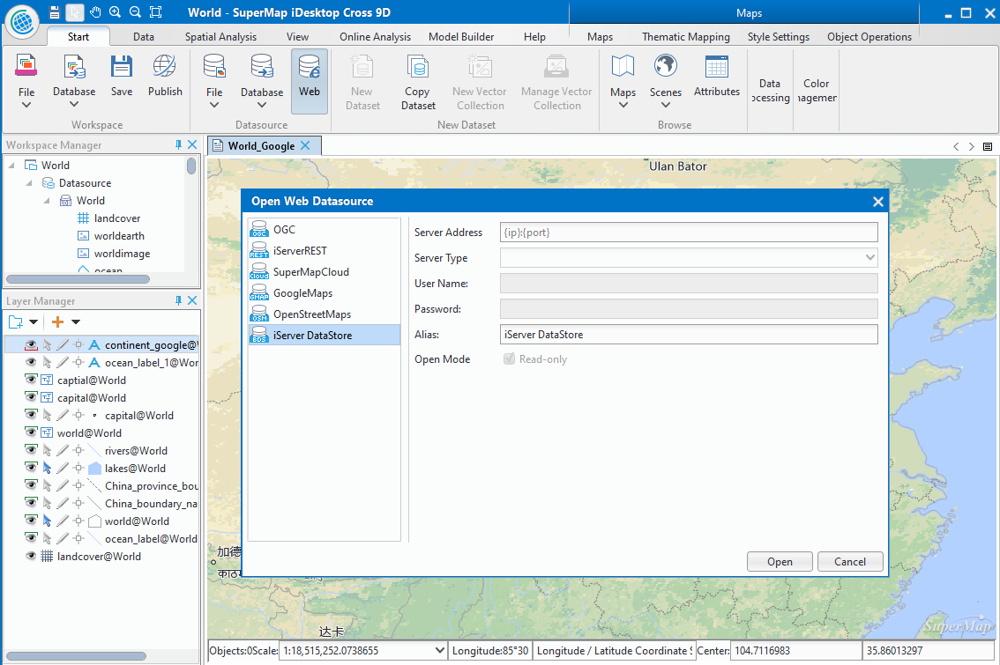
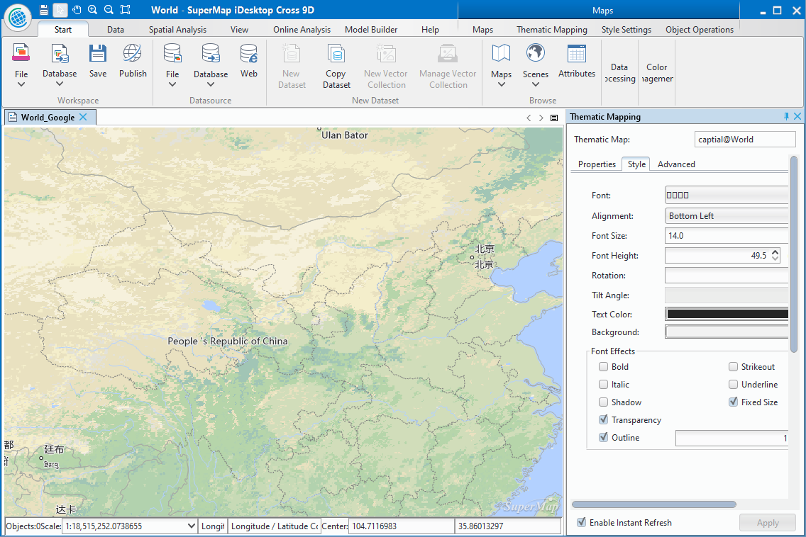

title: SuperMap iDesktop Cross 9D Introduction
---

　　

　　SuperMap iDesktop Cross 9D which is written in Java is a plug-in, cross-platform application software based on SuperMap iObjects Java 9D and OSGI. Cross provides various features, such as: data management, data processing, data analysis, and mapping (only supported on Windows), and provides a flexible development framework and auxiliary controls, user-friendly secondary development. The source codes of Cross is put on the platforms [OSChina](http://git.oschina.net/supermap/SuperMap-iDesktop-Cross) and [CSDN](https://code.csdn.net/SuperMapDesktop/supermap-idesktop-cross/tree/master).

## Product introduction

　　SuperMap iDesktop Cross is a professional , cross-platform GIS software which is developed based on SuperMap iObjects Java. by using OSGI framework and intellij idea tool. 
　　Multiple Cross versions are provided for Windows and Linux. For Windows, the provided versions include bin packages and installation package (both of them are in 32 bit and 64 bit), while the bin package in 64 bit is provided for Linux system.

## Provided functions

### Data management

　　Provided the workspace manager, datasource manager, and dataset manager; Supports various kinds of engines including file type, database type and web type; the operation and process in spatial data and its properties have been provided with the featuers of creating, editing, managing, accessing, and so on.

-   **Data engine**: Different data engines can be opened, such as: Oracle, SQLPlus (can't be opened in Linux system), DB2 and MySQL, etc. At the same time, Web map data can be opened from OGC service, iServerRest service, SuperMapClound service, GoogleMaps, OpenStreetMap, iServer DataStore and so on.

-   **Workspace manager**: You can open, save, close, delete a workspace, also you can save a workspace under other folders. The supported workspaces include file workspace, Oracle workspace, SQLServer workspace (can't be applied for Linux version), MySQL, PostgreSQL, DM, MongoDB. The workspace can be restored automatically if the product exited abnormally.

-   **Datasource manager**: You can open a file datasource, a database datasource or a Web datasource, also creating a file datasource, a database datasource or a memory datasource is supported.

-   **Dataset manager**: A variety of operations are supported, such as the tasks of creating, copying, closing, deleting, etc.

 

### Data conversion

　　The data in another format can be converted to an available format by SuperMap iDesktop Cross, also the data in SuperMap format can be exported in other data formats.

-   **Import data**: Data in other formats can be imported into the application, including vector, raster and model data formats, such as: \*.dwg, \*.e00, \*.shp, \*.mif, \*.csv, \*.tif, \*.img, \*.dem, \*.gpx, etc.

-   **Export data**: A dataset can exported in other data formats. The formats of data can be exported include: \*.dwg、\*.e00、\*.shp、\*.mif、\*.csv、\*.tif、\*.img、\*.sit、\*.kml、\*.gpx and so on.

### Data process

　　The data process is a basic feature, the data process features provided by SuperMap iDesktop Cross include: projection setting, data registration, data edit, SQL Query, topology process, etc.
-   **Projection setting**: Supports to convert projection in a vector, raster or model dataset.

-   **Data registration**: The data registration can be performed on one or more dataset with correcting and changing the spatial position of data according to the reference data.

-   **Data edit**: Abundant, comprehensive object drawing and object edit are provided, which is convenient to edit and adjust data.

-   **Spatial index**: Creating spatial index for vector data is supported, creating image pyramid for raster data enhances the efficiency of browsing data.

-   **Vector data process**: A lot of features for processing vector data are provided, such as: Dissolve, Topology Check, Topology Preprocessing, SQL Query, Attribute Update.

-   **SQL query**: Based on the specified SQL expression, the system will find out data meeting specified condition from existed data, a SQL expression also can be constructed by adding an external table field.

-   **Spatial query**: Based on the spatial position relation, to query objects meeting certain conditions.

### Mapping

**Related features on map**: Map display, rendering, edit are provided, settings of 2D or 3D point, line, region layer style are offered, also the creating and modifying of unique, range, label, or statistic thematic map are supported.

-   **Map selecting**: Supporting two ways to select objects (Tapping or frame selection).

-   **Browsing a map**: You can browse a map by these operations: pan, zoom in, zoom out, full extent, and so on.

-   **Style setting**: Providing abundant symbol resource, supporting to set layer style for 2D or 3D point, line, region, and supporting to set properties including point symbols, line symbols, region symbols, color, transparency to enhance the beauty of the map.

-   **Map edit**: Supporting these operations on map, including: copy, paste, cut, delete.

-   **Layer visibility**: The setting of layer scale is supported, a layer can be shown under different scales to improve the display efficiency and beauty.

-   **Thematic map**: The creation and modification for vector and raster layer thematic maps are supported, among them, 7 kinds of thematic map (unique, range, label, statistic, point density, graduated symbols, user-defined) are supported for vector layer, but only unique thematic maps and range thematic maps are supported for raster layers.

-   **Color scheme** : The application provides rich color schemes to improve the beauty of a map, also you can customize a color scheme.

-   **Map measure**: Three measure types are provided: distance, area and angle.

-   **Map clip**: Clipping data within a specified region according to needs, and multiple layers can be clipped in bulk.

  

### Data Analysis

-   **Buffer analysis**: The principle is that building area with certain width around point, line or region objects according to a specified distance. Many reality problems are resolved by combining buffer analysis and overlay analysis.

-   **Overlay analysis**: New spatial geometric information required by users can be extracted by analyzing spatial data, such as: clip, union, intersect, erase, etc.

-   **Spatial statistic analysis**: Analyzing and forecasting the statistic value which is associated with spatial and time-space phenomenon, including: measure geography analysis, model analysis, cluster distribution, build model. The feature can be used to analyze the data elements of aggregation, discrete relationships, structure and trends.

### Model Builder

　　Building a model for importing data, processing data, and analyzing data, etc., you can design a workflow which can execute many operations to data continuously.

-   **Canvas**: You can add, delete, modify a model in a canvas conveniently.

-   **Provide functions**: Hundreds of features are provided in Model Builder, including: kernel density analysis, big data analysis, measuring geographic analysis, and so on.

-   **Play**: One node or whole model can be run, you can control and manage the process.

-   **Save**: The constructed model can be save into a workspace for further usage or modification.

-   **Manage**: In the workspace manager, the Model Builder node has been added for renaming, deleting, opening an existed workflow.

-   **Model**: The created model can be exported as a template, you can create a new model easily by loading a template.

-   **Check**: Supporting to check whether a created model exists some errors, such as: a free node, endless loop, no data imported and so on.

### Big Data

-   **iServer DataStore**: Supporting big data Web engine iServer DataStore, users can use the dataset from iServer DataStore datasource directly to processing and analyzing data.

-   **Data management**: Through an accessible Hadoop address to manage big amount of data. The supported features include uploading data, downloading data, folders management, tasks management, etc.

-   **Data analysis process**: The ability of analyzing and processing big data based on Spark is provided, users can make a map quickly, such as a heat map and a kernel density analysis map.

-   **Summary Region**: Within a specified range, the count of points, the length of lines, and the area of regions can be summarized, and the statistic data of property fields of objects can be computed.

### Map Cache

-   **Multi-process map caching**: Multiple processes can be run in one or more computers to execute the map cache task, which uses the resource of computers reasonably and shortens time of generating map cache effectively.

-   **Control the count of processes**: Users can add or reduce the number of processes during caching.

-   **Updata Cache**: Cache within a specified area and scale can be updated based on specified range.

-   **Check cache, regenerating cache**: Whether there are error tiles in the generated cache, if yes, these tiles with errors can be regenerated.

### Publish Service

　　A datasource in a workspace can be published to iServer (local or remote server) to share resource in Web.

## Key Features

### Cross-platform,  customizable

-   Since adopting JAVA program language, the product (based on Java iObjects) has the ability of cross-platform which means the product can run on Windows or Linux system.

-   The adoption of Felix makes the application easy to expand and flexible configuration framework and achieves a pluggable iDesktop.
-   The OSGI international standards is conformed. An application program can be devided into multiple units, so that relationships between each unit and these units developed by users can be managed to achieve the display for GIS data.

-   The interface adopts Swing graphic styles, supports cross-platform. Also it is strong security and can be easy to customize and secondary development. 

### Stable, easy to use, efficient, beautiful

-   Universality, efficiency and stability of the system Java-based are significantly improved by adopting Felix framework.

-   The application uses Swing of graphic style, rich features and modularized components to create beautiful, easy-to-use menu and toolbar interface.

-   The design concept "Functions on your hands" provides abundant response functions of right-click context menus and mouse activities to improve the usability of the software. The presentation "WYSWYG" makes sure that users can see the result of operations in the first place, so that users can design and modify the operation.

-   The application of templates can improve reusability and efficiency of work by using a map template which is formed by exporting a configured map as a template file.
