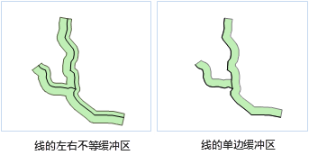
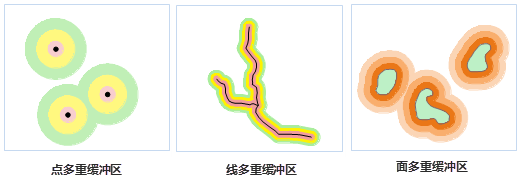

title: Theory of Buffer Analysis
---

　　Buffer analysis is one kind of analysis method which can build a zone of a certain width around every geometric object according to a given distance. A lot of practical problems can be solved under the combination of overlay analysis and buffer analysis. Buffer analysis can be used in various domains, such as, when you clean up the environment of an area, around the polluted rivers, polluted zones can be drawn through the buffer analysis. For another example, when extending a road, according to the width of road create buffer zones, then overlay the buffer layer and a building layer, so the buildings which are located in buffer zones need dismantling.

　　The basic buffer feature is point, line or polygon. Buffer analyst supports point dataset, line dataset, polygon dataset and network dataset. The buffer analyst of the network dataset focuses on edges. Two types of buffer analysis: single-ring buffer and multi-ring buffer (analysis). Following is the introduction of point, line and region buffer zone, which takes the single ring buffer as an example.

### Point Buffer Zone 

　　The point buffer zone is a circular region that is generated by a specified point object (the center of a circle) and a specified buffer distance (the radius of a circle). If the buffer distance is large enough, the buffer zone of two or more point objects may overlap. If you select Union Buffer, the overlapped part will be merged, the output buffer zone is a complex polygon object.

   

### Line Buffer Zone 

　　The line buffer zone is an enclosed region formed by joining the two lines that are generated by moving the specified line object a fixed distance on both sides of it along the normal direction of the line object with the smooth curves (or flat heads) at the endpoints of the two lines. Similarly, if the buffer distance is large enough, the buffer zone of two or more line objects may overlap. Its dissolved result is the same with dissolving the point buffer zones.

  

　　When the buffer for line data is of a flat type, the buffer distance on the two sides of the lines can be different. You can also create a buffer on either side, as shown below:

   

### Region Buffer Zone 

　　It is similar to generate the line buffer zone. The difference is the polygon buffer zone only extends or contracts on one side of the polygon boundary. If the buffer radius is positive, the buffer zone extends outside the boundary of the polygon object; and if the buffer radius is negative, the buffer zone contracts inside the boundary of the polygon object. Similarly, if the buffer distance is large enough, the buffer zone of two or more polygon objects may overlap. Its dissolved result is the same with dissolving the point buffer zones.

  

### Multi-ring Buffer Zone

　　Multi-ring Buffer is to create multiple buffers around the geometry objects according to the several specified buffer radius. For line objects, you also can create one-side multi buffer.

   

###  Related Topics

[Generate single buffer](SingleBuffer.html)

[Example on Buffer Analysis](BufferAnalyst_Example.html)
