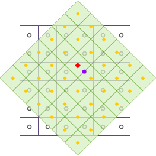
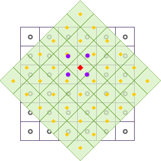
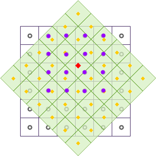
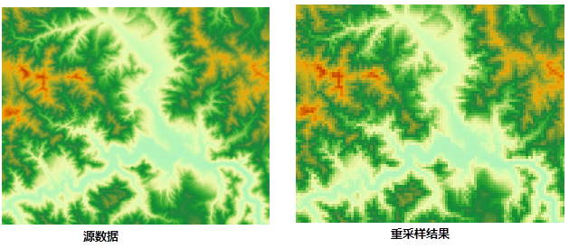

  
### Instructions  

　　Raster Resample is a procedure of assigning the pixel values of input images to every output image. The image mentioned here is raster data including GRID and IMAGE. If the positions of input or output or resolution of images have some changes, you should resample your raster data.

　　Resample function can be used to process the problem on resolutions of raster data do not match during the spatial analysis. Through the Resample function, the raster resolution can be decreased with some details missed, or increased with the same details as the original data. Through Resample operation, turn the low resolution of multiband remote sensing image into the same resolution as a panchromatic image, and then dissolve the two images to get a new image with high band resolution and full information.
   
 　 Three modes are provided for resampling raster data: Nearest, Bilinear, Cubic. Following contents detail the three methods.

#### Nearest

Take the nearest cell value in input raster dataset as the input value and assign it to the corresponding cell in output raster dataset.

This method won't change the original cell value and it is fastest of three methods. It is applicable to discrete data primarily, such as landuse, vegetation type and so on.

  

As the above picture shows, the black one is the input raster dataset and the green one represents the output raster dataset, and the red point is the center of a pixel in output dataset. After performing the Nearest operation, its value equals the nearest pixel (the purple point) value in the input dataset.

#### Bilinear
  
Calculate a new pixel value based on the weighted average value of the 4 nearest input pixel values and assign it to the corresponding output pixel. And the weighted value is determined through the distance between the center of every pixel and interpolation point.
  
This method will smooth the output dataset, but the original pixel values will be changed. It is applicable to the continuous data representing phenomenon distribution and terrain surface, such as DEM, rainfall distribution. slope and so on which were obtained through interpolation of sampling points.

  

As the above picture shows, the black one is the input raster dataset and the green one represents the output raster dataset, and the red point is the center of a pixel in output dataset. After performing the Bilinear operation, the system will calculate the weighted average value of the nearest 4 pixels (whose centers are the 4 purple points), then assign the value to the output pixel.

#### Cubic
  
It is similar to the Bilinear. Assign the weighted average of the 16 nearest input cell values to the corresponding output cell. 

Performing this method can improve the interpolation accuracy, and has a clear result, and the result dataset has less distorted than it getting through other methods. But the disadvantages is it requires more processing time and changes the original raster values, in some cases, the raster values in output dataset can be outside the range of input raster values. This method is appropriate for resampling of air photos and remote sensing image set.
  
  
As the above picture shows, the black one is the input raster dataset and the green one represents the output raster dataset, and the red point is the center of a pixel in output dataset. After performing the Cubic operation, the system will calculate the weighted average value of the nearest 16 pixels (whose centers are the 16 purple points), then assign the value to the output pixel.

### Basic steps  

 1. In the toolbox, click "Data Processing" > "Raster" > "Resample" to open the "Resample" dialog box.
 2. Specify the dataset which needs resampling. **Note**: Multiband image data is not supported to resample.
 3. Parameter settings:   
 	- Resample mode: Specify a method to perform the operation.
 	- Resolution: Set the resolution of the output dataset. The default resolution is the twice of the input dataset. 
 	- Columns: How many columns there are in the output raster dataset. You can't manual modify it and it is controlled by the "Resolution" parameter. The default is the same as columns of input raster dataset. 
 	- Rows: How many Rows there are in the output raster dataset. You can't manual modify it and it is controlled by the "Resolution" parameter. The default is the same as rows of input raster dataset. 
 	 
 4. Set the result dataset name and specify a datasource to save the dataset. Click "Run" image button to perform the operation. As the following picture shows, the right image is the effect adjusting the pixel size from 80 to 500.

 
   
  

