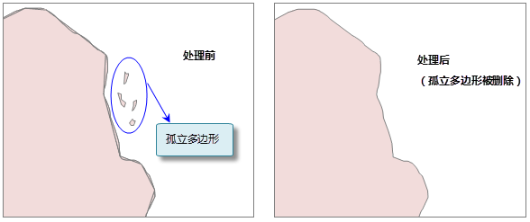

　　Merge the tiny polygons to larger polygons.

　　During the procedures of creating and processing data, some tiny polygons maybe generated. You can merge these tiny polygons to adjacent polygons, or delete the isolated polygons.

　　Generally speaking, a polygon whose area is much smaller than other region objects' is the tiny polygon. You can set the minimum polygon tolerance according to your needs. The vertex tolerance is used to determine whether the polygon is adjacent. If you set a great tolerance for the region object or the polygon, it may result in failure to merge tiny polygons.

　　Following pictures illustrate tiny polygons were merged into an adjacent big polygons.

  

　　For isolated polygons whose areas are less than the specified minimum polygon tolerance respectively, you can select Delete Isolated Polygon, the results are as shown below:

  

### Basic steps

 1. In the toolbox, click "Data Processing" > "Vector" > "Eliminate Tiny Polygons" to open the "Eliminate Tiny Polygons" dialog box.
 2. Select the dataset in which the tiny polygons will be merged into big polygons.
 3. Node Snap Tolerance: If the distance between two nodes are less than this tolerance, they will be merged into one node. 
 4. Min Polygon Area: The polygons whose area are less than this value will be considered as tiny polygons. The system will set the value as the one millionths of the maximum object's area, you can reset the value, it is recommended the value ranges from one millionths to one ten-thousandth of the area of the maximum object. A red mark will be displayed if the value exceeds the range, you can view the minimum value and maximum value by double-click the mark. 
 5. Delete Single Region: Check it to delete isolated polygons (not intersect or tangent to other polygons).
 6. Click "Run" to perform the operation.

### Related topics

 [Dissolve](Datafuse.html)

