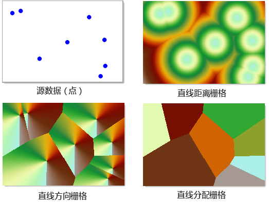

　　Generate distance raster is used to calculate the distances between every cells to the nearest sources (the interested features or objects, such as well, road or school), and assign the values to the cells to create distance dataset. Then create direction dataset according to the direction to the nearest source; then identify the service coverage of each source and create the allocation dataset.
　　When creating distance raster, you can specify the cost data to get the cost distance raster. The source data of the cost distance raster analysis can be vector data (point, line, region) or raster data. Similar to straight-line distance raster analysis, the result of cost distance raster analysis including: cost distance raster dataset, cost direction raster dataset and cost allocation raster dataset. The cost distance raster contains the least accumulated cost value form each cell to the nearest source, the nearest source of a cell is the source that the cell can travel to with the least cost, and the cell value is the least accumulated cost in the many paths to the source. Cost data is optional, you will get the straight-line distance raster result if do not set it.

　　Calculate the distance between cell and source. The result can be used to resolve following three questions:

 - Distance from cell to the closest source like to the closest school.
 - Direction from cell to the closest source like to the closest school.
 - Cells to be allocated to the source data according to the spatial distribution, such as the location of the several nearest schools. 

Three kinds of datasets will be got: distance raster, direction raster and allocation raster. As shown below.

   

### Basic steps

1. Two function entrances are provided:
 - Under the "Spatial Analysis" tab on the "Raster Analysis" group, click "Distance Raster" then select "Generate Distance Raster".
  - In the toolbox, click "Raster Analysis" > "Distance Raster" > "Generate Distance Raster" or drag the item into the model panel.
2. Source Dataset: Specify the datasource and select the dataset where the source data is saved in. The source data is the interested feature or object, such as well, road or school. it can be vector data or raster data. 

3. **Cost Data**: Specify a datasource to store cost data, and choose a cost raster dataset from the datasource (the dataset can be empty), but a negative value is not allowed, and the system will prompt "The cost grid can not have a negative value.". The cost dataset contains the cost of each cell, such as height, slope, etc. 
4. Parameter Settings: 
 - **Max Distance**: The maximum distance of the distance raster created. The cells larger than the distance will be assigned to no value in the result dataset. The default value is 0 meaning the result is not restricted by distance. This is an optional parameter.
 - **Resolution**: Set the resolution of the result dataset. The default value is 1/500 of the diagonal line of the source dataset. This parameter is optional.

5. Result Data: Specify a datasource to save results, then enter three names for distance raster, direction raster, and allocation dataset. The default names are DistanceGird, DirectionGrid, AllocationGrid respectively.
6. Click "Run" image button to start the operation.

### Related topics  
 
　　 [Distance raster overview](AboutRasterDistance.html)  

　　 [Calculate the shortest path](ShortPath.html) 
   
　　 [The shortest path between two points](TwoPointDis.html) 
   
　　 [The shortest cost path between two points](TwoPointCostDis.html)    
 

