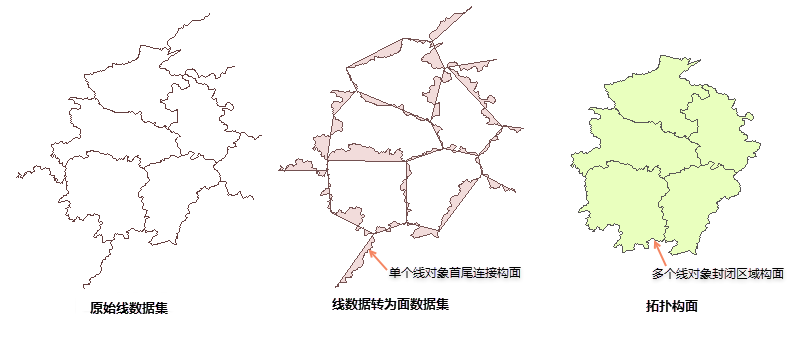
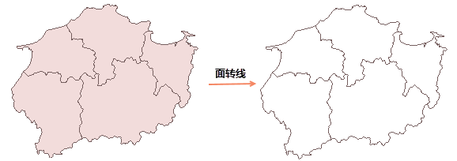

## 点与线类型互转

　　SuperMap iDesktop Cross 支持将点数据转为线数据，即通过把指定的连接字段值相同的点，按照 SmID 顺序连接成一个线对象，进而生成新的线数据集。   
　　同时支持将线数据转为点数据，即通过把线数据集中所有线对象的节点提取出来，进而生成新的点数据集。　　

### 点数据转为线数据  
  
- 对于点数据集中的连接字段值相同的点，系统会将它们连接为同一个线对象；若连接字段的某个字段值只有一个点对象，或者点对象的连接字段值为空，则默认不处理该点。  
- 若点数据集中所有点对象的连接字段值为空，或连接字段值都为唯一值，或连接字段值部分为空部分有值，并且非空字段值唯一时，转换为线数据集会失败。     
- 生成的线数据会保留点数据连接字段的属性信息。   
- 连接字段支持设置数值型、宽字符型和文本型字段，其他类型字段不支持。   

**操作说明**

　　1. 在“点数据—>线数据”对话框中，在“源数据”处选择待转换的点数据集。  
　　2. 在“连接字段”列表框中选择字段，应用程序会根据指定的连接字段值，将字段值相同的点对象按照 SmID 的顺序连接成一个线对象。  
　　3. 在“结果数据”处设置结果数据集存储的数据源及结果数据集名称。   
　　  
### 线数据转为点数据    
  
- 对于线数据集中的参数曲线（圆、弧等），系统会将其看作是具有很多临近节点的折线，所以在转换操作时，系统会将其所有的节点都提取出来，生成点数据。   
- 生成的点数据会继承节点所在的线对象的 SmUserID 和所有非系统字段的属性信息。   
  
**操作说明**  
  
　　在“线数据—>点数据”对话框中，分别在“源数据”和“结果数据”处设置待转换的线数据集和转换后结果数据集，单击执行按钮，进行线数据转为点数据的操作。  

  
## 线与面类型互转

　　线数据与面数据的互转包括：线数据转面数据和面数据转线数据两种方式。

### 线数据转为面数据   
  
　　线数据转为面数据，即通过将线数据集中每个线对象的起点与终点相连接而构成一个面对象，起点与终点的连接方式是最短距离的直线连接构成一个面对象。当线对象为单一直线且构面的面积为0时，则该对象构面失败。常用于当用户需要以单个线对象作为处理线转面的操作时。若用户想要将多个线对象构成的封闭区域进行构面时，可使用“拓扑构面”功能，请参看“拓扑构面”文档。  

  
  
- 如果输入的线图层包含复合对象，输出的面数据仍为复合对象，可以通过使用分解功能，将转换后的面对象分解为简单对象。 
- 新生成的面数据集（或追加后的数据集）继承源数据集的字段 SmUserID 和所有非系统字段的属性信息。
  　　  
### 面数据转为线数据  
  
　　面数据转为线数据，即通过将面对象的边界转化为线，从而创建一个包含线对象的数据集。    
  
- 输入的面数据的属性信息能够全部保留。新生成线数据会继承源数据集的字段 SmUserID 和所有非系统字段的属性信息。   
- 多个面数据转为线数据时，生成的线数据的投影与源数据（转换前的面数据集）的投影保持一致。 
- 输入的图层包含复合对象，输出的线仍为复合对象，可以通过使用分解功能，将转化后的线对象分解为简单对象。 
   
  

## 面数据转为点数据

　　面数据转为点数据，即通过将面数据集中的每个对象的质心提取出来生成一个新的点数据集。新生成的点数据集会继承源数据集的 SmUserID 和所有非系统字段的属性信息。 常用于当用户想要用点数据表示对象位置信息时，可将已有的面数据转为点数据，同时保留了面对象的属性值又能精确的表示面内的位置信息。  

  
  

**操作说明**  
  
　　在“面数据—>点数据”对话框中，分别在“源数据”和“结果数据”处设置待转换的面数据集和转换后结果数据集，单击执行按钮，进行面数据转为点数据的操作。 