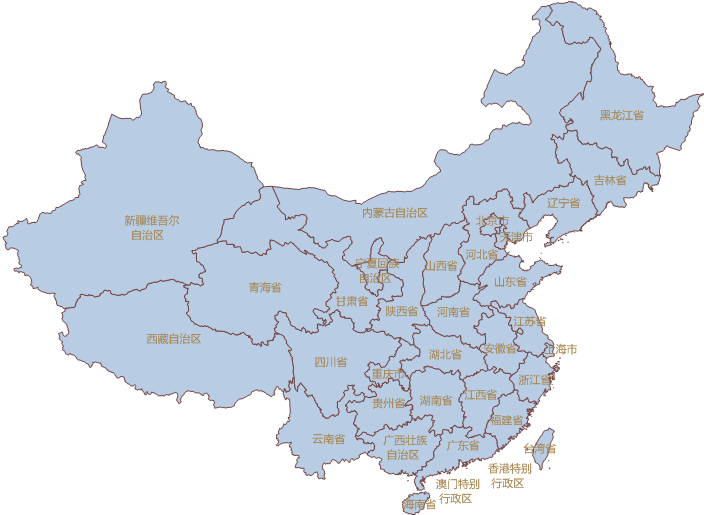

  
### 使用说明　　  
- 把数据集中的某个字段内容，转变到文本数据集，通过此功能可以实现地图标注。例如我们可以将 China 数据源下 Province_R 数据集的 Name 字段转换为文本数据，将此文本数据和 Province_R 数据集在同一窗口中显示，以实现对 Province_R 数据集的标注。  
-  字段到文本后的文本位置由其所对应对象的**内点**所确定的。如果转换后文本的位置不理想，可以通过改变文本对象对齐方式的方法进行调整。对于不同的几何对象，内点位置不同：    
  
	- 点对象的内点是该点本身；  
	- 线对象的内点是线对象的节点数最多的子对象的内点（当线对象只有一个子对象时，取该子对象的内点），当该子对象有奇数个节点时，取中间一个节点为内点，当该子对象有偶数个节点时（多于两个节点的情况），取中间两个节点之后者，当该子对象有两个节点时，取两节点之中心为内点；  
	- 面对象的内点是在几何对象的内部，并靠近中央的点；  
	- 文本对象的内点是该文本对象的第一个子对象的锚点。  
	
- 适用于点、线、面、文本、三维点、三维线、三维面、二维网络数据、三维网络数据集以及模型数据集。 
 
    
   
### 操作说明  
  
　　1. 在“字段—>文本数据”对话框中，分别在“源数据”和“结果数据”处设置待转换的数据集和转换后结果数据集。  
　　2. 设置“**转出字段**”， 即为需要转为文本数据集的字段。单击执行按钮，进行属性转为点数据的操作。 
　   
   

  

