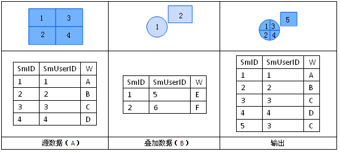

title: 裁剪
---
   
### 使用说明    
 
裁剪是用裁剪数据集从被裁剪数据集中提取部分特征集合的运算。裁剪数据集中的多边形集合定义了裁剪区域，被裁剪数据集中凡是落在这些多边形区域外的特征都将被去除，而落在多边形区域内的特征要素都将被输出到结果数据集中。裁剪数据集的类型必须为面数据集，被裁剪数据集的类型可以是点、线、面数据集。
  
  
  
  
裁剪运算的输出结果的属性表来自于被裁剪数据集的属性表，其属性表结构与被裁剪数据集结构相同，属性值中除了面积、周长、长度等需要重新计算外，其余皆保留被裁剪数据集A的属性值。如下图所示，自动添加数据集A中的所有字段。  
  
  

### 操作说明   
  
1. 在工具箱的“矢量分析”-“叠加分析”选项中，双击“裁剪”，即可弹出“裁剪”对话框。  
2. 设置源数据。选择被裁剪数据集所在的数据源及被裁剪的数据集。   
3. 设置叠加数据。选择裁剪数据集所在的数据源及裁剪数据集。   
4. 设置结果。选择存储结果数据集的数据源，指定结果数据集的名称。    
5. **容限值**：叠加操作后，若两个节点之间的距离小于此值，则将这两个节点合并，该值的默认值为被裁剪数据集的节点容限默认值，该值可在数据集属性对话框的矢量数据集选项卡的数据集容限下的节点容限中设置。若未在数据集属性中设置节点容限，则此处容限默认值与数据集的坐标系有关。  
6. 设置是否进行结果对比：勾选“进行结果对比”复选框，可将被裁剪数据集、裁剪数据集及结果数据集同时显示在一个新的地图窗口中，便于用户进行结果的比较。  
7. 单击“执行”按钮即可进行裁剪操作。

