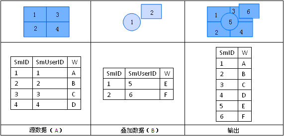

title: 更新
---

### 使用说明  

更新运算是用更新数据集替换与被更新数据集重合的部分，是一个先擦除后粘贴的过程。结果数据集中保留了更新数据集的几何形状和属性信息。更新数据集及被更新数据集的类型必须为面数据集。 

  
  
更新运算输出结果的属性表如下图所示，A、B数据集几何对象重合部分的属性值更新为B的属性值。  

            

### 操作说明   
  
1. 在工具箱的“矢量分析”-“叠加分析”选项中，双击“更新”，即可弹出“更新”对话框。  
2. 设置源数据。选择被更新数据集所在的数据源及被更新的数据集。     
3. 设置叠加数据。选择更新数据集所在的数据源及更新的数据集。      
4. 设置结果。选择存储结果数据集的数据源，指定结果数据集的名称。  
5. **容限值**：根据参与分析的数据集，会自动给出默认的容限值。叠加操作后，若两个节点之间的距离小于此值，则将这两个节点合并，该值的默认值为被裁剪数据集的节点容限默认值，该值可在数据集属性对话框的“矢量数据集”选项卡的数据集容限下的节点容限中设置。若未在数据集属性中设置节点容限，则此处容限默认值与数据集的坐标系有关
6. 设置是否进行结果对比：勾选“进行结果对比”复选框，可将源数据集、叠加数据集及结果数据集同时显示在一个新的地图窗口中，便于用户进行结果的比较。
7. 单击“执行”按钮，即可进行更新操作。