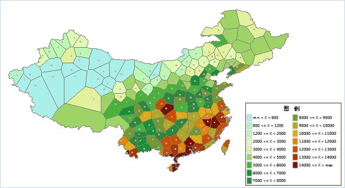

title: 泰森多边形
---
   
### 使用说明
 
泰森多边形可用于定性分析、统计分析、邻近分析等。例如，可以用离散点的性质来描述泰森多边形区域的性质；可用离散点的数据来计算泰森多边形区域的数据；判断一个离散点与其它哪些离散点相邻时，可根据泰森多边形直接得出，且若泰森多边形是 n 边形，则就与 n 个离散点相邻；当某一数据点落入某一泰森多边形中时，它与相应的离散点最邻近，无需计算距离。  
  
以下基于全国的气象站点数据，对其构建泰森多边形，将点数据中的属性反映到面对象的面对象中，得到每个气象站点构建区域的平均降雨量，对其制作分段专题图，分析各区域的降雨量情况。

  
### 操作说明  

1. 在工具箱的“矢量分析”-“邻近分析”选项中，双击“泰森多边形”，即可弹出“泰森多边形”对话框。  
2. 在对话框中设置源数据集为“气象站点”数据，在结果数据处选择存储结果数据集的数据源，指定结果数据集的名称。    
3. 单击“执行”按钮即可进行泰森多边形操作。
4. 对构建的泰森多边形面数据制作分段专题图，在专题图属性面板中设置表达式为“年降水量”字段，设置段数为15段，并重新设置段值，最终即可得到如下图所示的全国降水量分布图：
  
  
  
 