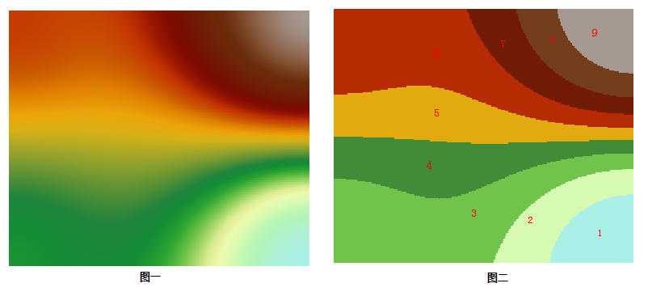

  
### 使用说明  

　　栅格分割是按照自然间断点分级法分割像元值。该方法是基于数据中固有的自然分组，这是方差最小化分级的形式，间断通常不均匀，且间断选择在值出现剧烈变动的地方，所以该方法能对相似值进行恰当分组并可使各分级间差异最大化。  
　　自然间断点分级法会将相似值（聚类值）放置在同一类中，所以该方法适用于分布不均匀的数据值。 
   如下图所示，图一以重分级区域为9，最低区域值为1自然分割重分级后得到图二的结果：  
       　

### 操作说明

1. 在工具箱的“数据处理”-“栅格”选项中，双击“分割”，即可弹出“分割”对话框。  
2. 在“源数据”中设置需要进行分割的数据源及数据集。  
3. **级数**：设置分级段数，默认值为10。输入级数值后，系统会将待分级栅格数据的最小值到最大值按照自然间断法分割为指定数值。例如上述默认值为10，则分割为10份。
4. **最小值**：该值作为栅格分级中最低区域的值，以该最小值为基础，每级加1作为新的栅格值。最低区域值设为1，重分级后的值以1为起始值每级递增。
5. 设置结果数据集所在数据源及数据集名称，单击“执行”按钮即可进行栅格分割操作。  

