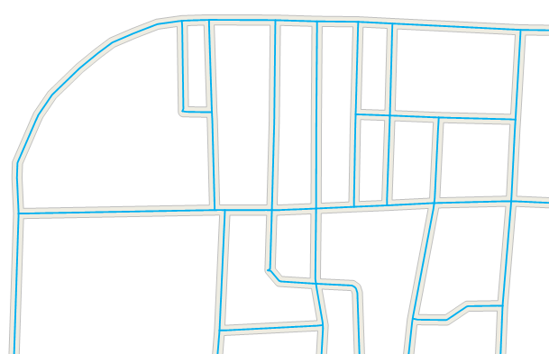

　　面提取中心线是指提取面数据集中所有面对象的中心线，并将结果保存为线数据集，一般用于提取道路面的中心线。

### 操作说明

 1. 在工具箱的“数据处理”-“矢量”选项中，双击“面提取中心线”，即可弹出“面提取中心线”对话框。
 2. 在源数据处设置需提取中心线的面数据集。
 3. **最大宽度**：需提取中心线的双线间最大宽度值（大于0），默认值为30，单位与源数据集相同。用户可通过“地图”选项卡“量算”组中的“距离”选项，量算双线的最大宽度。建议用户设置的最大宽度略大于实际量算的距离，这样提取的结果会更准确。
 4. **最小宽度**：需提取中心线的双线间最小宽度值（大于或等于0），当双线间距离小于最小宽度时，不提取该处中心线，默认值为0，单位与源数据集相同。 
 5. 设置好结果数据集之后，单击“执行”按钮，即可执行提取中心线操作，结果如下图所示：  

  

### 注意事项

　　注意：最大最小宽度与源数据集单位一致。最大宽度必须大于0，且必须设置最大宽度。双线宽度在最大和最小宽度之间时会提取其中心线；双线宽度小于最小宽度时不提取中心线；双线宽度大于最大宽度时提取其边界线。

### 相关主题

 [融合](Datafuse.html)

