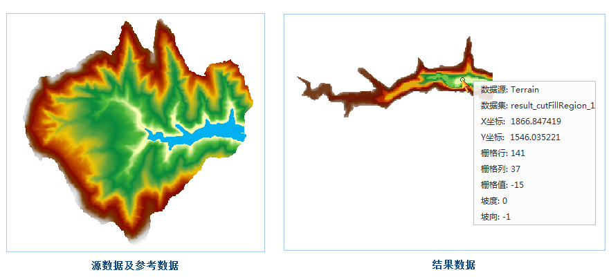

　　当需要将一个高低起伏的区域夷为平地时，需要知道多大的面积需要填方，多大的面积需要挖方，以及填方量和挖方量，选面填挖方功能即可以计算出这些结果。

　　用户可以通过指定高低起伏的区域以及夷为平地的面的高程，进行面填挖方计算，得出填方面积、挖方面积、填方量以及挖方量。该功能同时支持二维地图数据和三维场景数据。关于面填挖方的原理和方法介绍，请参见[填挖方](CutFill.html)页面部分。

  
### 操作说明

 1. 在工具箱的“栅格分析”-“表面分析”-“地形计算”选项中，双击“面填挖方”，即可弹出“面填挖方”对话框。
 2. 在“源数据”处设置需进行面填挖方计算的栅格数据集。
 3. 选择一个面或线数据集，作为参考数据。对于面对象，可直接作为指定平面参与面填挖方的运算；对于线对象，会先对其进行缓冲区分析，将缓冲结果作为指定平面参与面填挖方的计算。
 4. **附加高程**：填挖区域的结果高程值。
 5. 缓冲设置：当设置的参考数据为线对象时方可使用。

   - **缓冲类型**：用户可根据需要选择不同的缓冲类型，包括平头缓冲和圆头缓冲两种。平头缓冲表示缓冲区在线的两端和节点处均为折角，圆头缓冲表示缓冲区在线的两端和节点处均为平缓的圆角。 
   - **缓冲半径**：由缓冲半径确定缓冲区的范围，对绘制的线对象创建缓冲区，形成待填挖得到的面。
 6. 设置好结果数据集后，单击“执行”按钮，即可执行面填挖方操作。 执行完毕后会在输出窗口显示计算结果，包括填充体积、挖掘体积、填充面积、挖掘面积、未填挖面积5项内容，其中体积单位为立方米、面积单位为平方米。如下图所示：

　　

### 相关主题

 [融合](Datafuse.html)

