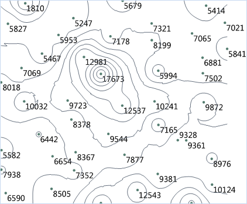

　　提取点数据集等值线要先对点数据集进行插值分析，得到栅格数据集，将栅格数据集中相邻的具有相同高程值的点连接起来，提取高程值相等点的等值线。

　　SuperMap桌面产品目前支持从二维点数据集、三维点集合中提取等值线。二维点数据集使用某个字段来存储用于提取等值线的属性信息，如高程、温度等，三维点集合中除了点的坐标信息外，还存储了第三维信息。从点数据中提取等值线的原理是，对点数据集、三维点集合进行插值，得到栅格数据集，再从栅格数据集提取等值线。

　　点数据中分散分布的点能够很好的表现位置信息，但对于点本身的其他属性信息却不能直观的体现，例如，已经获取了某个研究区域的大量采样点的高程信息，如下图所示，从左图的点数据上并不能看出地势高低起伏的趋势，若运用等值线的原理，将这些点数据所蕴含的信息以等值线的形式表现出来，即将相邻的具有相同高程值的点连接起来，形成右图所示的等高线图，这个区域的地形信息便可明显的表现出来。不同的点据提取的等值线具有不同的含义，主要依据点数据所代表的信息而定，如果点的值代表温度，那么提取的等值线就是等温线；如果点的值代表雨量，那么提取的等值线就是等降水量线，等等。

### 操作说明

 1. 在工具箱的“栅格分析”-“表面分析”-“提取等值线/面”选项中，双击“点数据提取等值线”，即可弹出“点数据提取等值线”对话框。
 2. 在源数据处设置需提取等值线的二维或三维点数据集。
 3. **属性字段**：要进行插值分析的属性字段，一般设置为高程字段。在提取等值线时，将用该字段中的值，对点数据集中的点数据进行插值分析。
 4. **插值类型**：若源数据集为三维点数据集，则可选择距离反比权值法(IDW)、克吕金内插法(Kriging)或者不规则三角网(TIN)其中的一种插值法，对数据进行插值。

   - **IDW**：通过计算附近区域离散点群的平均值来估算单元格的值，是一种简单有效的数据插值方法，运算速度较快。
   - **Kriging**：与普通克吕金插值方法思路一样，数据结构简单，非常适用于大区域宏观地形的构建。
   - **TIN**：需要先将给定的线数据集生成一个 TIN 模型，然后根据给定的极值点信息（可选）以及湖信息（可选）生成地形。TIN 模型能够较好地反映地形特征，但是数据结果复杂，适用于小区域地形的计算。 

 5. **分辨率**：对点数据集进行插值分析的中间结果（栅格数据集）的分辨率。当插值类型为TIN时，分辨率不可设置。
 6. 设置提取等值线的公共参数，包括基准值、等值距、重采样系数、光滑方法、光滑系数，公共参数的设置请参见[提取等值线/面](DriveContour.html)页面。
 7. 设置结果数据集，软件会根据点数据集的属性字段、基准值、等值距，自动计算并显示结果数据的最大最小等值线和等值数。
 8. 单击“执行”按钮，即可执行提取所有等值线操作，结果如下图所示：  

  

### 相关主题

 [提取等值线/面](DriveContour.html)

 [提取所有等值线](DriveContourAll.html)

 [提取指定等值线](DriveContourSpecific.html)

 [提取所有等值面](DriveRegionAll.html)

 [提取指定等值面](DriveRegionSpecific.html)

