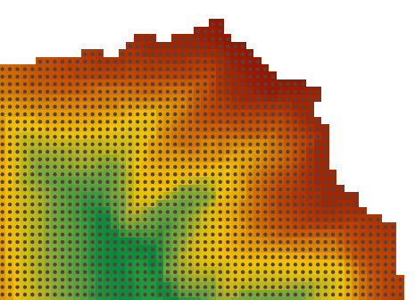

　　栅格转矢量又称矢量化，是将栅格单元中的空间信息转换为几何图形的过程。在SuperMap中，支持将栅格数据集、影像数据集转换为二维的点数据集、线数据集或面数据集。

　　栅格数据转为矢量数据时，除指定源栅格数据集、目标数据源和结果数据集名称外，还需要指定结果数据集类型、栅格值字段、背景色或无值的值及其容限，以及是否进行栅格细化、光滑方法和光滑度。其中光滑方法、光滑度和是否进行栅格细化处理的设置只适用于栅格转为矢量线数据。此外，还可以通过设置源栅格中的指定值来部分转为矢量数据。

### 操作说明

1. 功能入口有以下两种方式：
  - 在“空间分析”选项卡的“栅格分析”组中，单击“矢栅转换”下拉按钮，选择“栅格矢量化”选项。
  - 在工具箱的“栅格分析”-“矢栅转换”选项中，双击“栅格矢量化”选项，或将该选项拖入可视化建模的画布中。
2. 源数据：选择需要矢量化的栅格或者影像数据集，支持点、线、面数据集。
3. “矢量线设置”区域的参数只有在结果数据的“数据集类型”选择为“线数据集”的时候才生效。 
  - 光滑方法：只在栅格转为矢量线数据时有效，SuperMap 提供两种光滑处理的方法，“B 样条法”和“磨角法”，若想了解更多光滑过程可以参照光滑方法说明文档。
  - 光滑系数：只在栅格转为矢量线数据时且“光滑方法”不是“不进行光滑”时有效，光滑系数的有效取值与光滑方法有关,当光滑方法为 B 样条法时，光滑系数的值小于 2 时将不会进行光滑；当采用磨角法时，光滑系数的值设置为大于等于 1 时有效。 光滑系数的值越大，则结果矢量线的光滑度越高。
  - 细化预处理：选中此选项，则在矢量化前先对栅格数据进行细化处理。细化处理可以减少栅格数据中标识线性对象的单元格的数量，提高矢量化的速度和精度。例如一幅扫描的等高线图上可能使用5、6个单元格来显示一条等高线的宽度，细化处理后，等高线的宽度就只用一个单元格来显示了。也可以预先对栅格/影像数据进行细化处理，然后再矢量化。关于栅格细化功能的介绍，请参阅栅格细化。
4. “栅格设置”区域的参数只对栅格数据集矢量化时生效，对影像数据集进行矢量化时不生效。 
 - 无值：对栅格数据集，像元值为此设定值的单元格被视为无值数据不参与矢量化过程。
 - 无值容限：“无值数据”设定好像元值后设置该“无值容限”值，则“无值数据”的像元值及容限范围内的像元值均视为不参与矢量化过程的数据单元。
 - 栅格值字段：用来将每个单元格的栅格值存储到结果数据集中的字段中。栅格值字段的名称在后面的文本框中指定。默认字段名称为 value。
 - 只转换指定栅格值：仅提取单元格值等于设定值的区域进行矢量化。
 
     - 栅格值：像元值为此设定值的单元格参与矢量化过程。 
     - 栅格值容限：设置指定“栅格值”的容限范围，在指定“栅格值"及浮动容限范围内的栅格值参与矢量化过程。 
5. 在“影像设置”区域的参数只对影像数据集矢量化时生效，对栅格数据集进行矢量化时不生效。 
 - 背景色：对影像数据集，若遇到此种颜色的单元格，则将其视为背景色，不参与矢量化过程。 
 - 背景色容限：对于影像数据集选择了背景色后，数据集中若某个单元格的 RGB 值在背景色的浮动容限范围内，则该单元格也被作为背景色，不参与矢量化过程。容限值同时对应 RBG 三个值，比如容限值取10，那么颜色值（R±10、B±10、G±10 ）范围内的色值就是容限范围内，容限值取值范围（0～255）。 

6. 在“结果数据”区域设置矢量化后生成的结果数据集的位置和名称，并设置结果数据集类型，可以是点数据集、线数据集、面数据集。 
 - 点数据：表示栅格数据集中的每个像元都会提取一个点。
 - 线数据：栅格值相同的像元连接为一条线对象。
 - 面数据：栅格值相同的相邻像元矢量化为一个面对象。
7. 将界面参数切换至“**环境**”面板，设置分析环境，具体操作请参见[分析环境设置](AnalystEnvironment.html)页面。
8. 以上参数设置完成后，单击“执行”按钮，执行栅格矢量化操作，下图为栅格矢量化为点数据的结果：

  

### 相关主题

　　 [栅格细化](ThinRaster.html)

　　 [矢量栅格化](VectortoRaster.html)

